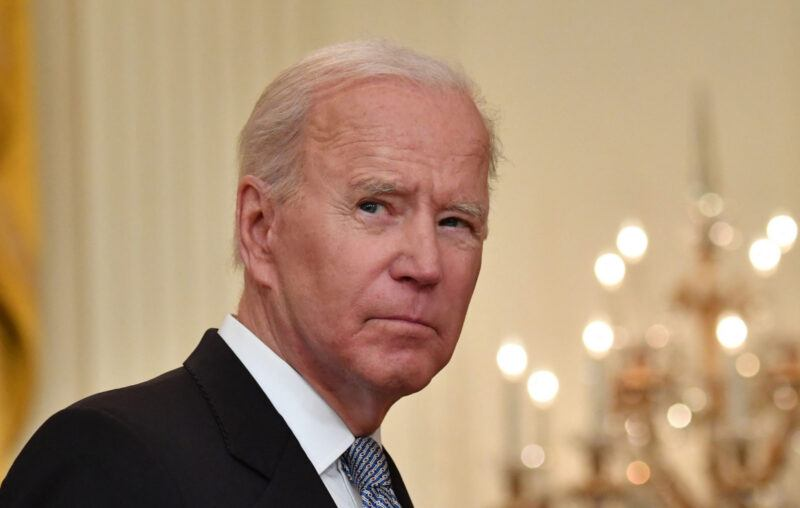
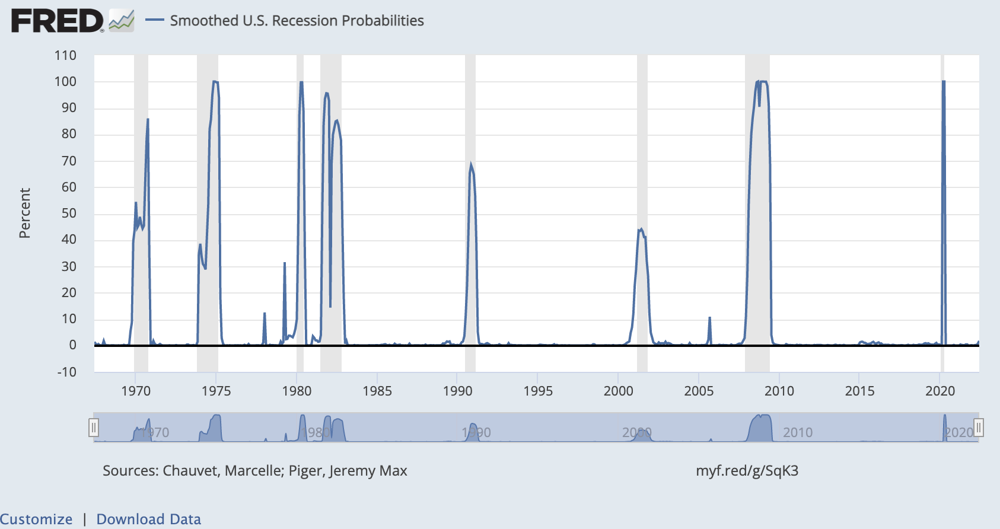

## Интрига 🤌

> — Видишь суслика?..  
> — Нет...  
> — И я не вижу... А он есть!  
> — Понятно...  

Как известно, на протяжении 2 кварталов экономика США показывает снижение ВВП[^1], что многие называют рецессией или спадом в экономике. Рецессия сопровождается падением доходов у населения, падением прибыли у бизнеса и снижением налогов у государства -- речь, в целом, идет о весьма неприятном периоде с прыжками из окон небоскреба, дефолтами  развивающихся экономик типа Аргентины и прочими страшилками.    Определение рецессии может быть достаточно простым: "Если ВВП сокращается половину календарного года (два квартала), то экономика находится в рецессии". Именно так давали определение экономисты старой школы и именно так определяют рецессию в многих странах включая [Великобритания](https://web.archive.org/web/20121102095705/http:/www.hm-treasury.gov.uk/junebudget_glossary.htm), [Германия](https://www.bundesbank.de/dynamic/action/en/homepage/glossary/729724/glossary?firstLetter=R&contentId=653260), [Франция](https://www.insee.fr/en/metadonnees/definition/c2129),  [Австралия](https://www.aph.gov.au/About_Parliament/Parliamentary_Departments/Parliamentary_Library/pubs/MSB/feature/FeatureGDP) и пр. Такое определение устраивает правительства многих стран, но только не США, которое предлагает следующее определение: 

> a significant decline in economic activity spread across the market, lasting more than a few months, normally visible in real [GDP](https://en.wikipedia.org/wiki/GDP), real income, employment, industrial production, and wholesale-retail sales[^2]

Или в переводе:

> существенное снижение экономической активности на рынках, которое длиться более нескольких месяцев, обычно наблюдаемое на реальном ВВП, занятости, промышленном производстве, розничных продажах

[^1]: [Real Gross Domestic Product](https://fred.stlouisfed.org/release/tables?rid=53&eid=13026#snid=13027)
[^2]: [Business Cycle Dating Committee Announcement January 7, 2008](https://www.nber.org/news/business-cycle-dating-committee-announcement-january-7-2008)

Другими словами, решение о наступлении рецессии принимается группой не публичных лиц из Национального Бюро Экономических Исследований или The National Bureau of Economic Research (NBER) на основании неформализованных правил, о которых можно только догадываться. При этом объявление может быть значительно позже наступления непосредственно рецессии и даже допустимо объявить рецессию уже после ее завершения. Такой подход мотивируется необходимостью точного определения момента перехода экономики в состояние рецессии. Возможно, именно для этого они публикуют сведения о состоянии экономики с точностью до одного дня[^3]. Это выглядит весьма странно с учетом того, что все периоды рецессии начинаются с началом месяца и заканчиваются также завершением месяца т.е. с тем же успехом можно было бы публиковать месячные сведения и не наводить тень на плетень 😳

[^3]:[NBER based Recession Indicators for the United States from the Period following the Peak through the Trough](https://fred.stlouisfed.org/series/USRECQ)

Надо сказать, что попытки манипулировать статусом рецессии -- это не есть что-то новое.  Печально известный президент Ричард Никсон в период рецессии 1973-1975 годов заявлял об отсутствии рецессии, но наличии некого временного эффекта снижения в экономике по причине Арабо-Израильского конфликта. Как известно, патологическое вранье Никсона привело его президентский срок к Уотергейтскому скандалу и досрочному увольнению с поста президента[^4].

[^4]: [Biden Borrows the Nixon Playbook on Recessions](https://www.aier.org/article/biden-borrows-the-nixon-playbook-on-recessions/?fs=e&s=cl)

Нужно ли говорить, что текущая экономическая и политическая конфигурация очень сильно напоминает период президнества Никсона. Политическая борьба между демократами и республиканцами обострилась настолько, что текущий президент Байден назвал сторонников Трампа  "полу-фашистами"[^6] в предверии выборов в конгресс США. 

[^6]: [Biden decries Republican loyalty to Trump as ‘semi-fascism’](https://www.theguardian.com/us-news/2022/aug/26/biden-trump-republicans-fascism-speech-maryland)

## И как теперь с этим жить? 👀

Переход экономики в режим рецессии -- означает, что потребители с уязвимым финансовом состоянием должны сокращать расходы и делать больше сбережений. Аналогично действует бизнес, переключая приоритет экстенсивного роста на режим сокращения издержек и оптимизации. Инвестиционный капитал также осуществляет перебалансировку портфеля из акций в облигации т.е. из бумаг, привязанных к прибыли компаний в бумаги с фиксированной процентной доходностью. Последний факт -- является сильнейшим сигналом для прогнозирования рецессий, но об этом в следующий раз. 

Итак, как же понять, что происходит простому Джо, если сообщение о наступлении рецессии приходит с таким запозданием? Самое простое, что можно сделать -- это посмотреть мнение ФРС США[^5] и вот какой ответ там можно найти:

> So, are we in a recession or not? **You can judge for yourself**; but at the time of this writing, the June 2022 data do not seem to indicate a recession.

Или в переводе: 

> Так наступила ли рецессия или нет? **Вам следует решать самим**, но на момент июня 2022 года данные не показывают инфляции

Звучит как издевательство. Вот и получается, что рецессия как бы есть и ее как бы нет. Удивительная история для величайшей демократии из всех демократий, где казалось бы на каждый чих есть какой-то закон или какое-то правило, которое будет иметь большую значимость чем мутное мнение, диктуемое политической ситуацией 😶‍🌫️

[^5]: [The FRED® Blog](https://fredblog.stlouisfed.org/)

К счастью, существует еще один вариант выхода из ситуации, предлагаемый ФРС. Таким вариантом -- является использование модели оценки текущей вероятности рецессии, которая выглядит как-то так:

Данная экономитрическая модель прогнозирует текущую вероятность рецессии на последних месячных данных и, как видно, на картинке выше: никаких признаков рецессии и близко не видно т.е. мы имеем математически точную демонстрацию отсутствия рецессии при полугодичном сжатии ВВП 🤯 

Естественно, у меня возникло сильное желание покопаться в этой модели т.е. попробовать ее восстановить и сделать код публичным и верифицируемым, как того требует базовые научные принципы. Другой задачей, которую можно сразу же сформулировать станет попытка создания альтернативной модели с использованием какой-нибудь попсовой техники машинного обучения. 

Минуя технические вопросы разработки математической модели, отдельно хотелось бы затронуть вопросы предметной области, а именно  логическая связь показателей-предикторов с показателем ВВП и также саму суть ВВП. Данный анализ необходим для того чтобы оценить способность работы эконометрической модели не только для циклических кризисов, но и для системного кризиса, в который кстати не верят 95% населения планеты, включая правительство РФ и  мою маму. Надеюсь, меня не сожгут на костре за мои попытки найти истину 🫣

## Итоги 🍪

- Если кто-то задает вопрос: есть ли рецессия в США на август-сентябрь 2022 года -- такой человек не получит вменяемого ответа  и с этим предлагают смириться 
- Для тех кто не смирился и продолжает искать ответ -- можно использовать модель прогнозирования  наличия рецессии, публикуемой ФРС
- Для тех кого не устроили первые два пункта предлагаю ознакомиться с моей следующей заметкой, в которой я разберу принципы работы модели от ФРС и попробую ее восстановить. Могу обещать лишь немного иронии, но много страшной математики

