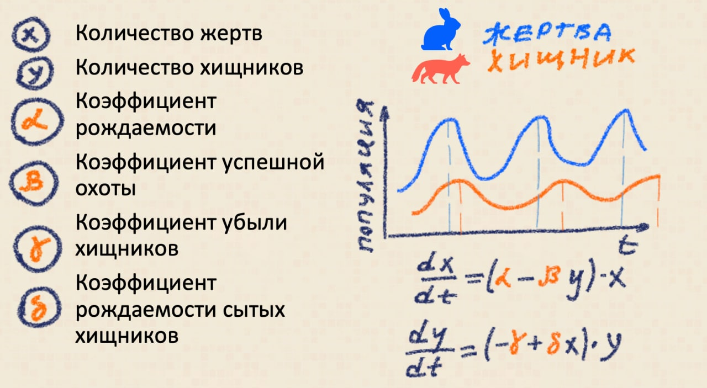

```{r setup, include=FALSE, echo=FALSE, warning=FALSE, message=FALSE}
knitr::opts_chunk$set(collapse = TRUE, echo = TRUE, message = FALSE, warning = FALSE, error = FALSE, fig.width=7.5)
```

## Научпоп 🧑🏿‍🔬

В мире все взаимосвязано и это вероятно правда. Некоторые взаимосвязи очевидны, а некоторые чрезвычайно сложны и запутаны. Человечество тратит колоссальные ресурсы на установление таких взаимосвязей, но на выходе получает либо убористый текст, перегруженный специальными терминами и математическими формулами, либо что-то вроде: "английские ученые доказали, что если скрестить крабовые палочки, то получатся крабовые крестики". 

Очевидно, что до обывателей долетают лишь жалкие ошметки научных исследований. Вероятно многие смотрели фильм "Эффект  бабочки", название которого отсылает к теории хаоса Эдварда Лоренса, допускающей возможность возникновения урагана от взмаха крыльев бабочки на другом конце света. Также, вероятно, многие сталкивались с понятием *энтропии*, которая пришла из термодинамики как мера упорядоченности системы, основное свойство которой заключается в необратимости ее роста. Считается, что именно необратимость роста энтропии определяет направления движения времени т.е. если бы была возможность обратить энтропию, то стало бы также возможно обратить время вспять и вот уже получается сюжет фильма "Довод" с бегающим задом протагонистом. 

Многие научные концепции доходят до нас в виде утрированных полуфабрикатов, готовых к быстрому употреблению, поскольку именно этого требует публика. Взгляд на эти концепции со стороны науки гораздо более прагматичный: теорию хаоса пытаются применять для задач экономики, а энтропия с легкой руки Шеннона мутировала в *информационную энтропию*, широко используемую в DataScience. 

Нет ничего плохого, что концепции одной научной дисциплины перехватываются другой сферой, раскрывая новые грани выявленных закономерностей. Выдающийся математик Ричард Хэмминг заметил по этому поводу: 

> *When a theory is sufficiently general to cover many fields of application, it acquires some "truth" from each of them.*

> *Когда теория достаточно универсальна чтобы охватить многие сферы применения она приобретает некоторую истину от каждой из них.* 

В моей прошлой [заметке](/post/us_recession2/) o модели прогноза рецессии в США я намерено оставил некоторые пробелы в описании. Пропустив причины выбора определенных опережающих индикаторов, я оставил возможность подробно раскрыть эту тему в отдельно заметке.  Напомню, что мной был использован следующий набор индикаторов:

- Уровень безработицы
- Спред между ставками долгосрочного и краткосрочного заимствований
- Эффективная ставка федеральных фондов

Более того, я не давал особых пояснений, что такие индикаторы означают и какие фундаментальные соображения подтолкнули к сделанному выбору. Все оставшиеся пробелы я намерен заполнить в этой заметке, используя идею конвергенции научных концепции, которую описал выше. 

## Модель хищник/жертва 🦊🐰

Представим себе остров достаточного размера для того чтобы кролик имел неплохие шансы спрятаться и/или убежать от лиса. На месте кроликов и лисов могут быть какие-либо иные зверюшки в качестве жертв и хищников, что не особо принципиально для модели. Остров также предположительно изобилует растительностью, которая позволяет прокормить популяцию кроликов практически любого размера. 

Если в такой экосистеме не будет хищников то очень вероятно, что расплодившиеся кролики пожрут всю доступную растительность и тупо вымрут от голода вскоре после наступления пика своей популяции. Таким образом, хищник выполняет роль регулятора экосистемы: с ростом популяции кроликов лисам становится проще на них охотиться и следовательно лисы также могут увеличивать свою популяцию вслед за популяцией кроликов. В какой-то момент популяция лисов становится достаточно большой, требующей поимки настолько большого количества кроликов, что это приводит к сокращению их численности.

Численность кроликов может падать до критических уровней, но размеры острова будут гарантировать, что критически малая популяция кроликов выживет т.к. даже толпы лисов не будут способны истребить кроликов полностью. Очевидно, что это условие очень важно для того чтобы обе популяции не исчезли полностью. Снижение кормовой базы лисов в виде кроликов неминуемо ведет к снижению популяции лисов, что необходимо для восстановления численности кроликов. Таким образом, численность кроликов начинает вновь увеличиваться и, можно сказать, что цикл повторяется вновь, а экосистема находится в состоянии *динамического равновесия*.

Описанная модель называется моделью Лотки-Вольтерры и может быть выражена простой системой математических уравнений, состоящий всего из двух равенств и четырех коэффициентов. Решение данной системы уравнений может быть проиллюстрировано графиками численности лисов и кроликов: популяция лисов изменяется с некоторым лагом за периодическими изменениями популяции кроликов. Не вижу смысла подробно описывать математику, стоящую за этой моделью в рамках данной заметки, но планирую активно использовать эту концепцию для объяснения экономических циклов.



Честно говоря, меня не сильно волнуют проблемы нарушения равновесия в экосистемах, но скорее есть желание сформировать некую точку сборки, подкрепленную научным базисом для объяснения природы экономических циклов. Модель Лотки-Вольтерра интересная тем, что предполагает динамическое равновесие системы, состоящей из субъектов противоположной мотивации: кролики хотят есть травку и плодиться, а лисы хотят есть кроликов. Выкинуть лисичек из системы -- означает катастрофу. Выкинуть кроликов из системы -- означает катастрофу. Выкинуть мотивацию лисичек ловить кроликов -- ну вы поняли 🪦🦊🐰 В общем нарушить динамическое равновесие не так уж и сложно. 

## Экономические циклы 🌀

История изучении экономических циклов насчитывает уже несколько сотен лет и за это время стало принято выделять несколько основных типов, каждый из которых характеризуется своим периодом продолжительности цикла. Природа каждого цикла имеет свое объяснение, связанное с некоторыми естественными процессами. 

В качестве примера можно привести относительно краткие циклы колебания объемов выпуска и запасов товаров. В условиях слабой информированности бизнеса возможна ситуация, когда бизнес наращивает обороты производства просто потому, что спрос будущего периода продолжительное время превышал спрос текущего периода. В этом случае со стороны бизнеса используется простая линейная модель: то, что происходило вчера и позволяло зарабатывать деньги -- будет работать и в будущем. Естественно, в какой-то момент времени происходит товарное перенасыщение рынка сбыта, но информация об этом не доходит своевременно до производственных планов и какое-то время производство продолжает работать с предельной интенсивностью, несмотря на возникшие проблемы со сбытом. Соответственно, когда складывается обратная ситуация и рынок сокращается некоторое продолжительное время, менеджмент ориентируется на аналогичную линейную модель, но с отрицательным знаком т.е. менеджмент нацелен на снижение объемов выпуска, рискуя пропустить восстановление спроса. Циклы такого характера можно наблюдать на графиках колебания запасов/выпуска, а называются они по имени их исследователя - Джозефа Китчена. Впрочем, современная экономическая мысль склонна отрицать наличие такого экономического цикла по следующим причинам: 

- В настоящее время широко распространен подход гибкого производства по методу "вытягивания" т.е. производство работает на минимальных запасах, отталкиваясь от текущего спроса и при возникновении признаков перенасыщения объемы выпуска адаптивно снижаются. Такая организация производства свойственная для эффективных дискретных производств с большим участием смежных поставщиков, к которым в первую очередь относятся отрасли машиностроения (привет ДАО ТАЙОТА 🎌) . В рамках такой организации информация о необходимости снижения темпов производства автоматически распространяется по всем технологическим цепочкам, завязанным на производство данного изделия. Несколько сложнее обстоит дело с поточными производствами, которые физически не способны эффективно снижать объемы выпуска. Например, для металлургов это означает остановку домны, для производителей строительного стекла -- остановку печи, что несет существенные капитальные затраты на возобновление производства. Тем не менее, такие производства при своевременном информировании могут заблаговременно выводить мощности блоками, например, для нужд капитального ремонта или модернизации/реконструкции. Т.е. колебания спроса на рынке товаров могут сглаживаться дальновидной работой менеджмента, который вместо истерик в период спада готовиться к будущему росту, а в период роста готовиться к спаду. Все логично -- не правда ли? 
- Интенсивное развитие логистики и глобализация рынков в виде упразднения импортных пошлин сделало возможным оперативно перераспределять товарные объемы по всему миру в случае возникновения перенасыщения на локальном рынке. Конечно, логистика потребует определенных затрат на транспортировку товаров, но зачастую такая балансировка будет выгоднее чем консервация производственных фондов и увольнение персонала в каждый раз когда возникают трудности со сбытом.
- В качестве еще одной помехи, вносящей коррективы в циклическую динамику может рассматриваться стратегия работы дирекции продаж. Дело в том, что такая дирекция нацелена на выполнение плана по продажам вне зависимости от текущей рыночной конъюнктуры. Используя различные методы в виде дополнительных дисконтов, маркетинговых программ, уникальных условий и тому подобное, - дирекция продаж может стимулировать закупку товара вопреки рыночному перенасыщению. С точки зрения физической экономики ничего не меняется: товарная масса просто меняет своего владельца иногда даже без перемещения со склада производителя на склад покупателя. В данном случае становится критичным наличие обратной связи между дирекцией продаж и топ менеджментом благодаря которой сброс товара на покупателей по любым условиям -- является частью антикризисной программы, а не попыткой получить бонусы любым доступным способом. 

Кроме циклов Китчина, которые предположительно имеют продолжительность от 3-х до 5-ти лет принято выделять циклы Жугляра (7-11 лет), Кузнеца (15-25 лет), Кондратьева (45-60) лет, которые также получили свое название по имени исследователей, которые их изучали. Несмотря на горячие споры экономических школ о экономических циклах -- единого мнения относительно природы данного явления по-прежнему нет. Вот лишь некоторые из теорий, которые я держал в уме при подготовке исходных сведений для прогноза рецессии:

- Согласно взглядам Кейнсеанской экономической школы экономические колебания могут происходить из-за динамического равновесия в рамках взаимодействия бизнеса и наемного труда. Механизм динамического равновесия похож на модель Лотки-Вольтерра с зайцами, лисами и прочими островами. Конечно, в данном случае никто никого не сжирает в буквальном смысле этого слова. Более того, вопреки распространенным взглядам о зверином оскале капитализма, в данной аналогии в качестве лисов выступает именно наемный персонал, который охотится на рабочие места, предоставляемые бизнесом. В периоды экономического бума наемный персонал купается в изобилии рабочих мест подобно тому как лис без особого труда ловит кролика, когда популяция последних велика. Наоборот в период рецессии многие работники увольняются, что ведет к безработице с одной стороны, но позволяет сократить расходы бизнесу -- с другой стороны. В общем и целом можно заключить, что **показатель безработицы согласно описанному механизму может иметь хорошую предсказательную силу**. 
- Другой альтернативной теорией о происхождении экономических циклов -- является идея о том, что существуют периоды кредитного расширения и сжатия. В данном случае предполагается, что бизнес уверенный в будущем с большей энтузиазмом берет долгосрочные кредиты, что порождает некоторый дифференциал между ставками краткосрочного и долгосрочного заимствований. Так как спрос выше на долгосрочные заимствования, то ставка по долгосрочному займу несколько выше чем по краткосрочному. В тот момент когда бизнесу становится тревожно за экономическое будущее он стремится использовать краткосрочные займы для финансирования текущих расходов, но не готов идти на капитальные вложения и следовательно кредитоваться в долгую. Такая ситуация называется инверсией доходности т.к. краткосрочные ставки займов превосходят долгосрочные, что является предвестником будущих экономических проблем. Лично мне эта теория не очень нравиться т.к. в качестве ориентира в данном случае используется спред ставок между трехмесячными и десятилетними заимствованиями по облигациям, но это виртуальный рыночный бенчмарк, который отражает спрос и предложение финансового рынка, ограничено влияющий на кредитный рынок реального сектора, но никак не наоборот. Правильнее будет сказать, что не бизнес, но инвестор начинает тревожиться относительно перспектив долгосрочных вложений, стимулируя перемещение капитала из бумаг долгосрочного заимствования в бумаги краткосрочного и таким образом формирует сигнал о грядущих проблемах рефинансирования в реальном секторе. В данной гипотезе в качестве лисов будет выступать бизнес, а капитал будет в роли пугливых кроликов. Так или иначе, с точки ли зрения кейсианской школы или с моей личной точки зрения  **в перечень предикторов модели прогноза рецессии имеет смысл включить спред ставок между трехмесячными облигациями и десятилетками**. 
- Следующая теория экономических колебаний связана происходит от Австрийской экономической школы, которая заключается в том, что центральные банки развитых стран неадекватно управляют ставкой рефинансирования/ключевой ставкой/эффективной ставкой -- в общем названий там много, но смысл один: некий ориентир по ставкам кредитования от центрального банка, подкрепленный реальными финансовыми инструментами типа денежной эмиссии/денежной стерилизации и всякими там РЕПО в качестве тонкой настройки денежно-кредитной стратегии. Центральные банки путем изменения ставки как метроном отбивают экономический такт, который можно считывать в виде значений конкретных показателей. Именно поэтому **в модель прогноза рецессии США мной была добавлена ставка по федеральным фондам в качестве предиктора**.  

Каждый из опережающих индикаторов, как следует из текста выше, фундаментально связан с экономическими циклами и периодами рецессии. К сожалению, любые попытки алгоритмически определить колебательные составляющие, например, быстрым преобразованием Фурье будут терпеть неудачи в силу случайных составляющих и также некой перманентной эволюции экономических процессов. Никто особо и не обещал, что все будет просто. Опять же куча экономистов по всему миру исследуют эту проблематику -- ищут более совершенные модели и получают за это нобелевские премии. 

В моем небольшом исследовании я не стал заморачиваться и использовал алгоритмов машинного обучения, для которого отсутствует необходимость определять конкретные гармонические составляющие, но есть острое желание предсказать чего-нибудь полезное и внушительное типа рецессии. Модель решающих деревьев, которую я использовал, просто "нарезает" пространство комбинаций предикторов таким образом чтобы получить статистически значимое расщепление информации, способное предсказывать рецессию. Все достаточно прагматично и логично: если теоретическая база носит противоречивый характер из-за грызни экономистов разных школ в отношении объяснений экономических циклов, то я тупо беру кусок теории от каждой школы и помещаю их в некоторую считалку, которая генерирует прогнозы. Напомню, что наиболее важными предикторами в модели прогноза рецессии оказались спред по краткосрочным и долгосрочным ставкам, а также уровень безработицы, а это указывает на большую правоту последователей Кейнса в сравнении с остальными экономическими школами. 

## Великая неопределенность 😱

Теперь когда сделаны все положенные реверансы в адрес всяческих экономических теорий и также разработана модель прогнозирования рецессии можно смело поразмышлять относительно того, что происходит в мировой экономике сейчас и что будет происходить в ближайшие годы. Всем известно, что экосистемы иногда демонстрирую поразительную адаптивность или устойчивость, но также иногда могу быть разрушены казалось бы незначительной причиной. Самое время вспомнить про пресловутый "эффект бабочки". Действительно, при очередном сокращении популяции кроликов вполне может случиться дополнительный фактор риска: например, кролики могут заразиться новой мутацией вируса, что поставит под вопрос существование популяции кроликов и лисов. 

Возможен также другой сценарий, когда лисы и кролики жили в динамическом равновесии многие годы, но в определенный момент кто-то решил изменить правила игры и начал подкармливать лисов, снижая тем самым навык лисов самостоятельно добывать себе пропитание. Все это может прекрасно работать пока существуют запасы корма. После того как корм закончился лисы, не привыкшие к охоте, испытают настолько сильный стресс, что это поставит под угрозу выживание всей популяции. 

Описанный сценарий мне сильно напоминает поведение мировых центральных банков, которые занимались спасением экономики путем прямой денежной эмиссии начиная с 2008 года. Именно тогда динамическое равновесие было нарушено и сейчас затруднительно сказать насколько адаптивно будет себя вести мировая экономическая система. Предел прочности стратегии необеспеченной эмиссии фактически наступил в 2021 году, когда ~~корм для лисов закончился~~ начала расти инфляция. Тем не менее в 2022 году экономический истеблишмент ни капли не волнуется относительно своей правоты и награждает Бена Бернанке нобелевской премией. Того самого вертолетного Бена, который получил свое прозвище благодаря метафоре о разбрасывании денег с вертолета в рамках борьбы с ипотечным кризисом. Можно сколь угодно долго создавать модели и пытаться воспроизвести будущее по примерам из прошлого, но сам факт награждения вертолетного Бена -- является ясным сигналом о том как будут развиваться события в дальнейшем. Уверен, что при первых признаках рецессии и кредитного сжатия ФРС разрядит всю обойму монетарных инструментов для закрытия кассовых разрывов по все цепочке потребления капитала в экономике. Грядет эпоха великой инфляции от которой будет крайне сложно укрыться и лисичкам и зайкам. 

Можно конечно возразить, что солнце входит и заходит, а рецессию сменяет следующий период роста. Предыдущую рецессию 2021 года никто не заметил и все будет прекрасно в тридевятом королевстве: пони будут радостно играть с единорогами на розовых лужайках. Лично меня смущает, когда вслед за весьма продолжительным периодом (с 2008 года) отсутствия рецессий экономическая система испытала падение в 2021 год и вслед за ним сразу следует рецессия 2023 года. Другими словами, период колебаний системы становится жутко неравномерным в сравнении со всей предыдущей экономической историей. Именно существенное нарушение периодичности вызывает у меня подозрения о том, что система переходит в точку бифуркации или в состояние великой неопределенности. Как я уже замечал, при нарушении динамического равновесия система может переключиться на совершенно неожиданные траектории эволюции и остается только надеяться, что новая траектория не станет сюжетом постапокалипсиса из видеоигр. 

P.S. Настоящая заметка подытоживает небольшое исследование о прогнозировании рецессии, детали можно найти в предыдущих заметках:

- [Рецессия пришла, но это не точно](/post/us_recession/) 
- [Так есть ли рецессия? 🔻🔻🔻](/post/markov_switch_model/) 
- [Марковская модель с переключением 🕹⛓🕹](/post/markov_switch_model1/) 
- [Рецессия и DataScience 💪🧠](/post/us_recession1/)
- [Прогноз рецессии в США 🔮📉](/post/us_recession2/)


Простой способ узнать о новых публикациях – подписаться на Telegram-канал:
<div class="telegram-icon" align="left">
<a href="https://t.me/investcookies" target="_blank" rel="noopener noreferrer me">
🍪🍪🪙 InvestCookies 
<svg xmlns="http://www.w3.org/2000/svg" viewBox="0 0 24 24" fill="none" stroke="currentColor" stroke-width="2"
    stroke-linecap="round" stroke-linejoin="round">
    <path
        d="M21.198 2.433a2.242 2.242 0 0 0-1.022.215l-8.609 3.33c-2.068.8-4.133 1.598-5.724 2.21a405.15 405.15 0 0 1-2.849 1.09c-.42.147-.99.332-1.473.901-.728.968.193 1.798.919 2.286 1.61.516 3.275 1.009 4.654 1.472.509 1.793.997 3.592 1.48 5.388.16.36.506.494.864.498l-.002.018s.281.028.555-.038a2.1 2.1 0 0 0 .933-.517c.345-.324 1.28-1.244 1.811-1.764l3.999 2.952.032.018s.442.311 1.09.355c.324.022.75-.04 1.116-.308.37-.27.613-.702.728-1.196.342-1.492 2.61-12.285 2.997-14.072l-.01.042c.27-1.006.17-1.928-.455-2.474a1.654 1.654 0 0 0-1.034-.407z" />
</svg>
</a>
</div>