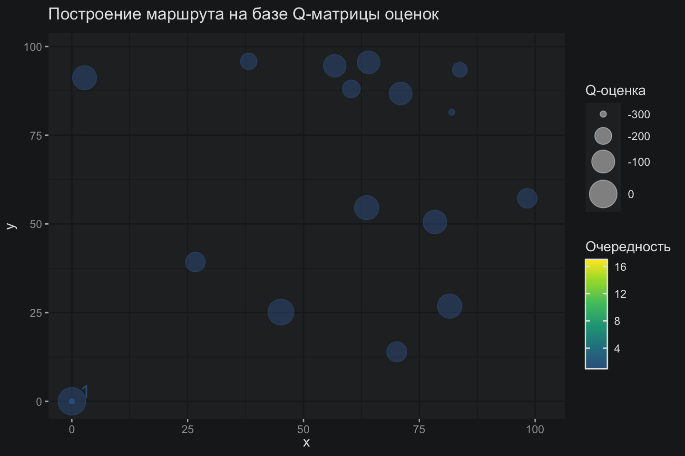

<script src="index_files/htmlwidgets/htmlwidgets.js"></script>
<script src="index_files/d3/d3.min.js"></script>
<script src="index_files/dagre/dagre-d3.min.js"></script>
<link href="index_files/mermaid/dist/mermaid.css" rel="stylesheet" />
<script src="index_files/mermaid/dist/mermaid.slim.min.js"></script>
<link href="index_files/DiagrammeR-styles/styles.css" rel="stylesheet" />
<script src="index_files/chromatography/chromatography.js"></script>
<script src="index_files/DiagrammeR-binding/DiagrammeR.js"></script>

## Краткое содержание предыдущих серий

В заметке про [Pointer Network](/post/vnimanie_eto_vse_cto_nuzno_kommivoazeru) было много всего: нетривиальная архитектура кодировщика (энкодера) и декодера, механизм внимания, а также совсем немного про обучение с подкреплением. В общем, много-много всякого, нужного для охвата пазла целиком. Далее в следующей [заметке](/post/prosto_o_vnimanii) я начал растаскивать этот пазл по кусочкам и добавил интуиции вокруг механизма внимания, а теперь наступил момент поговорить подробнее про обучение с подкреплением.

Напомню, что современные архитектуры оптимизации, способные решать задачу коммивояжера, не нуждаются в правильных ответах, но могут самостоятельно изучать пространство возможных состояний и выбирать оптимальную стратегию достижения лучшего решения, используя оценки градиента функционала по параметрам стратегии. Здесь слово “функционал” – это тот редкий случай, когда оно употреблено к месту в отличие от более распространенной практики подмены слова “функциональность”.

Работая с задачами Data Science, мы как-то свыкаемся с идеей, что есть датасет с правильными ответами, и модель просто должна научиться корректно извлекать структуру для осуществления дальнейших прогнозов, будь то классификация или регрессионная оценка непрерывного показателя. Безусловно, на практике попадаются задачи кластеризации, поиска аномалий и снижения размерности, но такие задачи очень утилитарны, тогда как способность модели играть в видеоигры — это весьма убедительная имитация человеческого интеллекта.

Осознание этого факта в какой-то момент для меня стало откровением. В теме обучения с подкреплением ощущалась чёрная магия, а в голове шумели какие-то хаотические обрывки знаний про актёров и критиков, которые как-то умеют генерировать оптимальные решения для видеоигр или многострадального коммивояжера.

В этой заметке я попробую добавить немного интуиции в эту черную магию, зайдя в тему с главного входа, то есть путем реализации алгоритма Q-learning для задачи коммивояжера.

## Q-функция

В первую очередь предлагаю определить законы, по которым будет жить не особо разнообразный мир коммивояжера. Скажем, например, что решения о посещении следующего города можно принимать на основании текущих состояний, то есть нахождения коммивояжера в некотором городе. Иными словами, процесс зависит только от текущего состояния и не связан с предыдущей историей. В таком случае говорят о марковском процессе. При этом, даже если мы используем masking, то есть игнорируем уже посещённые города, мы не делаем процесс менее марковским, так как решения по-прежнему принимаются исходя из текущего состояния и текущего знания об уже посещённых городах.

Соответсвенно, логично предположить, что задачу коммивояжера можно сформулировать в терминах марковского процесса принятия решения (Markov Decision Process, MDP):

- \[s\] - текущее состояние или город, в котором сейчас коммивояжер
- \[s’\] - новое состояние или город, который коммивояжер собирается посетить
- \[a\] - действие для перехода из \[s\] в \[s’\]
- \[r\] - награда, которую получает коммивояжер после перемещения из одного города в другой

Теория MDP разрабатывалась вокруг идеи научить искусственный интеллект играть в игры, поэтому большинство примеров проистекает также из видеоигр. В случае с TSP коммивояжер не кушает тортики и не бросается в лаву, как герой видеоигры, но перемещается из одного города в другой и получает награду \[r := r(s,a)\], или точнее штрафы в виде пройденного отрезка от одного города к другому.

Тогда процесс можно описать следующим образом. В начальном состоянии мира \[s_0\] коммивояжер находится в каком-то городе, возможно, в любом из доступных, но я на практике всегда помещаю в один и тот же город N-ск. Коммивояжер может наблюдать сразу все возможные города для следующего визита и на базе каких-то пока мистических ощущений, выбирает действие \[a\], которое считает лучшим (оптимальным). Мир отвечает коммивояжеру генерацией награды и коммивояжер оказывается в следующем городе и в следующем состоянии \[s_1\], далее процесс продолжается пока все города не будут посещены.

Введем понятие Q-функции для некоторой стратегии принятия решения \[\pi\]:
$$
Q^\pi(s, a) := \sum_{t \geq 0} \gamma^t \mathbb{E}_{\mathcal{T} \sim \pi \mid s_0, a_0} [r_t]
$$
По определению, Q-функция — это награды, которые коммулятивно набирает коммивояжер для всех траекторий (маршрутов) посещений \[\mathcal{T}\] городов, полученных из стратегии \[\pi\] для стартовых состояния \[s_0\] и действия \[a_0\]. Другими словами, коммивояжер посещает города, принимая решения на базе своей стратегии, и потом аккуратненько в эксельку записывает сколько он прошел (награду \[r\]), если был в таком-то городе и отправился другой. В следующий день он повторяет этот процесс, добавляя в эксельку, возможно какие-то другие сведения для других городов и действий, потому что решил посещать города немного в ином порядке.

Необходимо обратить внимание на весовой коэффициент \[\gamma\], который согласно теории должен быть меньше единицы (обычно от 0,9 до 0,99). Коэффициент \[\gamma\] обеспечивает уменьшение вклада будущих наград в Q-функцию. Такой параметр позволяет управлять склонностью получить награду прямо сейчас, нежели получить награды в будущем. Фактически, речь идет о выборе журавля в небе или синицы в руках. Его значение влияет на приоритет текущих наград перед будущими. Например:

- Если \[\gamma \to 0\], коммивояжер ориентируется только на текущую награду.
- Если \[\gamma \to 1\], коммивояжер учитывает долгосрочные награды.

В данном случае коммивояжер заносит в эксельку возможные решения, в какой город пойдет первым, получив первую награду \[0.9^0r_1\], далее – в какой город пойдет вторым получив награду \[0.9^1r_2\], и далее \[0.9^2r_3\], и таким образом выводит сумму, что и будет Q-функцией, которая представляет собой ожидаемую суммарную дисконтированную награду от действия \[a\] в состоянии \[s\], если следовать стратегии \[\pi\].

Получается, что коммивояжер бегает по городам, принимая решения на базе стратегии, которую пытается сделать оптимальной. Будем считать, что оптимальность стратегии \[\pi\] достигается, когда максимизируются награды по траекториям (маршрутам). Действительно, если такие маршруты дают нам хорошие или даже лучшие награды, то чего же еще желать?
$$
\pi(s):=\underset{a}{\operatorname{argmax}} Q(s, a)
$$

## Табличный алгоритм

Соответственно, если у коммивояжера есть экселька и две переменные: состояния и действия \[(s, a)\], а также их возможные комбинации, то они могут быть аккуратно уложены в табличку вида:

|         | \[s_1\] | \[s_2\] | \[s_3\] |
|---------|---------|---------|---------|
| \[a_1\] | 0       | -50     | -130    |
| \[a_2\] | -10     | 0       | -30     |
| \[a_3\] | -40     | -80     | 0       |

Здесь можно заметить, что использование таблички не является единственным доступным вариантом решения задачи. Вместо статичной записи, накопленных наград можно перейти к апроксимации Q-функции с использованием глубокого обучения. В таком случае на выходе получится архитектура DQN (Deep Q-learning). В то время как табличный метод подкупает своей простотой и наглядностью, DQN, очевидно, будет выглядеть более предпочтительно для задач большей размеренности.

Элементы в такой табличке инициализируются произвольно, например нулем, и означают награды коммивояжера, накопленные определенным образом, то есть с помощью формулы временной разности (Temporal Difference) для уравнения Беллмана:
$$
Q_{k+1}(s, a) \leftarrow Q_k(s, a)+\alpha_k \underbrace{(\overbrace{r+\gamma \max_{a'}Q_k(s', a')}^{\text {target}}-Q_k(s, a))}_{\text {временная разность }}
$$

, где \[Q_k(s,a)\] - это текущая оценка \[Q^{\pi}(s, a)\] на момент итерации

Несмотря на то, что данная формула имеет формальный вывод ее можно интерпретировать интуитивно. На каждом шаге совершается целевое (target) действие \[a\] по переходу из состояния \[s\] в состояние \[s’\], рассчитывается награда \[r := r(s,a)\], и извлекается \[Q_k(s’,a’)\] следующего состояния \[s’\] и следующего набора действий \[a’\], из которого выбирается лучшее (максимальное). Далее текущее приближение \[Q_k(s,a)\] просто сдвигается с некоторым коэффициентом (learning rate, скорость обучения) в сторону целевого (target) значения.

Формула на каждом шаге рассматривает фрагмент цепочки состояний и переписывает веса Q-матрицы, распространяя информацию о лучших наградах по цепочке по мере увеличения количества шагов. После того как маршрут определен, и корректировки Q-матрицы сохранены начинается новая итерация по поиску нового маршрута на базе обновленной Q-матрицы.

Последнее, что важно отметить – это преднамеренное нарушение стационарности стратегии принятия решений, то есть делается допущения об изменении стратегии с течением времени. Тогда идею поиска оптимального пути можно представить в виде дерева принятия решений, где ребра дерева представляют собой стоимость перехода (дистанция с обратным знаком или награда), а узлы - это состояния, в которые попадает коммивояжер. В узлах-состояниях такого дерева коммивояжер принимает решение о выборе города и это раскрывает перед ним новое состояние с новой конфигурацией выбора. Дерево решений не является частью алгоритма Q-обучения, но по-моему прекрасно объясняет проблему исследования всех возможных состояний задачи.

<div id="htmlwidget-1" style="width:750px;height:400px;" class="DiagrammeR html-widget"></div>
<script type="application/json" data-for="htmlwidget-1">{"x":{"diagram":"graph TD\n    \n    subgraph Дерево решений\n    city_1-->|d=-3|city_1.2\n    city_1-->|d=-5|city_1.3\n    city_1-->|d=-1|city_1.4\n    city_1.2-->|d=-4|city_1.2.3\n    city_1.2.3-->|d=-1|city_1.2.3.4\n    city_1.2-->|d=-1|city_1.2.4\n    city_1.2.4-->|d=-3|city_1.2.4.3\n    city_1.3-->|d=-3|city_1.3.2\n    city_1.3.2-->|d=-4|city_1.3.2.4\n    city_1.3-->|d=-4|city_1.3.4\n    city_1.3.4-->|d=-2|city_1.3.4.2\n    city_1.4-->|d=-6|city_1.4.2\n    city_1.4.2-->|d=-7|city_1.4.2.3\n    city_1.4-->|d=-7|city_1.4.3\n    city_1.4.3-->|d=-8|city_1.4.3.2\n    end\n    \n   style city_1.4 stroke:firebrick, opacity:0.7, stroke-width:4px\n   style city_1.2  stroke:seagreen, opacity:0.7, stroke-width:4px\n   style city_1.2.4  stroke:seagreen, opacity:0.7, stroke-width:4px\n   style city_1.2.4.3  stroke:seagreen, opacity:0.7, stroke-width:4px\n\n   "},"evals":[],"jsHooks":[]}</script>

Сделав выбор в пользу траектории `1.4`, коммивояжер получает максимальную награду (получает минимальный штраф за пройденную дистанцию) на первом этапе, но последующие решения не выглядят очень перспективными. Хотелось бы, чтобы коммивояжер заглянул во все состояния поддерева, а не жадно тыкался в траекторию `1.4`, что в итоге позволило бы найти оптимальный маршрут `1.2.4.3`. Чтобы позволить коммивояжеру исследовать потенциал других состояний нужно ввести две фазы работы алгоритма: исследование и эксплуатацию. Практическая реализация на R осуществляет плавный переход от режима исследования в режим эксплуатации приблизительно так:

``` r
if(runif(1) > epsilon){ # epsilon - затухающий с итерациями гиперпараметр 
        # ЭКСПЛУАТАЦИЯ
        q = Q_mtrx[,state] # выбор вектора состояния из Q-матрицы
        # mem - это простой вектор, который хранит информацию о посещенных городах
        q[mem] = -Inf  # игнорирование посещенных городов
        action = which.max(q) # выбор лучшего следующего решения
      }
      else{  
        # ИССЛЕДОВАНИЕ
        options = n_seq[which(!n_seq %in% mem)] # доступные для посещения города
        action = sample(options, size = 1) # случаный выбор города
      }
```

Еще один практический момент, который отличает конкретно мою реализацию от канонических вариантов, — это обработка терминального (конечного) состояния игры коммивояжера. По условиям задачи, коммивояжер должен вернуться в исходный город и получить последнюю награду для своего маршрута:

``` r
if(i == n_cities){ # если коммивояжер выбрал последний город для посещения
    # Q-табличка обновляется наградой перехода из последнего города в первоначальный
    Q_mtrx[action, state] = Q_mtrx[action, state] + 
      lr*(reward + gamma*next_q[mem[1]] -Q_mtrx[action, state])
  }else{ # иначе ...
    next_q[mem] = -Inf  # исключаем посещенные города 
    # Q-табличка обновляется выражением временной разности
    Q_mtrx[action, state] = Q_mtrx[action, state] + 
      lr*(reward + gamma*which.max(next_q) - Q_mtrx[action, state])
      }
```

Выражение для терминального состояния `next_q[mem[1]]` указывает на возврат коммивояжера в изначальный город.

В итоге получается алгоритм Q-обучения для задачи коммивояжера. Теория говорит о том, что данный алгоритм является *off-policy*, то есть не требуется отслеживать опыт взаимодействия конкретной стратегии со средой. На практике это дает приятное свойство обучать коммивояжера на любом опыте или на любых траекториях посещения городов, в том числе на траекториях другого коммивояжера, которые просто сохранены в буфер памяти. В принципе, даже не обязательно проходить полностью весь маршрут, достаточно просто исследовать все возможные состояния. В данной реализации это свойство не используется, по причине того, что извлечение траекторий для задачи TSP является простой процедурой, тогда как для многих иных игровых и бизнес-задач такой способ будет неприемлем. Действительно, на производственном предприятии никто не будет менять режимы производства для того, чтобы получить отклик среды специально для обучения модели с подкреплением. Куда вероятнее запустить алгоритм оптимизации на имеющихся исторических данных. Однако на этом преимущества такого подхода заканчиваются.

По сути, такой подход сводится к обучению критика в связке “актер-критик”, которая концептуально является основным понятием обучения с подкреплением. Действительно, в выражении временной разности есть только итеративная оценка Q-функции, говорящая о качестве текущей стратегии в явном виде через табличное представление.

## Сопоставление с Pointer Network

Если вернуться в самое начало заметки и вспомнить про *Pointer Network*, а также формулу для оценки лосса:
$$
L=-R⋅\sum_{i=1}^nlog(\rho(a_i))
$$

- \[R\] - это награда всего маршрута
- \[(a_i)\] - вероятность принятия действия с индексом \[i\]

Можно заметить, что награда представляет собой скалярный коэффициент, посчитанный для маршрута, а, собственно, градиент связан исключительно с вероятностями выбора действия, находящимися под логарифмом.

В данном подходе основной акцент делается на улучшении стратегии выбора действий, однако ничего не говорится об оценке этой стратегии, а также о Q-функции. Этот метод известен как REINFORCE. Его ключевая характеристика заключается в том, что он ориентирован на обучение *актера* – модели, способной непосредственно генерировать действия.

В отличие от этого методы Q-обучения и DQN сосредоточены исключительно на оценке действий, то есть в них работает только *критик*. В общем случае обучение с подкреплением сочетает обе эти составляющие:

- *Актера* для обучения стратегии \[\],
- *Критика* для обучения оценочной функции.

Вот такое получается “кино” с *актерами и критиками*, нужными для реализации обучения с подкреплением в общем случае.

## Практическая реализация Q-обучения

Несмотря на то что весь искусственный интеллект в контексте Q-обучения уложился в 50 строчек кода на R, я буду придерживаться практики публикации исходного скрипта реализации в репозитории проекта [AI Optimization](https://github.com/dkibalnikov/ai_optimization/blob/main/algorithms/Q-learning.R). В этой заметке хотелось бы остаться на уровне идей и ключевых результатов. Базовая задача для анализа остается прежней – это случайно сгенерированные координаты 16 городов точно такие, какие использовались для всех предыдущих заметок серии.

}}index_files/figure-html/unnamed-chunk-4-1.png" width="720" />

В данном случае лучший маршрут, который встречался в процессе обучения уступает маршруту, полученному из окончательной Q-матрицы, что в целом не является закономерностью. Кстати, матрица выглядит приблизительно так:

<pre style='font-size:12px'>
<span style='text-decoration:underline;'>       V1  V2  V3   V4   V5   V6   V7   V8   V9  V10  V11  V12  V13  V14  V15  V16</span><br/>1   <span style='color:#000000;'><span style='background-color:#f2e52b;'>    0</span></span><span style='color:#000000;'><span style='background-color:#62c167;'> -82</span></span><span style='color:#000000;'><span style='background-color:#61c068;'> -83</span></span><span style='color:#000000;'><span style='background-color:#47b378;'> -104</span></span><span style='color:#000000;'><span style='background-color:#5cbd6c;'>  -88</span></span><span style='color:#000000;'><span style='background-color:#6ec85e;'>  -71</span></span><span style='color:#000000;'><span style='background-color:#76ce55;'>  -62</span></span><span style='color:#000000;'><span style='background-color:#4bb576;'> -101</span></span><span style='color:#000000;'><span style='background-color:#98d64b;'>  -45</span></span><span style='color:#000000;'><span style='background-color:#61c068;'>  -83</span></span><span style='color:#ffffff;'><span style='background-color:#2b9289;'> -151</span></span><span style='color:#000000;'><span style='background-color:#37ad7e;'> -113</span></span><span style='color:#ffffff;'><span style='background-color:#2c858c;'> -168</span></span><span style='color:#000000;'><span style='background-color:#48b477;'> -103</span></span><span style='color:#000000;'><span style='background-color:#4ab476;'> -102</span></span><span style='color:#000000;'><span style='background-color:#48b477;'> -103</span></span><br/>2   <span style='color:#000000;'><span style='background-color:#a5d847;'>  -39</span></span><span style='color:#000000;'><span style='background-color:#f2e52b;'>   0</span></span><span style='color:#000000;'><span style='background-color:#acd946;'> -36</span></span><span style='color:#000000;'><span style='background-color:#79d052;'>  -59</span></span><span style='color:#000000;'><span style='background-color:#76ce55;'>  -62</span></span><span style='color:#000000;'><span style='background-color:#b0da45;'>  -34</span></span><span style='color:#000000;'><span style='background-color:#d0e03a;'>  -18</span></span><span style='color:#000000;'><span style='background-color:#7ad151;'>  -58</span></span><span style='color:#000000;'><span style='background-color:#dde235;'>  -11</span></span><span style='color:#000000;'><span style='background-color:#b8db42;'>  -30</span></span><span style='color:#ffffff;'><span style='background-color:#279f86;'> -133</span></span><span style='color:#000000;'><span style='background-color:#6fc95d;'>  -70</span></span><span style='color:#000000;'><span style='background-color:#71ca5b;'>  -68</span></span><span style='color:#000000;'><span style='background-color:#77cf54;'>  -61</span></span><span style='color:#000000;'><span style='background-color:#7cd151;'>  -57</span></span><span style='color:#000000;'><span style='background-color:#83d24f;'>  -54</span></span><br/>3   <span style='color:#000000;'><span style='background-color:#5dbe6b;'>  -87</span></span><span style='color:#000000;'><span style='background-color:#b2da44;'> -33</span></span><span style='color:#000000;'><span style='background-color:#f2e52b;'>   0</span></span><span style='color:#000000;'><span style='background-color:#badc42;'>  -29</span></span><span style='color:#000000;'><span style='background-color:#96d64b;'>  -46</span></span><span style='color:#000000;'><span style='background-color:#eae42f;'>   -4</span></span><span style='color:#000000;'><span style='background-color:#aeda45;'>  -35</span></span><span style='color:#000000;'><span style='background-color:#b4db43;'>  -32</span></span><span style='color:#000000;'><span style='background-color:#8bd44e;'>  -51</span></span><span style='color:#000000;'><span style='background-color:#d2e03a;'>  -17</span></span><span style='color:#000000;'><span style='background-color:#e9e430;'>   -5</span></span><span style='color:#000000;'><span style='background-color:#6dc85e;'>  -72</span></span><span style='color:#000000;'><span style='background-color:#b4db43;'>  -32</span></span><span style='color:#000000;'><span style='background-color:#a7d947;'>  -38</span></span><span style='color:#000000;'><span style='background-color:#aeda45;'>  -35</span></span><span style='color:#000000;'><span style='background-color:#bedc40;'>  -27</span></span><br/>4   <span style='color:#000000;'><span style='background-color:#48b477;'> -103</span></span><span style='color:#000000;'><span style='background-color:#7cd151;'> -57</span></span><span style='color:#000000;'><span style='background-color:#bedc40;'> -27</span></span><span style='color:#000000;'><span style='background-color:#f2e52b;'>    0</span></span><span style='color:#000000;'><span style='background-color:#c2dd3f;'>  -25</span></span><span style='color:#000000;'><span style='background-color:#b6db43;'>  -31</span></span><span style='color:#000000;'><span style='background-color:#75ce56;'>  -63</span></span><span style='color:#000000;'><span style='background-color:#f9e627;'>    4</span></span><span style='color:#000000;'><span style='background-color:#74cd57;'>  -64</span></span><span style='color:#000000;'><span style='background-color:#83d24f;'>  -54</span></span><span style='color:#000000;'><span style='background-color:#b8db42;'>  -30</span></span><span style='color:#000000;'><span style='background-color:#81d250;'>  -55</span></span><span style='color:#000000;'><span style='background-color:#f4e62a;'>    1</span></span><span style='color:#000000;'><span style='background-color:#e7e331;'>   -6</span></span><span style='color:#000000;'><span style='background-color:#dde235;'>  -11</span></span><span style='color:#000000;'><span style='background-color:#e1e234;'>   -9</span></span><br/>5   <span style='color:#ffffff;'><span style='background-color:#36698c;'> -204</span></span><span style='color:#000000;'><span style='background-color:#6fc95d;'> -70</span></span><span style='color:#000000;'><span style='background-color:#8dd44d;'> -50</span></span><span style='color:#000000;'><span style='background-color:#d0e03a;'>  -18</span></span><span style='color:#000000;'><span style='background-color:#f2e52b;'>    0</span></span><span style='color:#000000;'><span style='background-color:#96d64b;'>  -46</span></span><span style='color:#000000;'><span style='background-color:#67c464;'>  -78</span></span><span style='color:#000000;'><span style='background-color:#c8de3d;'>  -22</span></span><span style='color:#000000;'><span style='background-color:#96d64b;'>  -46</span></span><span style='color:#000000;'><span style='background-color:#31ab80;'> -116</span></span><span style='color:#000000;'><span style='background-color:#6fc95d;'>  -70</span></span><span style='color:#000000;'><span style='background-color:#bedc40;'>  -27</span></span><span style='color:#000000;'><span style='background-color:#acd946;'>  -36</span></span><span style='color:#000000;'><span style='background-color:#c8de3d;'>  -22</span></span><span style='color:#000000;'><span style='background-color:#e9e430;'>   -5</span></span><span style='color:#000000;'><span style='background-color:#9dd74a;'>  -43</span></span><br/>6   <span style='color:#000000;'><span style='background-color:#6dc85e;'>  -72</span></span><span style='color:#000000;'><span style='background-color:#bcdc41;'> -28</span></span><span style='color:#000000;'><span style='background-color:#eae42f;'>  -4</span></span><span style='color:#000000;'><span style='background-color:#c2dd3f;'>  -25</span></span><span style='color:#000000;'><span style='background-color:#aad946;'>  -37</span></span><span style='color:#000000;'><span style='background-color:#f2e52b;'>    0</span></span><span style='color:#000000;'><span style='background-color:#a3d848;'>  -40</span></span><span style='color:#000000;'><span style='background-color:#aad946;'>  -37</span></span><span style='color:#000000;'><span style='background-color:#a5d847;'>  -39</span></span><span style='color:#000000;'><span style='background-color:#c0dd40;'>  -26</span></span><span style='color:#000000;'><span style='background-color:#c2dd3f;'>  -25</span></span><span style='color:#000000;'><span style='background-color:#6fc95d;'>  -70</span></span><span style='color:#ffffff;'><span style='background-color:#440154;'> -313</span></span><span style='color:#000000;'><span style='background-color:#badc42;'>  -29</span></span><span style='color:#000000;'><span style='background-color:#b2da44;'>  -33</span></span><span style='color:#000000;'><span style='background-color:#b6db43;'>  -31</span></span><br/>7   <span style='color:#ffffff;'><span style='background-color:#2b9089;'> -153</span></span><span style='color:#000000;'><span style='background-color:#d0e03a;'> -18</span></span><span style='color:#000000;'><span style='background-color:#bedc40;'> -27</span></span><span style='color:#000000;'><span style='background-color:#73cc58;'>  -65</span></span><span style='color:#000000;'><span style='background-color:#42b17a;'> -107</span></span><span style='color:#ffffff;'><span style='background-color:#440154;'> -313</span></span><span style='color:#000000;'><span style='background-color:#f2e52b;'>    0</span></span><span style='color:#000000;'><span style='background-color:#72cb5a;'>  -67</span></span><span style='color:#000000;'><span style='background-color:#9ad64a;'>  -44</span></span><span style='color:#000000;'><span style='background-color:#d4e039;'>  -16</span></span><span style='color:#000000;'><span style='background-color:#8dd44d;'>  -50</span></span><span style='color:#000000;'><span style='background-color:#4ab476;'> -102</span></span><span style='color:#000000;'><span style='background-color:#6ac661;'>  -75</span></span><span style='color:#000000;'><span style='background-color:#71ca5b;'>  -68</span></span><span style='color:#000000;'><span style='background-color:#45b278;'> -105</span></span><span style='color:#000000;'><span style='background-color:#73cc58;'>  -65</span></span><br/>8   <span style='color:#000000;'><span style='background-color:#43b279;'> -106</span></span><span style='color:#000000;'><span style='background-color:#74cd57;'> -64</span></span><span style='color:#000000;'><span style='background-color:#a1d749;'> -41</span></span><span style='color:#000000;'><span style='background-color:#f6e629;'>    2</span></span><span style='color:#000000;'><span style='background-color:#ccdf3c;'>  -20</span></span><span style='color:#000000;'><span style='background-color:#a7d947;'>  -38</span></span><span style='color:#000000;'><span style='background-color:#6dc85e;'>  -72</span></span><span style='color:#000000;'><span style='background-color:#f2e52b;'>    0</span></span><span style='color:#000000;'><span style='background-color:#73cc59;'>  -66</span></span><span style='color:#000000;'><span style='background-color:#74cd57;'>  -64</span></span><span style='color:#000000;'><span style='background-color:#acd946;'>  -36</span></span><span style='color:#000000;'><span style='background-color:#7cd151;'>  -57</span></span><span style='color:#000000;'><span style='background-color:#eae42f;'>   -4</span></span><span style='color:#000000;'><span style='background-color:#eae42f;'>   -4</span></span><span style='color:#000000;'><span style='background-color:#fde725;'>    6</span></span><span style='color:#000000;'><span style='background-color:#ccdf3c;'>  -20</span></span><br/>9   <span style='color:#ffffff;'><span style='background-color:#2b8c8a;'> -159</span></span><span style='color:#000000;'><span style='background-color:#d4e039;'> -16</span></span><span style='color:#000000;'><span style='background-color:#9fd749;'> -42</span></span><span style='color:#000000;'><span style='background-color:#7cd151;'>  -57</span></span><span style='color:#000000;'><span style='background-color:#7cd151;'>  -57</span></span><span style='color:#000000;'><span style='background-color:#aad946;'>  -37</span></span><span style='color:#000000;'><span style='background-color:#a3d848;'>  -40</span></span><span style='color:#000000;'><span style='background-color:#75ce56;'>  -63</span></span><span style='color:#000000;'><span style='background-color:#f2e52b;'>    0</span></span><span style='color:#000000;'><span style='background-color:#8dd44d;'>  -50</span></span><span style='color:#000000;'><span style='background-color:#6ec85e;'>  -71</span></span><span style='color:#000000;'><span style='background-color:#88d34e;'>  -52</span></span><span style='color:#000000;'><span style='background-color:#6cc75f;'>  -73</span></span><span style='color:#000000;'><span style='background-color:#81d250;'>  -55</span></span><span style='color:#000000;'><span style='background-color:#81d250;'>  -55</span></span><span style='color:#000000;'><span style='background-color:#73cc59;'>  -66</span></span><br/>10  <span style='color:#000000;'><span style='background-color:#6cc75f;'>  -73</span></span><span style='color:#000000;'><span style='background-color:#bcdc41;'> -28</span></span><span style='color:#000000;'><span style='background-color:#d0e03a;'> -18</span></span><span style='color:#000000;'><span style='background-color:#86d34f;'>  -53</span></span><span style='color:#000000;'><span style='background-color:#72cb5a;'>  -67</span></span><span style='color:#000000;'><span style='background-color:#b4db43;'>  -32</span></span><span style='color:#000000;'><span style='background-color:#d6e138;'>  -15</span></span><span style='color:#000000;'><span style='background-color:#72cb5a;'>  -67</span></span><span style='color:#000000;'><span style='background-color:#9ad64a;'>  -44</span></span><span style='color:#000000;'><span style='background-color:#f2e52b;'>    0</span></span><span style='color:#000000;'><span style='background-color:#cedf3b;'>  -19</span></span><span style='color:#000000;'><span style='background-color:#53b971;'>  -95</span></span><span style='color:#ffffff;'><span style='background-color:#279e86;'> -135</span></span><span style='color:#000000;'><span style='background-color:#77cf54;'>  -61</span></span><span style='color:#000000;'><span style='background-color:#72cb5a;'>  -67</span></span><span style='color:#000000;'><span style='background-color:#9fd749;'>  -42</span></span><br/>11  <span style='color:#ffffff;'><span style='background-color:#2b8c8a;'> -159</span></span><span style='color:#000000;'><span style='background-color:#81d250;'> -55</span></span><span style='color:#000000;'><span style='background-color:#d6e138;'> -15</span></span><span style='color:#000000;'><span style='background-color:#b4db43;'>  -32</span></span><span style='color:#000000;'><span style='background-color:#6fc95d;'>  -70</span></span><span style='color:#000000;'><span style='background-color:#b0da45;'>  -34</span></span><span style='color:#000000;'><span style='background-color:#9fd749;'>  -42</span></span><span style='color:#000000;'><span style='background-color:#aad946;'>  -37</span></span><span style='color:#000000;'><span style='background-color:#6cc75f;'>  -73</span></span><span style='color:#000000;'><span style='background-color:#bcdc41;'>  -28</span></span><span style='color:#000000;'><span style='background-color:#f2e52b;'>    0</span></span><span style='color:#000000;'><span style='background-color:#4cb675;'> -100</span></span><span style='color:#000000;'><span style='background-color:#a7d947;'>  -38</span></span><span style='color:#000000;'><span style='background-color:#98d64b;'>  -45</span></span><span style='color:#000000;'><span style='background-color:#9fd749;'>  -42</span></span><span style='color:#000000;'><span style='background-color:#c2dd3f;'>  -25</span></span><br/>12  <span style='color:#000000;'><span style='background-color:#67c464;'>  -78</span></span><span style='color:#000000;'><span style='background-color:#6fc95d;'> -70</span></span><span style='color:#000000;'><span style='background-color:#69c562;'> -76</span></span><span style='color:#000000;'><span style='background-color:#75ce56;'>  -63</span></span><span style='color:#000000;'><span style='background-color:#aeda45;'>  -35</span></span><span style='color:#000000;'><span style='background-color:#6fc95d;'>  -70</span></span><span style='color:#000000;'><span style='background-color:#4bb576;'> -101</span></span><span style='color:#000000;'><span style='background-color:#7cd151;'>  -57</span></span><span style='color:#000000;'><span style='background-color:#81d250;'>  -55</span></span><span style='color:#000000;'><span style='background-color:#53b971;'>  -95</span></span><span style='color:#000000;'><span style='background-color:#4cb675;'> -100</span></span><span style='color:#000000;'><span style='background-color:#f2e52b;'>    0</span></span><span style='color:#ffffff;'><span style='background-color:#450b59;'> -307</span></span><span style='color:#000000;'><span style='background-color:#9dd74a;'>  -43</span></span><span style='color:#ffffff;'><span style='background-color:#2c8b8a;'> -160</span></span><span style='color:#000000;'><span style='background-color:#72cb5a;'>  -67</span></span><br/>13  <span style='color:#ffffff;'><span style='background-color:#3e5589;'> -229</span></span><span style='color:#000000;'><span style='background-color:#6fc95d;'> -70</span></span><span style='color:#000000;'><span style='background-color:#6fc95d;'> -70</span></span><span style='color:#000000;'><span style='background-color:#e7e331;'>   -6</span></span><span style='color:#000000;'><span style='background-color:#b0da45;'>  -34</span></span><span style='color:#000000;'><span style='background-color:#9dd74a;'>  -43</span></span><span style='color:#000000;'><span style='background-color:#66c364;'>  -79</span></span><span style='color:#000000;'><span style='background-color:#d4e039;'>  -16</span></span><span style='color:#000000;'><span style='background-color:#67c464;'>  -78</span></span><span style='color:#000000;'><span style='background-color:#78d053;'>  -60</span></span><span style='color:#000000;'><span style='background-color:#acd946;'>  -36</span></span><span style='color:#000000;'><span style='background-color:#65c265;'>  -80</span></span><span style='color:#000000;'><span style='background-color:#f2e52b;'>    0</span></span><span style='color:#000000;'><span style='background-color:#e1e234;'>   -9</span></span><span style='color:#000000;'><span style='background-color:#c8de3d;'>  -22</span></span><span style='color:#000000;'><span style='background-color:#e1e234;'>   -9</span></span><br/>14  <span style='color:#ffffff;'><span style='background-color:#2c768e;'> -188</span></span><span style='color:#000000;'><span style='background-color:#7ad151;'> -58</span></span><span style='color:#000000;'><span style='background-color:#acd946;'> -36</span></span><span style='color:#000000;'><span style='background-color:#ece42e;'>   -3</span></span><span style='color:#000000;'><span style='background-color:#dbe136;'>  -12</span></span><span style='color:#000000;'><span style='background-color:#b6db43;'>  -31</span></span><span style='color:#000000;'><span style='background-color:#73cc58;'>  -65</span></span><span style='color:#000000;'><span style='background-color:#eae42f;'>   -4</span></span><span style='color:#000000;'><span style='background-color:#7cd151;'>  -57</span></span><span style='color:#000000;'><span style='background-color:#76ce55;'>  -62</span></span><span style='color:#000000;'><span style='background-color:#96d64b;'>  -46</span></span><span style='color:#ffffff;'><span style='background-color:#2b8f8a;'> -155</span></span><span style='color:#000000;'><span style='background-color:#cedf3b;'>  -19</span></span><span style='color:#000000;'><span style='background-color:#f2e52b;'>    0</span></span><span style='color:#000000;'><span style='background-color:#f2e52b;'>    0</span></span><span style='color:#000000;'><span style='background-color:#ccdf3c;'>  -20</span></span><br/>15  <span style='color:#000000;'><span style='background-color:#40b17b;'> -108</span></span><span style='color:#000000;'><span style='background-color:#77cf54;'> -61</span></span><span style='color:#000000;'><span style='background-color:#9dd74a;'> -43</span></span><span style='color:#000000;'><span style='background-color:#e3e333;'>   -8</span></span><span style='color:#000000;'><span style='background-color:#e5e332;'>   -7</span></span><span style='color:#000000;'><span style='background-color:#a7d947;'>  -38</span></span><span style='color:#000000;'><span style='background-color:#6dc85e;'>  -72</span></span><span style='color:#000000;'><span style='background-color:#ece42e;'>   -3</span></span><span style='color:#000000;'><span style='background-color:#7fd250;'>  -56</span></span><span style='color:#000000;'><span style='background-color:#70ca5c;'>  -69</span></span><span style='color:#000000;'><span style='background-color:#a3d848;'>  -40</span></span><span style='color:#000000;'><span style='background-color:#a3d848;'>  -40</span></span><span style='color:#000000;'><span style='background-color:#d9e137;'>  -13</span></span><span style='color:#000000;'><span style='background-color:#eee52d;'>   -2</span></span><span style='color:#000000;'><span style='background-color:#f2e52b;'>    0</span></span><span style='color:#000000;'><span style='background-color:#c4dd3e;'>  -24</span></span><br/>16  <span style='color:#ffffff;'><span style='background-color:#45145e;'> -300</span></span><span style='color:#000000;'><span style='background-color:#78d053;'> -60</span></span><span style='color:#000000;'><span style='background-color:#c2dd3f;'> -25</span></span><span style='color:#000000;'><span style='background-color:#eae42f;'>   -4</span></span><span style='color:#000000;'><span style='background-color:#b0da45;'>  -34</span></span><span style='color:#000000;'><span style='background-color:#b4db43;'>  -32</span></span><span style='color:#000000;'><span style='background-color:#79d052;'>  -59</span></span><span style='color:#000000;'><span style='background-color:#e3e333;'>   -8</span></span><span style='color:#ffffff;'><span style='background-color:#3d578a;'> -226</span></span><span style='color:#000000;'><span style='background-color:#92d54c;'>  -48</span></span><span style='color:#ffffff;'><span style='background-color:#3e5589;'> -229</span></span><span style='color:#000000;'><span style='background-color:#66c364;'>  -79</span></span><span style='color:#000000;'><span style='background-color:#dde235;'>  -11</span></span><span style='color:#000000;'><span style='background-color:#d2e03a;'>  -17</span></span><span style='color:#000000;'><span style='background-color:#ccdf3c;'>  -20</span></span><span style='color:#000000;'><span style='background-color:#f2e52b;'>    0</span></span><br/>
</pre>

Напомню, что в данном случае колонки выступают в качестве состояния, а строчки в качестве действий. Соответственно, для определения траектории нужно пойти в первую колоноку и там найти максимальное значение. Номер строчки максимального значения и будет первым действие по переходу в другую колоноку. Небольшое залипательное кино по этому поводу:

<!-- -->

## Тестирование

В практическом отношении алгоритм Q-обучения может быть доработан по многим направлениям: можно поиграться с гиперпараметрами и скоростью обучения, добавить обучение из буфера. В данном случае я стараюсь придерживаться стандартных настроек и подходов в реализации алгоритма, иначе можно убить очень много времени на работу сомнительной перспективы. Тем не менее, сравнить алгоритмы хотя бы приблизительно – это то, чего я не готов лишиться после всего, что было тут написано.

}}index_files/figure-html/unnamed-chunk-7-1.png" width="720" />

Теоретически Q-обучение в табличном виде должно не так хорошо справляться с задачами большой размерности, но в данном случае алгоритм выглядит предпочтительнее *Pointer Net* именно на размерностях более высокого порядка. Безусловно, все алгоритмы из мира ИИ пока выглядят гадкими утятами по сравнению с царь-алгоритмом *Concorde* или относительно простым *Cristofides.* Если посмотреть на вычислительную эффективность алгоритмов, то картинка для ИИ-алгоритмов выглядит не менее уныло:

}}index_files/figure-html/unnamed-chunk-8-1.png" width="720" />

Путешествие по теории обучения с подкреплением и архитектурам нейронных сетей пока больше напоминает экстравагантное развлечение, а не доработку рабочего инструмента. Однако многие перспективные архитектуры пока еще не были рассмотрены в серии моих заметок. Есть надежда, что DQN и архитектура трансформеров смогут, если не превзойти классические алгоритмы по точности решения, то хотя бы приблизиться к ним, не теряя важной способности обобщения и оставаясь всеядными по отношению к широкому спектру задач оптимизации. Думаю, этих свойств будет уже вполне достаточно для старта обкатки таких алгоритмов в реальных производственных задачах.

------------------------------------------------------------------------

**Полезные ссылки:**
- [Reinforcement Learning Theory Book (rus)](https://arxiv.org/abs/2201.09746)
- [Понимание Q-learning, проблема «Прогулка по скале»](https://habr.com/ru/articles/443240/)
- [Reinforcement Learning](https://d2l.ai/chapter_reinforcement-learning/index.html)

------------------------------------------------------------------------

Простой способ узнать о новых публикациях – подписаться на Telegram-канал:

<div class="telegram-icon" align="left">

<a href="https://t.me/investcookies" target="_blank" rel="noopener noreferrer me">
🍪🍪🪙 InvestCookies
<svg xmlns="http://www.w3.org/2000/svg" viewBox="0 0 24 24" fill="none" stroke="currentColor" stroke-width="2"
    stroke-linecap="round" stroke-linejoin="round">
<path
        d="M21.198 2.433a2.242 2.242 0 0 0-1.022.215l-8.609 3.33c-2.068.8-4.133 1.598-5.724 2.21a405.15 405.15 0 0 1-2.849 1.09c-.42.147-.99.332-1.473.901-.728.968.193 1.798.919 2.286 1.61.516 3.275 1.009 4.654 1.472.509 1.793.997 3.592 1.48 5.388.16.36.506.494.864.498l-.002.018s.281.028.555-.038a2.1 2.1 0 0 0 .933-.517c.345-.324 1.28-1.244 1.811-1.764l3.999 2.952.032.018s.442.311 1.09.355c.324.022.75-.04 1.116-.308.37-.27.613-.702.728-1.196.342-1.492 2.61-12.285 2.997-14.072l-.01.042c.27-1.006.17-1.928-.455-2.474a1.654 1.654 0 0 0-1.034-.407z" />
</svg>
</a>

</div>
