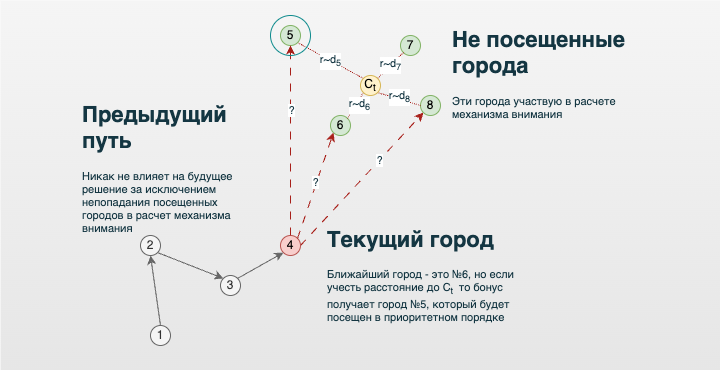
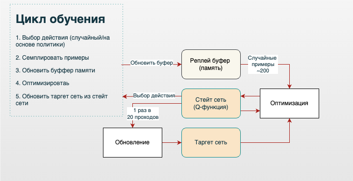

 

## Немного контекста 

Подходит к завершению серия моих заметок про использование идей искусственного интеллекта для решения задачи коммивояжера (TSP). Я последовательно разобрал некоторые классические решения TSP и далее [рассказал](/post/vnimanie_eto_vse_cto_nuzno_kommivoazeru) про реализацию знаковой архитектуры нейронной сети *Pointer Network* на базе механизма внимания. К сожалению, данная архитектура оказалась весьма непрактичной и слабой в сравнении с классическими методами. Однако можно было заметить важное свойство — способность к обобщению задачи, то есть способность генерировать решение для задачи, которую модель еще не видела. 

Далее я более подробно коснулся принципов работы [механизма внимания](/post/prosto_o_vnimanii) и [обучения с подкреплением](/post/a_ne_pora_li_nam_podkrepit_sa). Не уверен, но мне кажется, эти темы сейчас чуть ли не самые популярные. Вот, например, краткое описание реализации Chat GPT-o1:
> Технически GPT-o1 отличается использованием метода обучения с подкреплением, который позволяет модели улучшать свои способности к рассуждению путем получения обратной связи о правильности или ошибочности своих выводов. Это способствует более точному и обоснованному процессу принятия решений.

Магистральной идеей серии моих заметок являлось решение задачи TSP (задачи коммивояжера) различными алгоритмами, преимущественно доступными в виде описаний, значительно реже с исходным кодом. Теперь наступил черед опубликовать разбор своего собственного "велосипеда". Момент для автора трепетный, но неизбежный. Возможно, я просто исследовал тупиковую ветвь развития алгоритмов, но хочется конечно надеяться на обратное.

## Теория *Deep Q-learning (DQN)*

В прошлой [заметке](/post/a_ne_pora_li_nam_podkrepit_sa) мы говорили о том, что уравнение Беллмана помогает находить эффективные стратегии решения разнообразных задач, включая видеоигры и, конечно, TSP. Такая универсальность уже выглядит многообещающе, впрочем, данный подход можно дополнительно прокачать с помощью глубокого обучения. Это позволит обойти ограничение на количество рассматриваемых состояний, которые можно поместить в Q-таблицу. 

Другими словами, вместо оценки Q-таблицы можно обучать нейронную сеть или Q-функцию, которая будет аппроксимировать оптимальные решения. Вспомним формулу временной разности для уравнения Беллмана:

$$
Q_\theta(s, a) \leftarrow Q_\theta(s, a) + \alpha \left( r(s, a) + \gamma \max_{a^{\prime}} Q_\theta \left( s^{\prime}, a^{\prime} \right) - Q_\theta(s, a) \right)
$$

Данная формула очень напоминает градиентный спуск, где \[\alpha\] играет роль *learning rate*. Более того, условия сходимости здесь такие же, как и в стохастическом градиентном спуске. И, действительно, табличный вариант *Q-обучения* является градиентным спуском для решения некоторой задачи регрессии.

Поскольку это очень принципиальный момент, остановимся на нём подробнее. Пусть у нас есть текущая версия \[ Q_{\theta_k}(s, a) \], и мы хотим выполнить шаг метода простой итерации. Зададим следующую задачу регрессии:

- **Входом** является пара \[ s, a \] - состояние и действие.  
- **Искомым** значением \[\hat{y}\] на паре \[ s, a \] или правая часть уравнения оптимальности Беллмана будет: 

$$
\hat{y} := r(s, a) + \gamma \mathbb{E_{s'}} \max_{a'} Q_{θ_k}(s', a'),
$$
где  \[ \\mathbb{E_{s'}} \] означает усреднение будущих наград по всем возможным следующим состояниям \[ s' \] с учётом вероятностей переходов среды, \[\theta\] - параметры модели. 
- **Наблюдаемым** («зашумлённым») значением целевой переменной \[y\] или **таргетом** (target) будет:  

$$
y(s, a) := r(s, a) + \gamma \max_{a'} Q_{θ_k}(s', a'),
$$ 

где \[ s' \sim p(s' | s, a) \].  

- **Функцией потерь MSE**:  
$$
\text{Loss}(y, \hat{y}) = \frac{1}{2} (y - \hat{y})^2
$$

Таким образом, **наблюдаемые** значения мы берем из инференса «замороженной» по параметрам \[\theta_k\] глубокой модели плюс простые расчеты: выбираем максимум, умножаем на \[\gamma\] и суммируем с наградой. **Искомые** же значения -- это просто инференс глубокой модели, в которой активированы градиенты для минимизации потерь(*Loss*). Осталось только разобраться, что значит «замороженная» модель.

Заметим, что, как и в классической постановке задачи машинного обучения, значение целевой переменной — это её «зашумлённое» значение: по входу \[s, a\] генерируется \[s'\], затем от \[s'\] считается детерминированная функция, и результат \[y\] является наблюдаемым значением. Мы можем для данной пары \[s, a\] засемплировать себе таргет, взяв переход \[(s, a, r, s')\] и воспользовавшись семплом \[s'\], но существенно, что такой таргет — случайная функция от входа. Принципиально: согласно уравнениям Беллмана, мы хотим выучить математическое ожидание такого таргета, а значит, нам нужна квадратичная функция потерь.

Рассмотренное теоретическое объяснение перехода от табличных методов к нейросетевым, конечно, предполагает, что мы решаем задачу регрессии «полностью», обучая \[\theta\] при фиксированных \[\theta_k\]. «Замороженные» \[\theta_k\] соответствуют фиксированию формулы целевой переменной \[y(s, a)\], то есть фиксированию задачи регрессии. Так мы моделируем один шаг метода простой итерации, и только после этого объявляем выученные параметры модели \[\theta_{k+1} := \theta\]. В этот момент задача регрессии изменится (поменяется целевая переменная), и мы перейдём к следующему шагу метода простой итерации.

Однако в *Q-обучении*, как и во всех табличных методах, теория стохастической аппроксимации позволяла «сменять» задачу регрессии каждый шаг, используя свежие параметры модели при построении целевой переменной. Конечно, как только мы от «табличных параметрических функций» переходим к произвольным параметрическим семействам, все теоретические гарантии сходимости *Q-обучения* теряются (теоремы сходимости использовали «табличность» нашего представления Q-функции). Как только мы используем ограниченные параметрические семейства вроде нейросетей, неидеальные оптимизаторы вроде Адама или **не доводим каждый этап метода простой итерации до сходимости**, гарантий нет.

Но возникает вопрос: сколько шагов градиентного спуска тратить на решение фиксированной задачи регрессии? Возникает естественное желание по аналогии с табличными методами использовать для построения таргета свежую модель, то есть менять целевую переменную в задаче регрессии каждый шаг после каждого градиентного шага:

$$
y(s, a) := r + \gamma \max_a Q_\theta(s', a')
$$

**Принципиально важно**, что зависимость целевой переменной \[y(s, a)\] от параметров текущей модели \[\theta\] игнорировалась. Если вдруг в неё протекут градиенты, мы будем не только подстраивать прошлое под будущее, но и будущее под прошлое, что не будет являться корректной процедурой.

Эмпирически легко убедиться, что такой подход нестабилен, примерно от слова «совсем». Стохастическая оптимизация чревата тем, что после очередного шага модель может стать немного «сломанной» и некоторое время выдавать неудачные значения на ряде примеров. В обычном обучении с учителем этот эффект сглаживается большим количеством итераций: обучение на последующих мини-батчах «исправляет» предыдущие ошибки, и движение идёт в среднем в правильную сторону. Однако нет гарантий удачности каждого конкретного шага (на то это и стохастическая оптимизация). Здесь же, при неудачном шаге, сломанная модель может начать портить целевую переменную, на которую она же и обучается. Это приводит к цепной реакции: плохая целевая переменная начинает портить модель, которая, в свою очередь, портит целевую переменную... Этот эффект особенно ярко проявляется ещё и потому, что мы используем одношаговые целевые переменные, которые сильно смещены (слишком сильно опираются на текущую же аппроксимацию).

Для стабилизации процесса одну задачу регрессии нужно решать более чем за одну итерацию градиентного спуска: необходимо сделать хотя бы условно 100–200 шагов. Проблема в том, что если таргет строится по формуле \[ r + \gamma \max_a Q_\theta(s, a) \], то после первого же градиентного шага \[\theta\] поменяется.

Поэтому хранится копия \[Q\]-сети, называемая **таргет-сетью** (*target network*), единственная цель которой — генерировать таргеты текущей задачи регрессии для тренировок из засемплированных мини-батчей. Традиционно её параметры обозначаются \[\theta^-\]. Итак, целевая переменная в таких обозначениях генерируется по формуле:

$$
y(T) := r + \gamma \max_a Q_{\theta^-}(s', a')
$$

а раз в \[ K \] шагов веса \[\theta^-\] просто копируются из текущей модели с весами \[\theta\] для «задания» новой задачи регрессии.

## Специальный соус для TSP

Теперь необходимо подробнее коснуться архитектуры нейронной сети, которая будет аппроксимировать \[Q\]-функцию. В теории можно рассматривать простую полносвязную нейронную сеть с *ReLU* в качестве функции активации и *dropout* на выходе. Однако в данном вопросе можно себя не ограничивать и в экспериментальном кураже попробовать использовать, что угодно: *LSTM*, *convolution*-слои и даже целые *Decoder-Encoder + Attention*. 

Впрочем, ничего из перечисленного, кроме полносвязной сети, особо не заработало. При этом на вход подавались координаты текущего города без учёта того, какие города ещё нужно посетить. Здесь не нужно забывать про маску, которая топорно работает уже на самом выходе модели, обнуляя вероятности посещённых городов, но маска напрямую не влияет на параметры модели, а хотелось бы чтобы был механизм такого влияния.  

Кроме того, хорошо бы как-то использовать расстояние до оставшихся городов и также штрафовать за действия, которые оставляют *города-изгои* в стороне от текущей позиции. Такие города существенно ухудшают решения так как в конечном итоге их нужно посетить из невыгодного состояния, сделав логистический крюк с длинным плечом. В итоге родилось следующее решение с механизмом внимания, построенным на базе формулы:

$$
c_{t} = \sum_{t=1}^T \alpha (s_t, h_t)h_t, 
$$

где \[h_t\] — это вектор (эмбеддинг) ещё не посещённых городов, а \[s_t\] — текущее состояние или координаты в пространстве эмбеддинга. В данном случае механизм внимания на выходе формирует координаты некоторого центра внимания оставшихся городов, взвешенные на веса параметров градиента. Далее производится расчёт расстояний до оставшихся точек, и такие расстояния попадают в полносвязную нейронную сеть \[FFN\] с использованием *residual connection*. Полученный результат суммируется с простым вектором расстояний \[D(s_t, s_t')\] между текущим городом и оставшимися:

$$
Q_{\theta}(s_t, a_t) = FFN(D(c_{t}, s_t')) + D(c_{t}, s_t') - D(s_t, s_t'),
$$

где \[D(c_{t}, s_t')\] — расстояние от центра внимания до оставшихся городов. 

Таким образом, весьма прямолинейно учитывается эвристика выбора следующего города на базе расстояния, а также одновременно учитывается штраф/бонус за игнорирование/учёт *городов-изгоев*. 

Возникает вопрос: насколько такая архитектура будет универсальной для прочих задач? С учётом того, что алгоритм завязан на метрические расстояния, можно допустить универсальность для задач оптимизации на метрических пространствах, например по времени или расстоянию, как в задаче TSP. Конечно, такую универсальность требуется проверять и исследовать. Если алгоритм будет плохо справляться с прочими задачами оптимизации, типа логистической *VRP - Vehicle Routing Problem* или производственной *Flow Shop Scheduling Problem*, то смысл всех проделанных упражнений автоматически перетекает в категорию философскую.

## Практическая реализация *DQN* 

Ранее уже [упоминалось](/post/a_ne_pora_li_nam_podkrepit_sa), что *Q-обучение* и, следовательно, его прокачанный собрат *DQN* являются *off-policy*, то есть не требуется отслеживать опыт взаимодействия конкретной стратегии со средой. Это на практике позволяет работать с любыми семплами, в том числе из буфера памяти. 

На поверку буфер памяти в случае TSP не столько увеличил точность, сколько повысил стабильность алгоритма и дал некоторый выигрыш в скорости вычислений. В целом, *Q-обучение* и *DQN*, согласно теории, должны быть очень эффективны с точки зрения вычислений и семплирования: подразумевается, что можно брать мало семплов, и такие семплы не обязательно должны складываться в полный путь коммивояжера (полную игру). Достаточно, чтобы семплы покрывали все доступные состояния.

Теперь, когда все компоненты (Q-функция, таргет-сеть, реплей-буфер) на месте, можно зарисовать простую логическую архитектуру принципа работы *DQN*:

Также наглядно можно записать алгоритм в виде псевдокода:

> **Гиперпараметры:**
> - \[B \] — размер мини-батчей
> - \[K \] — периодичность апдейта таргет-сети
> - \[\varepsilon(t) \] — стратегия исследования
> - \[Q \] — нейросетка с параметрами \[\theta \], SGD-оптимизатор
>
> Инициализировать \[\theta \] произвольно
> Положить \[\theta^- := \theta \]
> Пронаблюдать \[s_0 \]
>
> **На очередном шаге \[t \]:**
> 1. Выбрать \[a_t \] случайно с вероятностью \[\varepsilon(t) \], иначе  
>   $$
>   a_t := \arg\max_{a_t} Q_{\theta}(s_t, a_t)
>   $$
> 2. Пронаблюдать \[r_t, s_{t+1}, \text{done}_{t+1} \]
> 3. Добавить пятёрку \[(s_t, a_t, r_t, s_{t+1}, \text{done}_{t+1}) \] в реплей буфер
> 4. Засемплировать мини-батч размера \[B \] из буфера
> 5. Для каждого перехода \[T = (s, a, r, s', \text{done}) \] посчитать таргет:
>  $$
>   y(T) := r + \gamma (1 - \text{done}) \max_{a'} Q_{\theta^-}(s', a')
>  $$
> 6. Посчитать лосс:
>     $$
>    \text{Loss}(\theta) := \frac{1}{B} \sum_T (Q_{\theta}(s, a) - y(T))^2
>     $$
> 7. Сделать шаг градиентного спуска по \[\theta \], используя \[\nabla_{\theta} \text{Loss}(\theta) \]
> 8. Если \[t \mod K = 0 \], то \[\theta^- \gets \theta \]

Терминология такого псевдокода почти полностью совпадает с терминами из [заметки про Q-обучение](/post/a_ne_pora_li_nam_podkrepit_sa), за исключением абстрактного оператора \[\text{done}\]. В данном случае речь идет об обработке терминального состояния, и моя реализация *DQN* работает аналогично табличному *Q-обучению*: предпоследний город получает штраф за переход в последний город и одновременно штраф за возвращение на исходную позицию. 

Нужно сказать, что базовая реализация *DQN* не является вершиной эволюции и может быть дополнительно прокачана до вариантов *Twin DQN* и *Noisy Nets*, что может способствовать улучшению стабильности и точности инференсов модели. 

Исходный код с нюансами реализации, в том числе реализация *Twin DQN* и *Noisy Nets*, остался за рамками данной заметки. Поэтому в качестве дополнительного материала можно использовать репозиторий проекта [AI optimization](https://github.com/dkibalnikov/ai_optimization).

## Примеры расчетов

Любопытно, что *DQN* выдает достаточно хорошие решения уже на первых итерациях замороженной таргет-сети.

}}index_files/figure-html/unnamed-chunk-1-1.png" width="720" />

Данное решение отличается всего на **3%** от оптимального, что внушает осторожные надежды на состоятельность архитектуры *DQN* для задач оптимизации. Интересно, сумеет ли данная архитектура обобщить свои знания и решить задачу TSP, которую модель ранее не видела?

}}index_files/figure-html/unnamed-chunk-2-1.png" width="720" />
**Оно работает !!!** 

## Тестирование

Касаемо точности, моя реализация **DQN** смогла лишь приблизиться, но не превзойти лучшие классические методы. Однако классические методы развиваются уже около 100 лет, тогда как технологии глубокого обучения начали свой эволюционный путь не так давно, и нужно хотя бы на это делать скидку.

}}index_files/figure-html/unnamed-chunk-3-1.png" width="720" />
С точки зрения скорости вычислений **DQN** расположился где-то между *PointerNet* и *Q-обучением*

}}index_files/figure-html/unnamed-chunk-4-1.png" width="720" />
## Итоги 

Архитектура **DQN** со специальным соусом на базе механизма внимания способна генерировать неплохие решения для TSP (задачи коммивояжера). Возможно, это не лучшие решения, но уже достаточно интересные. Кроме того, данная архитектура демонстрирует **способность обобщать знания** и генерировать достойные решения для задач, с которыми модель ранее не сталкивалась.

---

Полезные ссылки: 

- [Reinforcement Learning](https://d2l.ai/chapter_reinforcement-learning/index.html) -- теория **DQN** взята из этой замечательной книги
- [Reinforcement Learning (DQN) Tutorial](https://pytorch.org/tutorials/intermediate/reinforcement_q_learning.html) -- решение задачи **CartPole** методом *DQN* на Python 
- [AI optimization](https://github.com/dkibalnikov/ai_optimization) -- репозиторий алгоритмов оптимизации 

---

Простой способ узнать о новых публикациях – подписаться на Telegram-канал:

<a href="https://t.me/investcookies" target="_blank" rel="noopener noreferrer me">
🍪🍪🪙 InvestCookies 
<svg xmlns="http://www.w3.org/2000/svg" viewBox="0 0 24 24" fill="none" stroke="currentColor" stroke-width="2"
    stroke-linecap="round" stroke-linejoin="round">
    <path
        d="M21.198 2.433a2.242 2.242 0 0 0-1.022.215l-8.609 3.33c-2.068.8-4.133 1.598-5.724 2.21a405.15 405.15 0 0 1-2.849 1.09c-.42.147-.99.332-1.473.901-.728.968.193 1.798.919 2.286 1.61.516 3.275 1.009 4.654 1.472.509 1.793.997 3.592 1.48 5.388.16.36.506.494.864.498l-.002.018s.281.028.555-.038a2.1 2.1 0 0 0 .933-.517c.345-.324 1.28-1.244 1.811-1.764l3.999 2.952.032.018s.442.311 1.09.355c.324.022.75-.04 1.116-.308.37-.27.613-.702.728-1.196.342-1.492 2.61-12.285 2.997-14.072l-.01.042c.27-1.006.17-1.928-.455-2.474a1.654 1.654 0 0 0-1.034-.407z" />
</svg>
</a>

