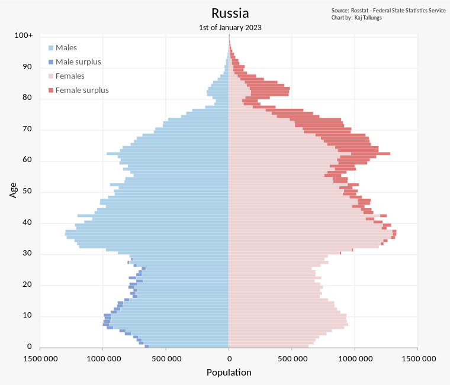

```{r setup, include=FALSE, echo=FALSE, warning=FALSE, message=FALSE}
knitr::opts_chunk$set(echo = FALSE, message = FALSE, warning = FALSE, error = FALSE, fig.width=7.5)

# Активируем тему для блога
thematic::thematic_rmd(bg = "#1D1E20", accent = "firebrick", fg = "grey90", 
                       font = thematic::font_spec("Roboto"), # sequential = firatheme::firaPalette(100), 
                       qualitative = palette.colors(palette = "Tableau")) 

# Сохраняем палитру в отдельную переменную
my_pal <- palette.colors(palette = "Tableau") |> unname() 

my_ggplot <- function(dt, ...){
  ggplot(dt, ...) +
    ggpp::annotate("text_npc", npcx = .5, npcy = .5, alpha = .9, size = 10, label = "InvestCookies.ru", color = "#1D1E20")
}

```

## Моя версия 

Поговорим о серьезном. Летом в разгар отпусков РОССТАТ имеет обыкновение публиковать демографическую стату для предыдущего года, а это значит, становится возможным сделать расчеты избыточной смертности. Настоящая заметка на 100% соответствует заголовку т.е. далее на основе официальных данных РОССТАТА будет произведен **расчет избыточной смертности мужского населения призывного возраста**, не больше, не меньше. 

Факторы или причины такой избыточной смертности установить из официальных данных в настоящий момент не представляется возможным, хотя спекуляции вокруг этого вопроса продолжают активно резонировать в интернетах. Речь идет о [публикации](https://meduza.io/feature/2023/07/10/47-tysyach-pogibshih-rossiyskih-soldat) информационного агенства "Медуза", которое по совместительству является иностранным агентом. Медуза делает свои расчеты на основе базы наследственных дел, которая публично не доступна т.е. что-либо подтвердить или опровергнуть в их расчетах по существу нельзя. Поэтому с исследовательской точки зрения можно просто игнорировать эту беллетристику как не заслуживающую какого-либо внимания. 

Кроме того, Медуза также ссылается на некое [исследование](https://github.com/dkobak/excess-mortality-war) Дмитрия Кобака, которое использует "официально запрошенные данные у РОССТАТА". Формально говоря, речь не идет об исследовании, а скорее о каких-то набросках кода в Jupyter notebook и некие спорадические [пояснения](https://kobak.livejournal.com/130440.html) т.е. назвать это творение серьезным исследованием -- даже язык не поворачивается. С моей точки зрения, ссылка на такое якобы исследование -- это серьезное пятно на репутации журналистов, которое я оставлю на совести этих самых журналистов. Естественно, не могли не появиться публикации с критикой расчетов Медузы [тут](https://aftershock.news/?q=node%2F1265781) или [тут](https://dzen.ru/a/ZK7xbWqfnCXTbROc). 

У меня нет желания дискутировать по всем допущением, сделанным Кобаком, которые собственно не были объявлены как допущения и многое просто пришлось бы додумывать самостоятельно. Вместо этого я сделаю расчет собственной модели с указанием всех сделанных допущений и описанием логики, которая вкладывалась в эти допущения. Я искренне полагаю мой подход -- является более честным, объективным и приближенным к стандартам написания исследовательских статей. 

## Методика

Любое исследование начинается с предметной области.  Очевидно, я не являюсь специалистом по демографии, как впрочем и [Кобак](https://dkobak.github.io), но я потратил определенные усилия и время для того чтобы разобраться как это устроено. Без понимания определенного набора базовых принципов расчеты избыточной смертности не могут быть корректными. 

1. Первый очевидный вопрос, возникающий в голове -- это, что собственно собой представляет избыточная смертность? *Избыточная* по отношению к чему? Какой эталон следует использовать, относительно которого возникает избыточность? Естественно, возникает соблазн взять какой-нибудь год из прошлого и сделать сравнение относительно такого года, но какой год взять? Какой год можно назвать абсолютно обычным и ничем непримечательным, который можно использовать в качестве эталона? Почему-то приходит в голову новогоднее выступление президента, где он сообщает, что прошел самый обычный и ничем не примечательный год, в котором все было в меру хорошо и плохо. В действительности, избыточную смертность приходится считать относительно модельного (прогнозного) значения в духе: "что было-бы если ..?". Кобак предложил использовать в качестве ориентира соотношение мужской и женской смертности. Объективно, такой подход не является идеальным, но это лучше чем ничего.  

2. Задача оценки эталонного значения мужской смертности 2022 года была бы значительно легче, если бы не было COVID-19, который очень прилично расколбасил тренды смертности и также соотношения для мужчин и женщин. Обычно исследователи в меру своих знаний и испорченности выбирают линейку, по которой делается прогноз. Медуза с Кобаком поступили относительно просто: выкинули 2020 и 2019 годы из рассмотрения и взяли обычную линейку с прямой линией для периода с 2015-2019 годы. Я считаю такой подход весьма странным и сомнительным. Дело в том, что COVID-19 способен избирательно поражать мужское население, о чем много написано в научных статьях, например [тут](https://link.springer.com/article/10.1186/s12879-021-06536-3) или [тут](https://www.frontiersin.org/articles/10.3389/fpubh.2020.00152/full?fbclid=IwAR0j28d7CvO1w_CKJyFyyaE4PkjERGrRNZQe4TdNo_XmBSQ_H-8ZQM_pjZ4). Очевидно, 2022 год **включает в себя эффекты от COVID-19**: либо напрямую в виде числа заболевших, либо в виде пост-ковидного синдрома, что искажает пропорции смертности мужского и женского населения. Поэтому просто выкинуть два года COVID-19 из расчетов не получится. Напомню, что пик заболеваемости пришелся именно на 2022 год, но многие этого просто не заметили т.к. тема COVID-19 была полностью вытеснена из инфопространства другой волнительной темой:

```{r}
library(tidyverse) # набор пакетов с простым для понимания синтаксисом
library(gganimate) # для создания анимированных диаграмм 
library(mgcv) # пакет для моделирования нелинейных процессов 
```

```{r, cache=TRUE}
covid19 <- quietly(COVID19::covid19)("Russia")$result
```

```{r}
# Динамика COVID-19
covid19 %>% 
  select(date, confirmed, deaths) %>% 
  mutate(across(-date, ~.-lag(.))) %>% 
  drop_na() %>% 
  my_ggplot(aes(date)) + 
  geom_line(aes(y=confirmed, col="Заражения")) + 
  geom_line(aes(y=deaths*1e2, col="Смерти")) + 
  geom_label(data = ~slice_max(., confirmed, n=1), 
             aes(date, confirmed, label=paste0("Пик заболеваемости: \n", date, ", ", confirmed, " чел."), col = "Заражения"), vjust=1, hjust=-0.1) +
  geom_point(data = ~slice_max(., confirmed, n=1), aes(date, confirmed), col = "white", alpha=.1, size=8) +
  scale_color_manual(values=c("Заражения"=my_pal[2], "Смерти"=my_pal[3])) + 
  scale_y_continuous(sec.axis = sec_axis(~./1e2, name = "Смерти, человек")) + 
  labs(title = "Динамика COVID-19", y = "Заболевания, человек", x ="День") +
  theme(legend.position = "none", axis.title.y.left = element_text(color=my_pal[2]), axis.title.y.right = element_text(color=my_pal[3]),
        axis.text.y.left = element_text(color=my_pal[2]), axis.text.y.right = element_text(color=my_pal[3]),
        axis.ticks.y.left = element_line(color=my_pal[2]), axis.ticks.y.right = element_line(color=my_pal[3]))
```

3. Смертность возрастной группы определяется не только количеством смертей, но и численностью представителей этой группы. Дело в том, что распределение численности населения по возрастам -- не является однородным. Вот соответствующая картинка из Википедии:

На демографической елочке хорошо видна яма у возрастной группы от 11 до 33 лет т.е. у молодых людей, которые родились в период с 1990 года по 2012 годы. Возрастная группа 30-40 чуть ли не в два раза больше группы 20-30 -- такое явление можно назвать своеобразным эхо 90-х годов, отраженное в демографической стате. Предлагаю оживить эту картинку с использованием официальных данных РОССТАТА, которые потребуются в дальнейшем для расчета количества избыточных смертей: 

```{r, cache=TRUE}
# Загрузка данных из РОССТАТА
male <- quietly(fedstatAPIr::fedstat_data_load_with_filters)("31548")$result 
female <- quietly(fedstatAPIr::fedstat_data_load_with_filters)("33459")$result 
dth <- quietly(fedstatAPIr::fedstat_data_load_with_filters)("30974")$result 
```

```{r, cache=TRUE}
# Возрасты которые попадают в исследование
vozr <- c("10-14 лет", "15-19 лет", "20-24 лет", "25-29 лет", "30-34 лет", "35-39 лет", 
          "40-44 лет", "45-49 лет", "50-54 лет", "55-59 лет", "60-64 лет", "65-69 лет", 
          "70-74 лет", "75-79 лет")

unmilitary_age <- c("05-9 лет", "10-14 лет", "45-49 лет", "50-54 лет", "55-59 лет", "60-64 лет", "65-69 лет", "70-74 лет", "75-79 лет")
military_age <- c("15-19 лет", "20-24 лет", "25-29 лет", "30-34 лет", "35-39 лет", "40-44 лет")

pop1 <- rbind(as.tibble(male) %>% mutate(S_GRUP_2="Мужчины"), 
              as.tibble(female) %>% mutate(S_GRUP_2="Женщины")) %>% 
  mutate(s_vozr = recode(s_vozr, "20-24" = "20-24 лет", "5-9 лет"="05-9 лет"),
         year=as.integer(Time) - 1,
         year=as.integer(Time), 
         value = as.double(ObsValue)) %>% 
  filter( s_vozr %in% c("0-4 года", "05-9 лет", vozr, "80-84 лет", "85-89 лет", "90-94 лет", "95-99 лет") & 
           s_OKATO_code=="643") %>% 
  select(year, s_vozr, S_GRUP_2, s_mest, pop=value) %>% 
  distinct(s_vozr, S_GRUP_2, s_mest, year, .keep_all = TRUE)

p <- filter(pop1, s_mest =="все население") %>% 
  mutate(way2pop=if_else(S_GRUP_2 == "Мужчины", -pop, pop)) %>% 
  my_ggplot() + 
  geom_col(aes(s_vozr, way2pop, fill = S_GRUP_2), alpha=.4) + 
  geom_col(data = ~group_by(., year, s_vozr) %>% summarise(min_pop=min(pop)), 
           aes(s_vozr, y=min_pop), fill = "white", alpha = .1) + 
  geom_col(data = ~group_by(., year, s_vozr) %>% summarise(min_pop=min(pop)), 
           aes(s_vozr, y=-min_pop), fill = "white", alpha = .1) + 
  scale_y_continuous(labels = scales::label_number(scale = 1e-6, style_negative =  "parens"), n.breaks = 10) + 
  coord_flip() +
  scale_fill_manual(values =my_pal[c(3,1)])+
  transition_time(year) + 
  labs(title = "Демографическое распределние по полу и возрасту", subtitle = "Год: {frame_time}", 
       x = "Возрастная группа", fill = "Пол", y = "Численность, млн.", 
       caption = "Повышенной яркостью показаны превышения численности одного пола над другим")

animate(p, renderer = gifski_renderer())
```

3. Поло-возрастная структура пришла в движение и показывает волнообразную динамику т.е. более юные возрастные группы с течением времени заменяют старшие. Выходит так, что сравнивать текущий год с предыдущими по количеству смертей не имеет смысла т.к. в прошлом году условно в группе могло быть 100 человек, а в этом году только 50 и 5 смертей в прошлом году означали 5% смертности, а в текущем уже 10%. Для того чтобы исключить фактор демографических волн можно просто использовать готовые сведения РОССТАТа по смертности или рассчитать смертность самостоятельно путем деления количества смертей в группе на размер такой группы. В продолжении этой идеи не буду сдерживаться и сразу выскажусь о нехороших людях, которые пытаются анализировать динамику смертности и рождаемости без учета возрастной структуры. Дети не появляются сами по себе, для них нужны женщины фертильного возраста: если таких женщин стало меньше из-за демографической ямы -- это еще не означает, что произошла какая-то трагедия сейчас, но означает, что она произошла 30 лет назад. Аналогично, при увеличении доли пожилого населения супротив молодого, удельная смертность на 1000 человек будет расти без каких-либо ужасных-ужасных событий. Именно поэтому демографы используют понятие фертильности и ожидаемой продолжительности жизни, которые позволяют изолировать фактор неоднородности демографических волн. 

4. РОССТАТ дает данные в разрезе городского и сельского населения, что можно использовать для получения более точных результатов и я планирую этим воспользоваться, попутно проверив гипотезу о большем росте смертности среди мужского сельского населения.

5. Если призадуматься, то понятие "призывной возраст" -- не является чем-то достаточно хорошо определенным. Действительно, в вооруженных силах служат и рядовые и офицеры, при этом возраст последних может быть весьма преклонным. Я считаю важным учитывать всю картину целиком и не ограничиваться возрастом в 59 лет, что позволит получить более объективную картину происходящего. 

## Данные и код 

Данные извлекались непосредственно из официального сайта [РОССТАТА](https://www.fedstat.ru/) с помощью пакета `fedstatAPIr`, соавтором которого я являюсь. Для исследования использовались следующие наборы данных: 

- [Численность постоянного населения - мужчин по возрасту на 1 января](https://www.fedstat.ru/indicator/31548)
- [Численность постоянного населения - женщин по возрасту на 1 января](https://www.fedstat.ru/indicator/33459)
- [Возрастные коэффициенты смертности](https://www.fedstat.ru/indicator/30974)

Как обычно в моих заметках, исходный код можно легко воспроизвести путем простого копирования и исполнения на собственной машине. Вся обработка специально написана на простом синтаксисе с комментариями для максимального снижения порога входа в тему. 

## Смертность 

РОССТАТ дает готовые данные по смертности в разрезе возрастных групп, пола и типа населения:

```{r, fig.height=7}
dth1 <- as.tibble(dth) %>% 
  mutate(s_vozr = recode(s_vozr, "20-24" = "20-24 лет"),
         year=as.integer(Time), 
         value = as.double(ObsValue)) %>% 
  filter(s_vozr %in%  vozr & 
           S_GRUP_2!="Оба пола" & 
           s_mest !="все население" & 
           s_OKATO_code=="643") %>% 
  select(year, s_vozr, S_GRUP_2, s_mest, dth=value) %>% 
  distinct(s_vozr, S_GRUP_2, s_mest, year, .keep_all = TRUE)

filter(dth1, s_vozr %in%  military_age) |> 
  my_ggplot(aes(year, dth, col=s_vozr, group=s_vozr)) + 
  geom_line() +
  scale_x_continuous(n.breaks = 10) + 
  scale_y_continuous(labels = scales::label_comma(accuracy = 1, suffix = "‰"), n.breaks = 8) +
  facet_grid(S_GRUP_2~s_mest, scales = "free") + 
  scale_color_viridis_d(direction = -1, begin = .2) + 
  labs(title = "Смертность от всех причин для возрастных групп от 15 до 44 лет", 
       y = "Смертность, промилле", x = "Год", col = "") + 
  theme(legend.position = "bottom")

```

При беглом просмотре не возникает сомнения, что в 2022 году присутствует контр-трендовый подъем смертности, при этом для сельского населения этот эффект более выражен чем для городского. Женская смертность напротив -- такого эффекта не имеет. Также длинный временной ряд с 1990 года наглядно демонстрирует гораздо более драматические периоды жизни страны: весь этот лютый период ковида и СВО даже близко не напоминает ту дичь, которая была в 90-е. Таким образом, явление избыточной смертности в 2022 году визуально хорошо фиксируется, но без количественной оценки сложно понять насколько такой эффект значим.  

## Отношение мужской смертности к женской 

Напоминаю, что для оценки эталонной смертности среди мужского населения в качестве ориентира предполагается использовать женскую смертность. К сожалению, соотношение мужской и женской смертности вряд ли можно назвать стабильным: такое соотношение может менять тренд со временем, а для разных возрастных групп тренды вовсе могут иметь разные направленности.  

```{r, fig.height=12}
dth_ratio <- dth1 |> 
  pivot_wider(id_cols = c("year", "s_vozr", "s_mest"), names_from = "S_GRUP_2", values_from = "dth") %>% 
  mutate(ratio=Мужчины/Женщины)

pred_period <- 1990:2023

mdl <- dth_ratio %>% 
  filter(year < 2022) %>% 
  nest_by(s_vozr, s_mest) %>% 
  mutate(mdl = list(gam(ratio ~ s(year, bs = "cs"), data=data) |> predict.gam(tibble(year=pred_period), se.fit = T)),
         fit = list(mdl$fit),
         upr = list(mdl$fit + 2*mdl$se.fit),
         lwr = list(mdl$fit - 2*mdl$se.fit)) %>% 
  reframe(year = pred_period, fit=as.vector(fit), upr=as.vector(upr), lwr=as.vector(lwr))
  
full_join(dth_ratio, mdl, by = c("s_vozr", "s_mest", "year")) %>% 
  my_ggplot(aes(year, ratio, col=s_vozr)) +
  geom_line() +
  geom_line(aes(y = fit), lty = 5, size = .5) +
  geom_ribbon(aes(ymin = lwr, ymax = upr, fill=s_vozr), alpha = .2, fill = my_pal[6], col =NA) +
  scale_x_continuous(n.breaks = 10) + 
  annotate(geom = "rect", xmin = 2021.5, xmax = 2023, ymin= -Inf, ymax = Inf, fill = my_pal[2], alpha = .2) +
  annotate(geom = "rect", xmin = 2019.5, xmax = 2021.5, ymin= -Inf, ymax = Inf, fill = my_pal[3], alpha = .2) +
  scale_color_viridis_d(direction = -1, begin = .3) + 
  scale_y_continuous(labels = scales::label_comma(accuracy = .1), n.breaks = 5) +
  facet_grid(s_vozr~s_mest, scales = "free") + 
  xlim(2003, 2023) +
  labs(title = "Соотношение смертности мужского и женского населения", col = "", x = "Год", y = "Отношение мужской к женской смертности") + 
  theme(legend.position = "bottom")
```

Молодые возрастные группы `10-14 лет`, `15-19 лет` характеризуются большим разбросом (дисперсией) соотношения смертности вокруг тренда, показанного пунктиром. В возрастных группа с 20 по 34 года видна явная аномалия, которая, вероятно связана с боевыми действиями при этом эффект опять же более выражен для сельского населения. Кроме того, весьма заметным и примечательным оказался контр-трендовый рост соотношения смертности для возрастных групп с 50 до 74 лет с пиком приблизительно в районе `70-74 лет`, что уже совсем трудно увязать с боевым возрастом. Похоже, первый год пандемии одинаково сказался на женском и мужском населении т.е. тренд в данных возрастных группах существенно не изменился, но вот 2021 год заметно изменил соотношение: женское население пострадало более выражено. Далее в 2022 году наблюдается компенсирующая динамика и соотношение частично возвращается на тренд.  Сложно сказать с чем связана такая динамика, но допускаю, что так проявляется действие различных штаммов вируса и также пост-ковидный синдром. Как бы то ни было, **на соотношение мужской и женской смертности влияет что-то иное кроме СВО.**

Оценка тренда производилась для периода, не включающего 2022 год путем построения кубического сплайна с базовыми настройками. Такое сглаживание "ловит" изменение тренда уже на второй-третий год после смены тренда и поэтому может быть использовано для прогноза на 2 года вперед, не более, что собственно и нужно для данной задачи. 

Если на базе такой модели сделать расчет избыточной смертности, то получится приблизительно следующая картинка: 
```{r}
res1 <- full_join(dth_ratio, mdl, by = c("s_vozr", "s_mest", "year")) %>% 
  left_join(filter(pop1, S_GRUP_2 =="Мужчины"), by = c("s_vozr", "s_mest", "year"), suffix = c("", "")) %>% 
  filter(year==2022) %>% 
  mutate(delta = ratio-fit,
         exces_dth=delta*Женщины*pop/1000,
         exces_dth_upr=(ratio-lwr)*Женщины*pop/1000,
         exces_dth_lwr=(ratio-upr)*Женщины*pop/1000)

select(res1, s_vozr, s_mest, exces_dth, exces_dth_upr, exces_dth_lwr) %>%
  my_ggplot(aes(s_vozr, exces_dth, fill = s_mest)) +
  geom_col(alpha=.5, position = "dodge") +
  geom_errorbar(aes(ymin = exces_dth_lwr, ymax = exces_dth_upr, col = s_mest), position = "dodge") +
  labs(title = "Количество избыточных смертей без исключения пост-ковидного синдрома",
       y = "Количество смертей", x="Возрастные группы", fill ="", col ="",
       caption = "Скобками показаны доверительные интервалы") +
  theme(legend.position = "bottom", axis.text.x = element_text(angle = 45))
```

Распределение количества смертей по возрастам, рассчитанное по соотношению мужской смертности и женской, имеет явно-выраженную двойную модальность: малый пик соответствует возрастной группе `30-34 лет` и большой пик `60-64 лет`. Логично предположить, что малый пик связан с избыточной смертностью от боевых действий тогда как большой -- есть проявление пост-ковидных процессов. Напоминаю, что старшие возрастные группы имеют в разы большую смертность чем младшие и поэтому второй пик значительно больше первого. Другими словами, как только мы вступаем на территорию возраста `40-44 лет` и выше возникает необходимость очень аккуратно работать с цифрами.  Определенно, такая модель не годится для оценки избыточной смертности среди мужчин призывного возраста и необходимо делать поправку чтобы исключить эффект пост-ковидного периода. 

## Поправка на пост-ковидный синдром

Допустим, что возрастные категории `10-14 лет` и также группы старшие 45 лет не испытывают влияния СВО и поэтому можно сделать интерполяцию, которая будет учитывать пост-ковидный синдром. Все это выглядит не самым красивым образом с точки зрения моделирования, но если есть задача оценки избыточной смертности, то эту задачу нужно как-то решать. На мой взгляд, совсем не учитывать данный эффект будет гораздо хуже. Еще одна модель естественно добавляет неопределенности и поэтому для конечного результата придется расширить доверительные интервалы. 

```{r}
res1 %>% 
  my_ggplot(aes(s_vozr, delta, col = s_mest, group=s_mest)) + 
  annotate(geom = "rect", xmin = "15-19 лет", xmax = "44-44 лет", ymin= -Inf, ymax = Inf, fill = my_pal[6], alpha = .2) +
  annotate(geom = "text", x = "30-34 лет", y = Inf, label = "Модель компенсации\nCOVID-19", vjust = 1, col = my_pal[6]) +
  geom_line() + 
  geom_point(data=~filter(., s_vozr%in% unmilitary_age)) + 
  stat_smooth(data=~filter(., s_vozr%in% unmilitary_age),  
              method = "gam", fullrange = TRUE, lty = 5, size = .5, formula = y ~ splines::ns(x, 4)) + 
  scale_y_continuous(labels = scales::label_comma(accuracy = .1, suffix = "‰"), n.breaks = 8) +
  labs(title = "Отклонение фактической смертности от эталонной по возрастным группам", y ="Отклонение, промилле",
       x="Возрастная группа", col="", fill="") +
  theme(legend.position = "bottom", axis.text.x = element_text(angle = 45))
```

Модельная кривая находится в диапазоне от группы `10-14 лет` до группы `45-49 лет` и дает поправку на эффект резкого роста соотношения мужской и женской смертности как последствие COVID-19. Итоговый результат выглядит следующим образом:  

```{r}
mdl_fix <- res1 %>% 
  mutate(age_lvl = factor(s_vozr)) %>% 
  filter(s_vozr%in% unmilitary_age) %>% 
  nest_by(s_mest) %>% 
  mutate(mdl = list(gam(delta ~ splines::ns(as.integer(age_lvl), 4), data=data) |> predict.gam(tibble(age_lvl=1:14), se.fit = T)),
         fix_fit = list(mdl$fit),
         fix_upr = list(mdl$fit + 2*mdl$se.fit),
         fix_lwr = list(mdl$fit - 2*mdl$se.fit)) %>% 
  reframe(age_lvl = 1:14, fix_fit = as.vector(fix_fit), fix_upr=as.vector(fix_upr), fix_lwr=as.vector(fix_lwr)) %>% 
  mutate(s_vozr = factor(age_lvl, labels = vozr) %>% as.character()) %>% 
  select(-age_lvl)

res2 <- left_join(res1, mdl_fix, by = c("s_mest", "s_vozr")) %>% 
  mutate(delta = ratio-fit-fix_fit,
         exces_dth=delta*Женщины*pop/1000,
         exces_dth_upr=(ratio-lwr-fix_lwr)*Женщины*pop/1000,
         exces_dth_lwr=(ratio-upr-fix_upr)*Женщины*pop/1000)
  
select(res2, s_vozr, s_mest, exces_dth, exces_dth_upr, exces_dth_lwr) %>%
  filter(s_vozr %in% c(military_age, "45-49 лет", "50-54 лет")) %>%
  my_ggplot(aes(s_vozr, exces_dth, fill = s_mest)) +
  geom_col(alpha=.5, position = "dodge") +
  geom_errorbar(aes(ymin = exces_dth_lwr, ymax = exces_dth_upr, col = s_mest), position = "dodge") +
  labs(title = "Количество избыточных смертей с исключением пост-ковидного синдрома",
       y = "Количество смертей", x="Возрастные группы", fill ="", col ="",
       caption = "Скобками показаны доверительные интервалы")+
  theme(legend.position = "bottom", axis.text.x = element_text(angle = 45))
```

Получено относительно однородное распределение, которое показывает логичное сокращение избыточной смертности по мере увеличения возраста, начиная с группы `30-34 лет`. Возрастные группы `15-19 лет` и `20-24 лет`, очевидно, рядового состава ВС в большей степени содержат сельское население. Возрастная группа `40-44 лет`, вероятно, соответствует офицерским чинам и содержит практически только городское население. Никаких аномальных эффектов в виде второго пика для возраста `45-49 лет`, наблюдаемый у Кобака, данная модель не показывает.

Таким образом, моя оценка количества избыточных смертей среди мужчин призывного возраста составляет **17310 ± 11091** для 95% доверительного интервала с учетом исключения фактора COVID-19. Как становится понятным, доверительные интервалы достаточно внушительные и включают цифры, озвученные официальными властями и также оценку Кобака. В данном случае ничего не попишешь, какая модель -- такая и точность. Пришлось сделать очень много допущений по пути чтобы получить итоговую оценку.

## Выводы 

1. Оценка избыточной смертности для 2022 года не может производиться без учета фактора COVID-19 т.к. пик заболеваемости пришелся на 11 февраля 2022 года, чего многие просто-напросто не заметили
2. Моя оценка количества избыточных смертей среди мужчин призывного возраста составляет **17310 ± 11091** для 95% доверительного интервала

---

<details>
<summary>Исходный код заметки</summary>

```{r, eval=FALSE, echo = TRUE}
library(tidyverse) # набор пакетов с простым для понимания синтаксисом
library(gganimate) # для создания анимированных диаграмм 
library(mgcv) # пакет для моделирования нелинейных процессов 

covid19 <- COVID19::covid19("Russia")

# Динамика COVID-19
covid19 %>% 
  select(date, confirmed, deaths) %>% 
  mutate(across(-date, ~.-lag(.))) %>% 
  drop_na() %>% 
  my_ggplot(aes(date)) + 
  geom_line(aes(y=confirmed, col="Заражения")) + 
  geom_line(aes(y=deaths*1e2, col="Смерти")) + 
  geom_label(data = ~slice_max(., confirmed, n=1), 
             aes(date, confirmed, label=paste0("Пик заболеваемости: \n", date, ", ", confirmed, " чел."), col = "Заражения"), 
             vjust=1, hjust=-0.1) +
  geom_point(data = ~slice_max(., confirmed, n=1), 
             aes(date, confirmed), col = "white", alpha=.1, size=8) +
  scale_color_manual(values=c("Заражения"=my_pal[2], "Смерти"=my_pal[3])) + 
  scale_y_continuous(sec.axis = sec_axis(~./1e2, name = "Смерти, человек")) + 
  labs(title = "Динамика COVID-19", y = "Заболевания, человек", x ="День") +
  theme(legend.position = "none", 
        axis.title.y.left = element_text(color=my_pal[2]), 
        axis.title.y.right = element_text(color=my_pal[3]),
        axis.text.y.left = element_text(color=my_pal[2]), 
        axis.text.y.right = element_text(color=my_pal[3]),
        axis.ticks.y.left = element_line(color=my_pal[2]), 
        axis.ticks.y.right = element_line(color=my_pal[3]))

# Загрузка данных из РОССТАТА
male <- fedstat_data_load_with_filters("31548") # мужчины 
female <- fedstatAPIr::fedstat_data_load_with_filters)("33459") # женщины 
dth <- fedstatAPIr::fedstat_data_load_with_filters)("30974") # смертность

# Возрасты которые попадают в исследование
vozr <- c("10-14 лет", "15-19 лет", "20-24 лет", "25-29 лет", "30-34 лет", "35-39 лет", 
          "40-44 лет", "45-49 лет", "50-54 лет", "55-59 лет", "60-64 лет", "65-69 лет", 
          "70-74 лет", "75-79 лет")

# Предполагаемый не призывной возраст
unmilitary_age <- c("05-9 лет", "10-14 лет", "45-49 лет", "50-54 лет", "55-59 лет", "60-64 лет", 
                    "65-69 лет", "70-74 лет", "75-79 лет")
# Предполагаемый призывной возраст
military_age <- c("15-19 лет", "20-24 лет", "25-29 лет", "30-34 лет", "35-39 лет", "40-44 лет")

# Подготовка данных по численности населения
pop1 <- rbind(as.tibble(male) %>% mutate(S_GRUP_2="Мужчины"), 
              as.tibble(female) %>% mutate(S_GRUP_2="Женщины")) %>% 
  mutate(s_vozr = recode(s_vozr, "20-24" = "20-24 лет", "5-9 лет"="05-9 лет"), # перекодировка некоторых значений для стандартизации
         year=as.integer(Time) - 1, # численность населения дано на начало года т.е. фактически за предыдущий
         value = as.double(ObsValue)) %>% 
  filter( s_vozr %in% c("0-4 года", "05-9 лет", vozr, "80-84 лет", "85-89 лет", "90-94 лет", "95-99 лет") & # фильтрация по возрастным группам
           s_OKATO_code=="643") %>% # исключение данных по регионам, используются только данные РФ
  select(year, s_vozr, S_GRUP_2, s_mest, pop=value) %>% 
  distinct(s_vozr, S_GRUP_2, s_mest, year, .keep_all = TRUE) # исправление повторов

# Анимированная диаграмма со структурой населения по полу и возрасту
p <- filter(pop1, s_mest =="все население") %>% 
  mutate(way2pop=if_else(S_GRUP_2 == "Мужчины", -pop, pop)) %>% 
  my_ggplot() + 
  geom_col(aes(s_vozr, way2pop, fill = S_GRUP_2), alpha=.4) + 
  geom_col(data = ~group_by(., year, s_vozr) %>% summarise(min_pop=min(pop)), 
           aes(s_vozr, y=min_pop), fill = "white", alpha = .1) + 
  geom_col(data = ~group_by(., year, s_vozr) %>% summarise(min_pop=min(pop)), 
           aes(s_vozr, y=-min_pop), fill = "white", alpha = .1) + 
  scale_y_continuous(labels = scales::label_number(scale = 1e-6, style_negative =  "parens"), n.breaks = 10) + 
  coord_flip() +
  scale_fill_manual(values =my_pal[c(3,1)])+
  transition_time(year) + 
  labs(title = "Демографическое распределние по полу и возрасту", subtitle = "Год: {frame_time}", 
       x = "Возрастная группа", fill = "Пол", y = "Численность, млн.", 
       caption = "Повышенной яркостью показаны превышения численности одного пола над другим")

animate(p, renderer = gifski_renderer())

# Подготовка данных по смертности 
dth1 <- as.tibble(dth) %>% 
  mutate(s_vozr = recode(s_vozr, "20-24" = "20-24 лет"), # перекодировка некоторых значений для стандартизации
         year=as.integer(Time), 
         value = as.double(ObsValue)) %>% 
  filter(s_vozr %in% vozr & # фильтрация по возрастным группа, интересным для исследования
           S_GRUP_2!="Оба пола" & # исключение агрегированной статистики по сумме двух полов 
           s_mest !="все население" & # исключение агрегированной статистики по сумме всех типов насления (городского, сельского)
           s_OKATO_code=="643") %>% # исключение данных по регионам, используются только данные РФ
  select(year, s_vozr, S_GRUP_2, s_mest, dth=value) %>% 
  distinct(s_vozr, S_GRUP_2, s_mest, year, .keep_all = TRUE) # исправление повторов

# Диаграмма смертности  
filter(dth1, s_vozr %in%  military_age) |> 
  my_ggplot(aes(year, dth, col=s_vozr, group=s_vozr)) + 
  geom_line() +
  scale_x_continuous(n.breaks = 10) + 
  scale_y_continuous(labels = scales::label_comma(accuracy = 1, suffix = "‰"), n.breaks = 8) +
  facet_grid(S_GRUP_2~s_mest, scales = "free") + 
  scale_color_viridis_d(direction = -1, begin = .2) + 
  labs(title = "Смертность от всех причин для возрастных групп от 15 до 44 лет", 
       y = "Смертность, промилле", x = "Год", col = "") + 
  theme(legend.position = "bottom")

# Подготовка данных по соотношению мужской и женской смертности
dth_ratio <- dth1 |> 
  pivot_wider(id_cols = c("year", "s_vozr", "s_mest"), names_from = "S_GRUP_2", values_from = "dth") %>% 
  mutate(ratio=Мужчины/Женщины) # непосредственно расчет соотношения 

pred_period <- 1990:2023 # период для которого будет построена трендовая(модельная) кривая 

mdl <- dth_ratio %>% 
  filter(year < 2022) %>% # исключение 2022 года для построения модели 
  nest_by(s_vozr, s_mest) %>% # перевод таблицы во вложенную структуру
  mutate(mdl = list(gam(ratio ~ s(year, bs = "cs"), data=data) %>%
                      predict.gam(tibble(year=pred_period), se.fit = T)), # модель кубических сплайнов
         fit = list(mdl$fit), # модельная оценка 
         upr = list(mdl$fit + 2*mdl$se.fit), # оценка верхнего доверительного интервала 
         lwr = list(mdl$fit - 2*mdl$se.fit)) %>% # оценка нижнего доверительного интервала 
  reframe(year = pred_period, fit=as.vector(fit), upr=as.vector(upr), lwr=as.vector(lwr)) # перевод обратно в плоскую таблицу

# Диаграмма соотношения мужской и женской смертности  
full_join(dth_ratio, mdl, by = c("s_vozr", "s_mest", "year")) %>% 
  my_ggplot(aes(year, ratio, col=s_vozr)) +
  geom_line() +
  geom_line(aes(y = fit), lty = 5, size = .5) +
  geom_ribbon(aes(ymin = lwr, ymax = upr, fill=s_vozr), alpha = .2, fill = my_pal[6], col =NA) +
  scale_x_continuous(n.breaks = 10) + 
  annotate(geom = "rect", xmin = 2021.5, xmax = 2023, ymin= -Inf, ymax = Inf, fill = my_pal[2], alpha = .2) +
  annotate(geom = "rect", xmin = 2019.5, xmax = 2021.5, ymin= -Inf, ymax = Inf, fill = my_pal[3], alpha = .2) +
  scale_color_viridis_d(direction = -1, begin = .3) + 
  scale_y_continuous(labels = scales::label_comma(accuracy = .1), n.breaks = 5) +
  facet_grid(s_vozr~s_mest, scales = "free") + 
  xlim(2003, 2023) +
  labs(title = "Соотношение смертности мужского и женского населения", col = "", 
       x = "Год", y = "Отношение мужской к женской смертности") + 
  theme(legend.position = "bottom")

# Расчет модели на базе соотношения мужской и женской смертности 
res1 <- full_join(dth_ratio, mdl, by = c("s_vozr", "s_mest", "year")) %>% 
  left_join(filter(pop1, S_GRUP_2 =="Мужчины"), by = c("s_vozr", "s_mest", "year"), suffix = c("", "")) %>% 
  filter(year==2022) %>% 
  mutate(delta = ratio-fit, # отклонение мужской и женской смертности 
         exces_dth=delta*Женщины*pop/1000, # оценка количества избыточных смертей мужского населения
         exces_dth_upr=(ratio-lwr)*Женщины*pop/1000, # верхняя граница доверительного интервала 
         exces_dth_lwr=(ratio-upr)*Женщины*pop/1000) # нижняя граница доверительного интервала 

# Диаграмма распределения количества избыточных смертей
select(res1, s_vozr, s_mest, exces_dth, exces_dth_upr, exces_dth_lwr) %>%
  my_ggplot(aes(s_vozr, exces_dth, fill = s_mest)) +
  geom_col(alpha=.5, position = "dodge") +
  geom_errorbar(aes(ymin = exces_dth_lwr, ymax = exces_dth_upr, col = s_mest), position = "dodge") +
  labs(title = "Количество избыточных смертей без исключения пост-ковидного синдрома",
       y = "Количество смертей", x="Возрастные группы", fill ="", col ="",
       caption = "Скобками показаны доверительные интервалы") +
  theme(legend.position = "bottom", axis.text.x = element_text(angle = 45))

# Диаграмма отклонения фактической смертности от эталонной по возрастным группам
res1 %>% 
  my_ggplot(aes(s_vozr, delta, col = s_mest, group=s_mest)) + 
  annotate(geom = "rect", xmin = "15-19 лет", xmax = "44-44 лет", 
           ymin= -Inf, ymax = Inf, fill = my_pal[6], alpha = .2) +
  annotate(geom = "text", x = "30-34 лет", y = Inf, 
           label = "Модель компенсации\nCOVID-19", vjust = 1, col = my_pal[6]) +
  geom_line() + 
  geom_point(data=~filter(., s_vozr%in% unmilitary_age)) + 
  stat_smooth(data=~filter(., s_vozr%in% unmilitary_age), method = "gam", 
              fullrange = TRUE, lty = 5, size = .5, formula = y ~ splines::ns(x, 4)) + 
  scale_y_continuous(labels = scales::label_comma(accuracy = .1, suffix = "‰"), n.breaks = 8) +
  labs(title = "Отклонение фактической смертности от эталонной по возрастным группам", 
       y ="Отклонение, промилле", x="Возрастная группа", col="", fill="") +
  theme(legend.position = "bottom", axis.text.x = element_text(angle = 45))

# Модель поправки на COVID-19 
mdl_fix <- res1 %>% 
  mutate(age_lvl = factor(s_vozr)) %>% 
  filter(s_vozr%in% unmilitary_age) %>% 
  nest_by(s_mest) %>% 
  mutate(mdl = list(gam(delta ~ splines::ns(as.integer(age_lvl), 4), data=data) %>% # модель кубического сплайна 
                      predict.gam(tibble(age_lvl=1:14), se.fit = T)), 
         fix_fit = list(mdl$fit),
         fix_upr = list(mdl$fit + 2*mdl$se.fit),
         fix_lwr = list(mdl$fit - 2*mdl$se.fit)) %>% 
  reframe(age_lvl = 1:14, fix_fit = as.vector(fix_fit), 
          fix_upr=as.vector(fix_upr), fix_lwr=as.vector(fix_lwr)) %>% 
  mutate(s_vozr = factor(age_lvl, labels = vozr) %>% as.character()) %>% 
  select(-age_lvl)

res2 <- left_join(res1, mdl_fix, by = c("s_mest", "s_vozr")) %>% 
  mutate(delta = ratio-fit-fix_fit, # отклонение мужской и женской смертности с учетом поправки
         exces_dth=delta*Женщины*pop/1000, # оценка количества избыточных смертей мужского населения с учетом поправки
         exces_dth_upr=(ratio-lwr-fix_lwr)*Женщины*pop/1000, # верхняя граница доверительного интервала 
         exces_dth_lwr=(ratio-upr-fix_upr)*Женщины*pop/1000) # нижняя граница доверительного интервала 

# Итоговая диаграмма отклонения фактической смертности от эталонной по возрастным группам
select(res2, s_vozr, s_mest, exces_dth, exces_dth_upr, exces_dth_lwr) %>%
  filter(s_vozr %in% c(military_age, "45-49 лет", "50-54 лет")) %>%
  my_ggplot(aes(s_vozr, exces_dth, fill = s_mest)) +
  geom_col(alpha=.5, position = "dodge") +
  geom_errorbar(aes(ymin = exces_dth_lwr, ymax = exces_dth_upr, col = s_mest), position = "dodge") +
  labs(title = "Количество избыточных смертей с исключением пост-ковидного синдрома",
       y = "Количество смертей", x="Возрастные группы", fill ="", col ="",
       caption = "Скобками показаны доверительные интервалы")+
  theme(legend.position = "bottom", axis.text.x = element_text(angle = 45))

# Итоговая оценка с доверительными интервалами
select(res2, s_vozr, s_mest, exces_dth, exces_dth_upr, exces_dth_lwr) %>% 
  filter(s_vozr %in% military_age) %>% 
  summarise(exces_dth = sum(exces_dth), 
            exces_dth_upr=sum(exces_dth_upr), 
            exces_dth_lwr=sum(exces_dth_lwr))
```

</details>

---

Простой способ узнать о новых публикациях – подписаться на Telegram-канал:
<div class="telegram-icon" align="left">
<a href="https://t.me/investcookies" target="_blank" rel="noopener noreferrer me">
🍪🍪🪙 InvestCookies 
<svg xmlns="http://www.w3.org/2000/svg" viewBox="0 0 24 24" fill="none" stroke="currentColor" stroke-width="2"
    stroke-linecap="round" stroke-linejoin="round">
    <path
        d="M21.198 2.433a2.242 2.242 0 0 0-1.022.215l-8.609 3.33c-2.068.8-4.133 1.598-5.724 2.21a405.15 405.15 0 0 1-2.849 1.09c-.42.147-.99.332-1.473.901-.728.968.193 1.798.919 2.286 1.61.516 3.275 1.009 4.654 1.472.509 1.793.997 3.592 1.48 5.388.16.36.506.494.864.498l-.002.018s.281.028.555-.038a2.1 2.1 0 0 0 .933-.517c.345-.324 1.28-1.244 1.811-1.764l3.999 2.952.032.018s.442.311 1.09.355c.324.022.75-.04 1.116-.308.37-.27.613-.702.728-1.196.342-1.492 2.61-12.285 2.997-14.072l-.01.042c.27-1.006.17-1.928-.455-2.474a1.654 1.654 0 0 0-1.034-.407z" />
</svg>
</a>
</div>