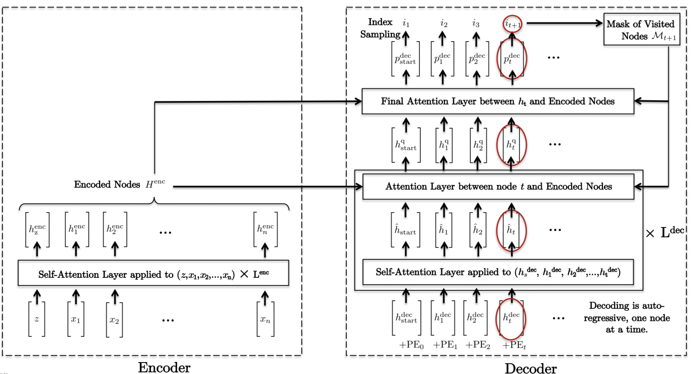
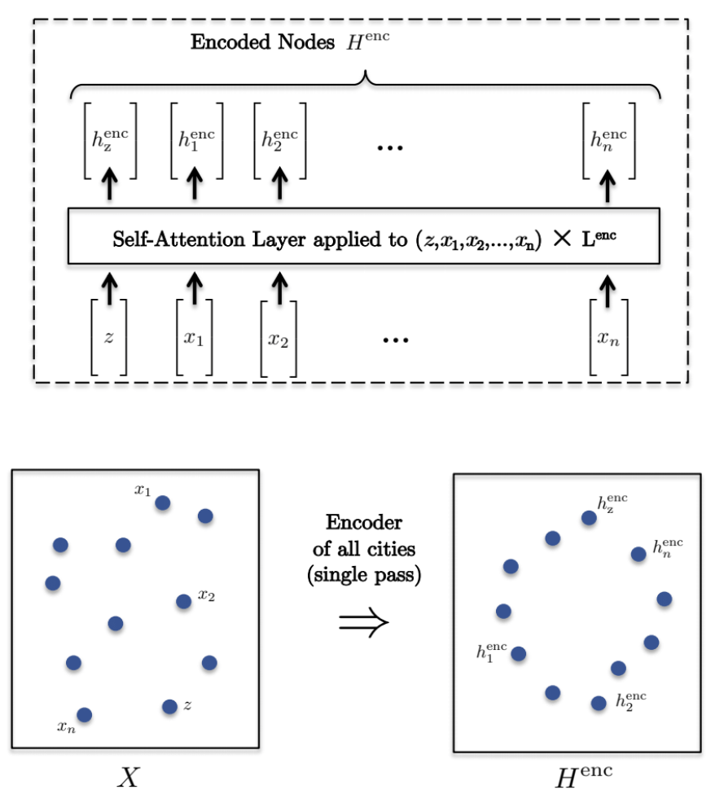
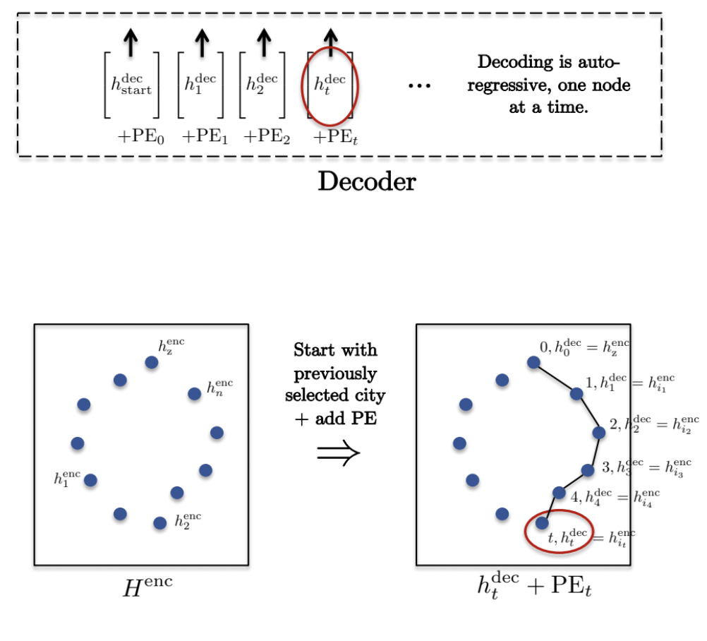
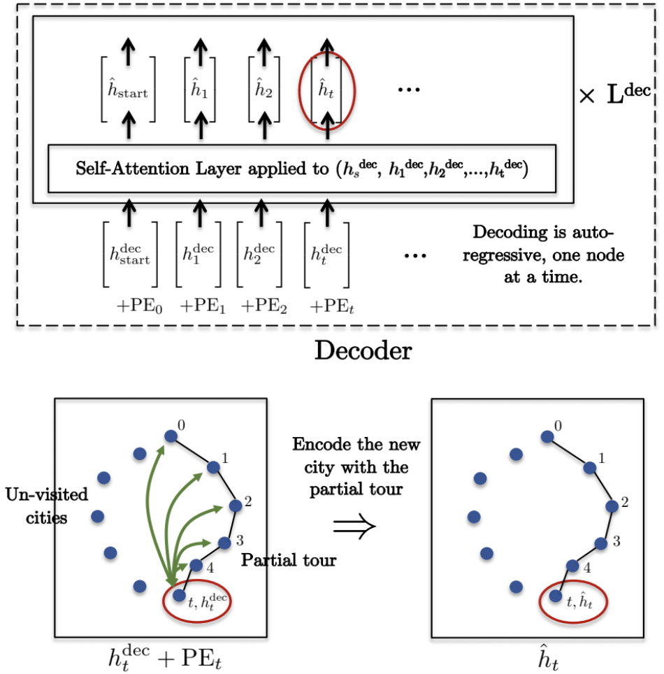
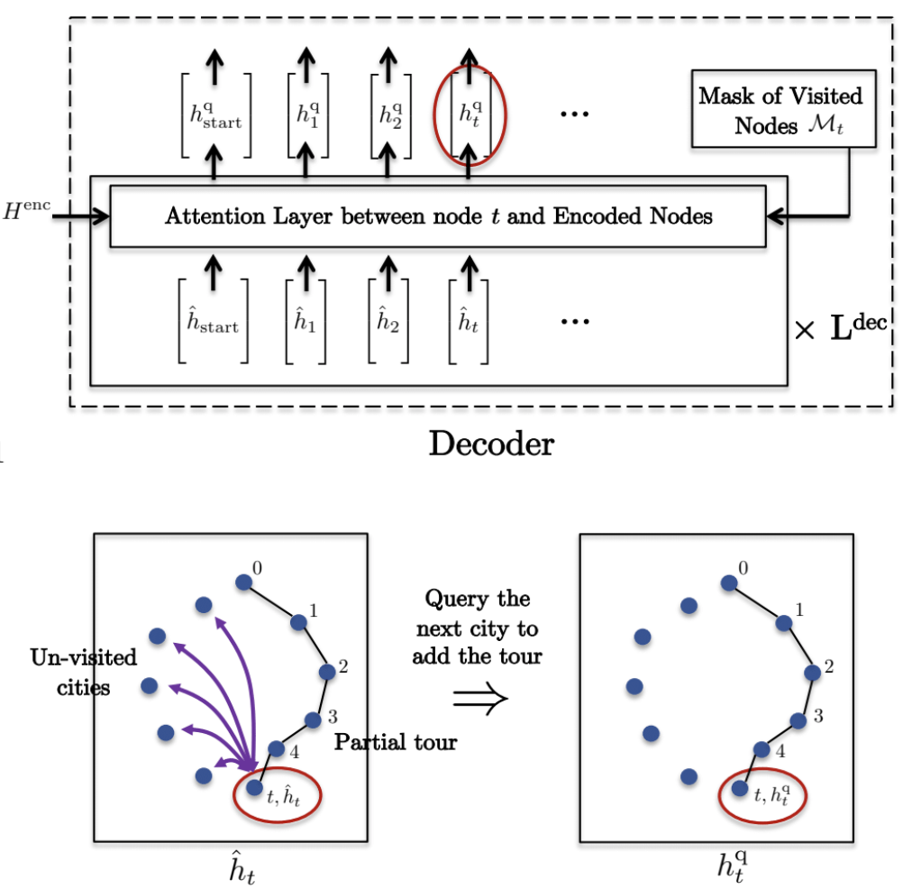
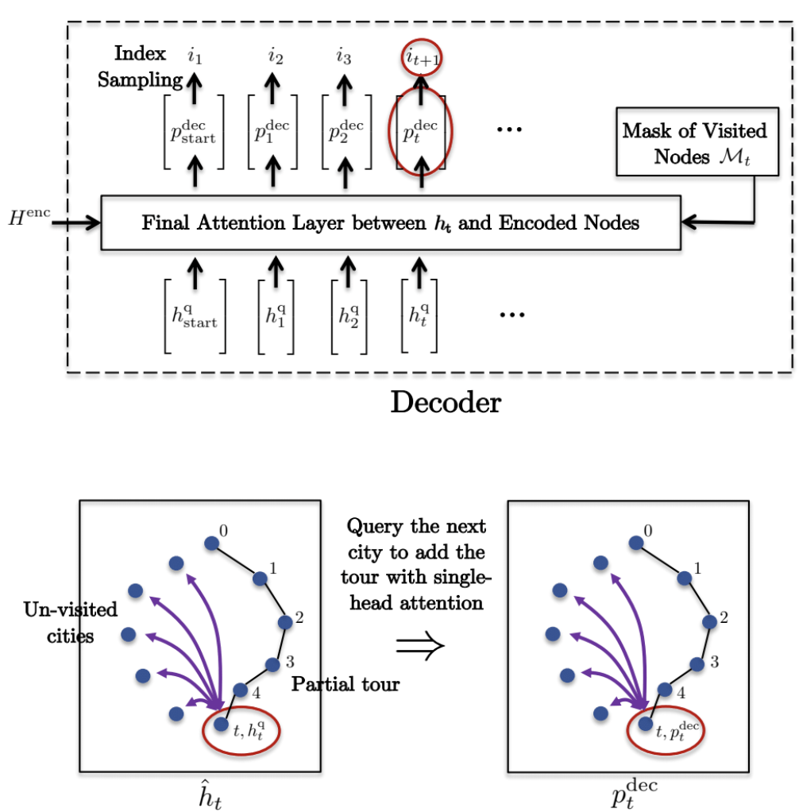
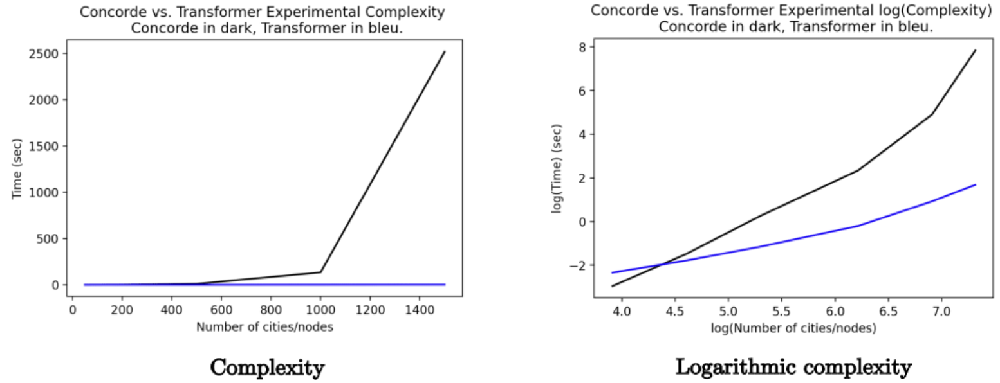
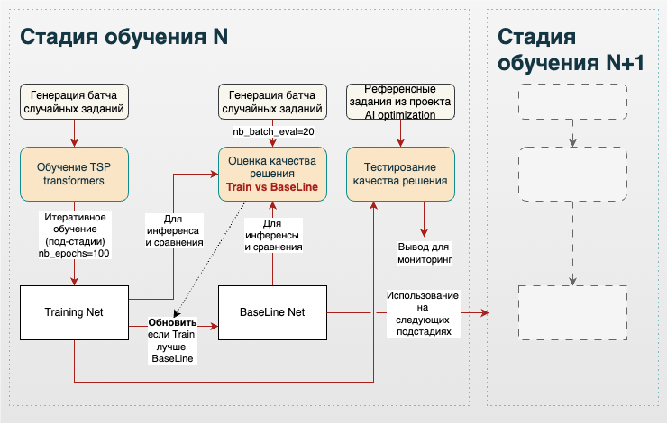

 

## Трансформеры — это больше, чем кажется на первый взгляд

Возможно кто-то догадался, что заголовок выше — это перевод первых строк темы из ламповых сюжетов мульсериала 80-х:

> The Transformers    
> More than meets the eye

Любопытное совпадение: эти строки весьма точно характеризуют мои мысли об архитектуре трансформеров в контексте современных технологий ИИ. Сейчас уже широко известно, что эта архитектура стала настоящим прорывом и подарила человечеству нечто особенное — очень сильно напоминающее искусственный интеллект из фантастических фильмов детства и юности. Сегодня мы наблюдаем экспансию чат-ботов во все сферы жизни, чуть позднее увидим, как эти боты начнут за нас совершать действия в цифровом мире и ещё позже — в мире реальном. Вот [тут](https://d2l.ai/chapter_attention-mechanisms-and-transformers/vision-transformer.html) можно почитать о том, что трансформеры весьма неплохо справляются с визуальной информацией. Неплохая такая заявка на универсальность — сопоставимая с гибкостью интеллекта человека.

А как же TSP? Собственно, об этом и хотелось поговорить в этой заметке, а именно о том, как трансформеры справляются с задачами оптимизации на примере TSP. В заключение я постараюсь подвести итог главному вопросу этой серии: **может ли ИИ в оптимизацию?**

Важно напомнить, что данная статья является продолжением серии моих заметок об алгоритмах оптимизации. Прочтение данного текста, ровно как и прочтение предыдущих заметок, не гарантирует понимания того, как работает ИИ, но, верю, делает тернистый путь изучения чуть менее тернистым:

- [Внимание — это всё, что нужно коммивояжеру](https://chatgpt.com/post/vnimanie_eto_vse_cto_nuzno_kommivoazeru/) — описание архитектуры `Pointer Net` с встроенным механизмом внимания;
- [Внимание, правильный ответ](https://chatgpt.com/post/prosto_o_vnimanii/) — связь непараметрических методов статистики с механизмом внимания;
- [А не пора ли нам подкрепиться?](https://chatgpt.com/post/vnimanie_eto_vse_cto_nuzno_kommivoazeru/) — описание табличного `off-policy` метода оптимизации (`Q-обучение`) и сравнение с `on-policy` подходом;
- [Глубокое Q-обучение (DQN)](https://chatgpt.com/post/dqn/) — авторский алгоритм на базе `Q-обучения` и глубокой нейронной сети.

Хотелось бы ограничить количество букв в заметке и опустить базовое описание архитектуры трансформеров, которое можно посмотреть, например, [тут](https://d2l.ai/chapter_attention-mechanisms-and-transformers/index.html). Действительно, я не ставлю целью перевод книг, где уже всё разложено по правильным полочкам. Таким образом, данная заметка будет сфокусирована на специфических моментах, важных для TSP.

## Архитектура TSP — трансформеров

Несмотря на то, что реализаций задачи TSP на базе трансформеров существует несколько, я бы хотел остановиться на конкретном варианте, который демонстрирует очень приличные результаты. Речь пойдёт про реализацию TSP-трансформеров от [Xavier Bresson](https://arxiv.org/pdf/2103.03012.pdf). Можно сказать, что TSP-трансформеры похожи на *Pointer Network* в том смысле, что за основу берётся архитектура из мира NLP (естественной обработки языка) и потом происходит адаптация такой архитектуры под задачу оптимизации TSP. Поэтому, когда мы говорим про TSP-трансформеры, на фоне мы всегда ощущаем рефрен генеративных нейронных сетей, воплощённых в уже привычных чат-ботах.

Важным отличием трансформеров от архитектуры *Pointer Network* (*Encoder + Decoder + Attention*) является то, что вместо рекуррентных модулей (LSTM, GRU) используются нейронные сети прямого распространения и *Self-Attention*. Это исключает капризные авторегрессионные процессы. Вместо этого порядок входящих токенов передаётся явным образом — в виде матрицы с использованием позиционного кодирования. Можно сказать, что авторегрессионный процесс остаётся только на уровне главного цикла выбора следующего города (токена).

В оригинальной статье архитектура выглядит следующим образом:

Можно сказать, что предложенная архитектура едва ли отличается от канонического варианта, описанного в [учебниках](https://d2l.ai/chapter_attention-mechanisms-and-transformers/transformer.html). Имеется блок кодировщика (*Encoder*), который, выражаясь образно, «смотрит» (обобщает) сразу всю задачу целиком. Также имеется декодер (*Decoder*), который рекурсивно, то есть один за другим, выбирает города для посещения. Каждый раз решение о выборе города принимается на основе сложившегося подмаршрута (смотрим пройденный путь) и доступных для выбора городов, информация о которых обогащается кодировщиком через механизм внимания. Каждый по отдельности кодировщик и декодер представляют собой слоёный пирог, состоящий из чередующихся модулей вычислений: модуля внимания, модуля нейронных сетей прямого распространения и модуля нормализации коэффициентов. Далее предлагаю разобрать каждый блок по отдельности.

### Кодировщик (*Encoder*)

Кодировщик (*Encoder*) получает на вход сразу все координаты городов, планируемых для посещения коммивояжером, и  транслирует координаты в свое представление с использованием *Self-Attention* механизма. Это означает, что ключи (*keys*), значения (*values*), и запросы (*queries*) -- это все один и тот же тензор эмбединга координат городов. На выходе получаем представление, которое содержит информацию о соотнесении координат городов друг к другу. Слои между между собой связываются через *Residual connection*, для улучшения процесса обучения применяются модули *Batch normalization*. Формальная математика следующая:

$$
H^{\text {enc}} =H^{\ell=L^{\text {enc }}} \in \mathbb{R}^{(n+1) \times d}
$$
$$
H^{\ell=0} =\operatorname{Concat}(z, X) \in \mathbb{R}^{(n+1) \times 2}, z \in \mathbb{R}^2, X \in \mathbb{R}^{n \times 2}
$$
$$
H^{\ell+1} =\operatorname{softmax}\left(\frac{Q^{\ell} K^{\ell}}{\sqrt{d}}\right) V^{\ell} \in \mathbb{R}^{(n+1) \times d}
$$
$$
Q^{\ell} =H^{\ell} W_Q^{\ell} \in \mathbb{R}^{(n+1) \times d}
$$
$$
K^{\ell} =H^{\ell} W_K^{\ell} \in \mathbb{R}^{(n+1) \times d}
$$
$$
V^{\ell} =H^{\ell} W_V^{\ell} \in \mathbb{R}^{(n+1) \times d}
$$

\[z\] — это стартовый токен, который инициализируется случайно и конкатенируется с тензором эмбединга координат, а далее поступает в декодер для старта авторегрессионного процесса выбора городов.

\[L^{enc}\] — количество, последовательно-соединяемых одинаковых слоев логики кодировщика. 

### Декодер (*Decoder*)

На вход декодера (*Decoder*) мы подаём координаты уже выбранных городов (подмаршрутов) для выбора следующего города. То есть процесс выбора города авторегрессионный: выбрали город — и думаем над тем, какой выбрать следующий. Декодер также имеет на входе слой *Self-Attention*, аналогичный кодировщику, но на вход декодеру подаётся подмаршрут (промежуточный путь).

Далее, поднимаясь выше по диаграмме, можно обнаружить слой, который обеспечивает перенос представления из кодировщика на контекст декодера: ключи и значения кодировщика подаются на слой внимания, а запросом служит выход с предыдущего слоя декодера. Данная логика соответствует канонической архитектуре трансформеров.

Однако выше присутствует уже оригинальный слой механизма внимания, который нужен для перевода тензора из размерности эмбединга в тензор размерности задачи поиска пути, что даёт на выходе распределение вероятности по непосещённым городам (NLP-трансформеры используют в этом месте нейронную сеть прямого распространения). В этом слое происходит нечто большее, чем просто изменение размерности: также подмешивается информация из кодировщика через всё те же ключи и значения.

Слои в декодере связываются между собой также через *Residual connection*, но в отличие от кодировщика тут используется *Layer normalization*.

В самом начале, очевидно, предыдущих городов нет, и поэтому нужно выбрать некий дополнительный город-призрак, который в перспективе будет оптимальным с точки зрения конечной задачи поиска кратчайшего пути. Координаты такого города выбираются из результата работы кодировщика:  
$$
h_{t=0}^{\mathrm{dec}}=h_{\mathrm{start}}^{\mathrm{dec}}+\mathrm{PE}_{t=0} \in \mathbb{R}^d, \text { with } h_{\mathrm{start}}^{\mathrm{dec}}=h_{\mathrm{z}}^{\mathrm{enc}}
$$
Разберём работу декодера по шагам. Представим, что первые \[t\] городов уже декодированы и выбраны, то есть уже имеется какой-то подмаршрут:

1. Стартуем декодирование с тензора, который был получен на предыдущем шаге. Кодируем такой тензор с помощью [стандартного кодировщика позиции](https://d2l.ai/chapter_attention-mechanisms-and-transformers/self-attention-and-positional-encoding.html) \[PE_t\]. 
$$
h_t^{\mathrm{dec}}=h_{i t}^{\mathrm{enc}}+\mathrm{PE}_t \in \mathbb{R}^d
$$
Кодировщик позиции использует гармонические функции следующего вида:
$$
\mathrm{PE}_t \in \mathbb{R}^d
$$
   
$$
PE_{t, i}= \begin{cases} \sin\(2 \pi f_i t\)\text { if } i \text { is even, }\\\\cos \(2 \pi f_i t\) \text { if } i \text { is odd, }\end{cases}
$$
$$
\text { with } f_i=\frac{{10,000 }^{\frac{d}{[2 i]}}}{2 \pi} 
$$
Возможно, для кого-то будет откровением использование гармонических функций для определения порядка следования городов. В действительности речь идет о стандартной практике кодирования последовательности токенов из задач NLP. Опять же, в [книгах](https://d2l.ai/chapter_attention-mechanisms-and-transformers/self-attention-and-positional-encoding.html) давно подробно описано, почему это работает, с примерами и иллюстрациями.

2. Кодируем результат предыдущего шага с помощью функции *Self-Attention*:

$$
\hat{h}_t^{\ell+1} =\text{softmax}\(\frac{q^{\ell} K^{\ell^2}}{\sqrt{d}}\) V^{\ell} \\in \mathbb{R}^d, \ell=0, \ldots, L^{\text {dec }}-1
$$

$$
q^{\ell} =\hat{h_t}^{\ell}\hat{W_q}^{\ell} \\in \mathbb{R}^d
$$

$$
\hat{H_{1, t}}^{\ell}  =\left[\hat{h_1}^{\ell}, . ., \hat{h_t}^{\ell}\right], 
$$

$$
\hat{h_t}^{\ell}=\begin{cases} h_t^{\text {dec }} \text { if } \ell=0 \\\ h_t^{\text {q}, \ell} \text { if } \ell>0 \end{cases}
$$

   

3. Осуществляем запрос (*query*) следующего города из списка не посещенных городов:
   
   $$
h_t^{\mathrm{q}, \ell+1}  =\text{softmax}\left(\frac{q^{\ell} K^{\ell^T}}{\sqrt{d}} \odot \mathcal{M}_t\right) V^{\ell} \\in \mathbb{R}^d, \ell=0, \ldots, L^{\mathrm{dec}}-1 \\\ q^{\ell} =\hat{h}_t^{\ell+1} \tilde{W}_q^{\ell} \\in \mathbb{R}^d \\\ K^{\ell} =H^{\mathrm{enc}} \tilde{W}_K^{\ell} \\in \mathbb{R}^{t \times d} \\\ V^{\ell} =H^{\mathrm{enc}} \tilde{W}_V^{\ell} \\in \mathbb{R}^{t \times d}
   $$

4. Наконец, делаем запрос результата предыдущего шага для получения индекса следующего города:
   1. Используется «одноголовый» слой внимания и контекст кодировщика (ключи, значения) для получения распределения вероятностей по потенциальным городам посещения.
   2. Следующий город выбирается путем семплирования распределения Бернулли из выхода «одноголового» слоя внимания. На этом этапе присутствует элемент случайности в процессе обучения нейронной сети. Соответственно, для генерации инференса сеть переключается в «жадный режим» и выбирает город с максимальной вероятностью.

$$
p_t^{\mathrm{dec}} =\operatorname{softmax}\(C \tanh \(\frac{q K^T}{\sqrt{d}} \odot \mathcal{M}_t\)\) \\in \mathbb{R}^n, \\\ \text { with } \\\ \qquad q =h_t^{\mathrm{q}} \bar{W}_q \\in \mathbb{R}^d \\\ K = H^{\mathrm{enc}} \bar{W}_K \\in \mathbb{R}^{n \times d}
$$

Таким образом, получается архитектура, содержащая лишь один авторегрессионный процесс, что повышает стабильность и скорость обучения за счёт параллельных вычислений. Идея выкорчевывания авторегрессионных процессов настолько сильна, что существует [дальнейшее развитие](https://towardsdatascience.com/transpormer-a-transformer-network-for-the-travelling-salesman-problem-154bd33c37b0/) этой концепции с полным исключением данного элемента из архитектуры. Такая реализация даёт ещё больший прирост в скорости вычислений, но не гарантирует наличие цикла в графе маршрута. Это означает необходимость постобработки результатов трансформеров с поиском оптимальной линковки некоторых вершин — нечто вроде описанного в заметке про алгоритм [Cristofides](/post/algoritm_kristofidesa_serdukova).

### Сравнение с NLP

Надеюсь, читатель ещё не забыл, что архитектура трансформеров изначально была придумана для задач NLP, то есть для обработки естественного языка. В этом ключе интересно выделить отличия данной архитектуры от её канонической реализации для NLP:

​	1.	При выбранном подмаршруте в задаче TSP порядок уже посещённых городов не имеет значения, в отличие от NLP, где порядок слов определяет смысл текста. Тем не менее, в TSP- и NLP-реализациях используется одна и та же техника позиционного кодирования. На мой взгляд, это скорее плюс, так как делает подход универсальным. В некоторых задачах оптимизации порядок предыдущих действий может определять размер награды потенциальных действий в будущем, и в данном случае мы получаем эту фичу бесплатно как побочный эффект.

​	2.	TSP-кодировщик получает бенефиты от использования *Batch Normalization*: все города кодируются скопом. В то же время TSP-декодер использует *Layer Normalization* аналогично тому, как это происходит в задачах NLP.

​	3.	Это очевидно, но не лишним будет ещё раз проговорить: TSP-трансформер использует обучение с подкреплением. Иными словами, правильных ответов никто не предоставляет, как это происходит в базовом процессе обучения NLP-архитектур, хотя обучение с подкреплением [встречается и в NLP](https://en.wikipedia.org/wiki/Reinforcement_learning_from_human_feedback).

​	4.	TSP и NLP имеют одинаковую алгоритмическую сложность \[O(n^2L)\]. Автор архитектуры TSP-трансформеров утверждает, что на задачах большой размерности его архитектура будет работать эффективнее, чем великий *Concorde*. Однако это сравнение не совсем корректное, так как последний решает задачу точно, а не приближённо.

### Некоторые особенности реализации

После того как принципы работы архитектуры раскрыты, хотелось бы перейти к некоторым приятным свойствам, которые нельзя оставить незамеченными. Речь пойдёт о способности этой архитектуры решать задачи, с которыми модель ранее не сталкивалась. Классические решатели так не умеют: они решают задачу каждый раз заново. Кроме того, предыдущие архитектуры, рассмотренные в серии моих заметок, демонстрировали это скорее как побочный эффект. Можно было обучить модель на одной задаче, затем подать другие данные, и она генерировала какой-то ответ. В случае с *DQN* этот ответ был даже сносным.

В TSP-трансформерах задача изначально решалась сразу и полностью. Процесс обучения разбивался на стадии, в рамках которых генерились рандомные задачи, а затем осуществлялся поиск оптимального набора параметров. Соответственно, для каждой сгенерированной задачи внутри стадии происходило обучение в несколько подстадий, задаваемых параметром nb_epochs: чем больше таких подстадий — тем выше точность решения.

Кроме того, в рамках каждой стадии присутствует этап оценки, регулируемый параметром `nb_batch_eval` — количеством случайных задач, для которых сравниваются результаты `Training Net` (новые коэффициенты модели) и `BaseLine Net` (старые коэффициенты модели с предыдущей стадии обучения). В своей реализации я использовал `nb_epochs=100` и `nb_batch_eval=20`. Однако это весьма скромные значения по сравнению с оригинальным кодом *Xavier Bresson*, но об этом немного позже. Соответственно, если `Training Net` показывала результат лучше, чем `BaseLine Net`, происходила перезапись: `Training Net` → `BaseLine Net`.

Дополнительно, для мониторинга была реализована логика тестирования промежуточных решений на референсных задачах TSP, то есть на задачах, использовавшихся во всех предыдущих экспериментах. Схему можно проиллюстрировать следующей диаграммой:

Можно заметить, что метод обучения использует идею похожую на реализацию `Target Net`, о которой я рассказывал в заметке про *DQN*, особенно если провести аналогию: `State Net` ~ `Training Net` и `Target Net` ~ `BaseLine Net`. Однако, в классической реализации *DQN* не было обязательного сравнения `Target Net` vs `State Net` и обновления происходили просто по достижении определённого шага в цикле обучения. Впрочем, в своем варианте *DQN* я реализовал обновление `Target Net` **только** в случае, если `State Net` показывала хороший результат. Такая реализация соответствует подходу TSP — трансформеров и экспериментально перформит чуть лучше классического *DQN* варианта. 

## Отличие R и PyTorch

Моей первой реализацией нейронной сети для TSP, напомню, была архитектура *Pointer Net* на базе механизма внимания. Естественно, эта реализация была протестирована на CPU и GPU. Ранее я уже указывал, что связка **R + CPU** работает существенно **лучше**, чем **Python + CPU**. Однако комбинация **R + GPU** показывает значительно **худшие** результаты по сравнению с **Python + GPU**.

Эта ситуация полностью повторилась и для TSP-трансформеров. Очевидно, что приоритетом является работа с GPU, поскольку она даёт значительный прирост в скорости вычислений.

На этот раз я потратил значительно больше времени, чтобы разобраться в причинах такого эффекта. Я настойчиво помучал ChatGPT с разных сторон и, конечно, адресовал вопрос в [Telegram-сообщество R](t.me/rlang_ru). Коллективный разум предложил обновить R Torch до последней версии, а ChatGPT выдал следующую подробную таблицу сравнения:

| **Функция**                        | **PyTorch (Python)**                      | **R Torch (R)**                         |
| ---------------------------------- | ----------------------------------------- | --------------------------------------- |
| **Оптимизация для GPU**            | ✅ Продвинутая (AMP, TorchScript, NVFuser) | ⚠️ Ограниченная                          |
| **Задержки между языками**         | ⚡ Минимальные (Pybind11)                  | ❌ Дополнительные накладные расходы Rcpp |
| **Управление памятью**             | ✅ Оптимизированное кэширование            | ⚠️ Вмешательство сборщика мусора R       |
| **Контроль параллелизма**          | ✅ Тонкая настройка (потоки, CUDA-стримы)  | ⚠️ Базовый уровень                       |
| **Сообщество и экосистема**        | 🌟 Огромное                                | 🐣 Развивающееся                         |
| **Варианты развертывания моделей** | ✅ TorchScript, ONNX                       | ⚠️ Ограниченные возможности              |

Тестирование вариантов TSP-трансформеров на R и Python я проводил на Kaggle. Как известно, Kaggle не очень торопится подгружать свежие пакеты в свой репозиторий, поэтому пришлось обновлять R Torch в рукопашную с шаманскими ритуалами К моему великому сожалению, убив кучу времени на установку свежей версии R Torch `0.13.0` --> `0.14.2` внутрь тетрадки Kaggle я не обнаружил существенного прироста производительности, хотя в теории свежий бекенд `libtorch 2.5.1` должен был дать какой-то прирост. В итоге, я получил в **8-10** раз более унылые вычисления на R в сравнении с Python. Судя по мониторингу ресурсов, для сессий R, загрузка ядра CPU держалась на 100%, тогда как GPU загружался примерно 10%. Вероятно, на каком-то этапе R вытаскивает тензор из видеокарточки и тащит его в центральный процессор. В общем, вывод такой, что нолик спереди в версии пакета R Torch `0.14.2` стоит не просто так и инкарнация популярного фреймворка на R пока не может заехать в прод, как мне бы этого не хотелось.  

Собственно, проблема скорости вычислений и вынудила меня использовать скромные `nb_epochs=100` и `nb_batch_eval=20`, хотя в оригинальной статье *Xavier Bresson* использовал в **10-25** раз большие значения. Именно в таком виде результаты и попали в итоговую диаграмму сравнения. Что тут скажешь? Эксперимент — он на то и эксперимент, чтобы собрать все подводные грабли. 

## Тестирование

В моем любимом конкурсе с горшками новый участник -- это TSP-трансформер, который **до непосредственно конкурса не видел тестовых задач** в отличие от прочих участников. Принимая во внимание этот факт и также памятуя о настройках модели формата "эконом", TSP-трансформеры показывают многообещающие результаты точности, которые очень близки к *Concorde*. Наконец-то, появился достойный кандидат, способный переиграть старичков на их поле. 

}}index_files/figure-html/unnamed-chunk-1-1.png" width="720" />

Поскольку TSP-трансформер обучался лишь один раз сразу для всех задач, в отличие от других моделей, сравнивать скорость вычислений напрямую было бы некорректно. Также следует учитывать особенности реализации на R, которая показала слабые результаты при вычислениях на GPU.

По совокупности этих причин в сравнительную диаграмму я добавил время инференса TSP-трансформера, которое сопоставимо со временем обучения классических моделей, таких как *2-opt* и модели имитации отжига.

}}index_files/figure-html/unnamed-chunk-2-1.png" width="720" />

## Вместо подведения итогов

### Универсальность трансформеров

Теперь можно подвести некоторые итоги и констатировать, что трансформер умеют не только в текст и изображение, но **и в оптимизацию тоже умеют неплохо**. Это наталкивает на мысль о возможности скормить трансформерам широкий класс мультимодальных бизнес-задач. 

Действительно, почему бы вместо условно отдельных систем: прогнозирования спроса, планирования, оптимизации ценообразования и производства, наконец оценки рисков, — не реализовать одну систему, способную одновременно прогнозировать и учитывать вероятностную природу прогноза (риски) при формировании оптимального плана? Безусловно, речь идет лишь о начальной фазе длинного пути трансформации бизнес-приложений в направлении внедрения оптимизаторов на базе ИИ, но уже сейчас перспективы выглядят крайне заманчиво. 

В настоящее время уже существуют реализации архитектуры трансформеров для популярных проблем оптимизации: Vehicle Routing Problem (VRP), Dial-a-Ride Problem (DARP), Job Shop Scheduling Problem (JSSP). Впрочем настоящий качественный прорыв, верю, произойдет когда постановка задач оптимизации будет адаптирована под возможности оптимизаторов на базе трансформеров. Думаю, данная область будет развиваться стремительно. На этом прекращаю свои вангования о прекрасном будущем.  

### Что дальше? 

Все кто испытывает когерентный интерес к данной теме -- буду рад пожать руку и, возможно, посотрудничать. Форматы сотрудничества могут быть разные: 

1. Если кто-то чувствует в себе способности и главное желание погружаться в алгоритмы, то готов обсуждать участие в проектах в роли исследователя-разработчика. 

2. Если какая-то организация видит возможность интеграции своей программной платформы с движками на основе ИИ, предлагаю обсудить совместную дорожную карту такой интеграции. 

3. Наконец, если компания из реального сектора готова тестировать и запускать новые, более эффективные, модели управления процессами на базе технологий ИИ, в этом случае можно говорить о совместной проектной работе в формате лаборатории по адаптации технологий ИИ к имеющимся задачам. 

На этом я хотел бы поставить не точку, а многоточие — и, возможно, продолжить эту серию заметок уже в контексте более прикладных, менее академических, но более боевых задач.   

---

**Полезные ссылки:**

- [Исходный код на R в репозитории AI optimization](https://github.com/dkibalnikov/ai_optimization/blob/main/algorithms/transformers.R)   
- [Тетрадка с реализацией на Kaggle](https://www.kaggle.com/code/dmitrykibalnikov/tsp-transformers-in-r)    
- [Исходный код Xavier Bresson на Python](https://github.com/xbresson/TSP_Transformer)    
- [Презентация TSP трансформеров Xavier Bresson](https://t.co/ySxGiKtQL5)    

---

Простой способ узнать о новых публикациях – подписаться на Telegram-канал:

<a href="https://t.me/investcookies" target="_blank" rel="noopener noreferrer me">
🍪🍪🪙 InvestCookies 
<svg xmlns="http://www.w3.org/2000/svg" viewBox="0 0 24 24" fill="none" stroke="currentColor" stroke-width="2"
    stroke-linecap="round" stroke-linejoin="round">
    <path
        d="M21.198 2.433a2.242 2.242 0 0 0-1.022.215l-8.609 3.33c-2.068.8-4.133 1.598-5.724 2.21a405.15 405.15 0 0 1-2.849 1.09c-.42.147-.99.332-1.473.901-.728.968.193 1.798.919 2.286 1.61.516 3.275 1.009 4.654 1.472.509 1.793.997 3.592 1.48 5.388.16.36.506.494.864.498l-.002.018s.281.028.555-.038a2.1 2.1 0 0 0 .933-.517c.345-.324 1.28-1.244 1.811-1.764l3.999 2.952.032.018s.442.311 1.09.355c.324.022.75-.04 1.116-.308.37-.27.613-.702.728-1.196.342-1.492 2.61-12.285 2.997-14.072l-.01.042c.27-1.006.17-1.928-.455-2.474a1.654 1.654 0 0 0-1.034-.407z" />
</svg>
</a>

