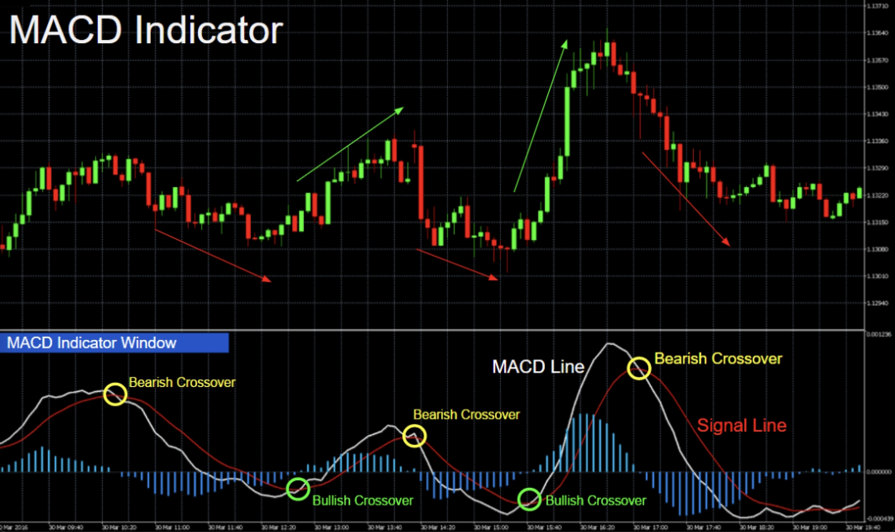

## Где инвест печеньки? 🍪
Так случается, что иногда мне звонят ребята из чатов и упрекают меня в обмане их ожиданий. Мол, я пишу всякие умные штуки и вангую кризисы, а вот конкретно сказать когда купить и когда продать не могу. Конечно, можно было бы ответить в духе цитаты одного футболиста: *ваши ожидания - ваши проблемы*, но все-таки изначально я планировал писать про инвест печеньки т.е. про всякие помогалки людям, которые занимаются инвестициями. К сожалению, в определенный момент чреда известных событий перепрошила серое вещество в моей голове, которое какое-то время буквально отказывалось размышлять об инвестиционных стратегиях. 

Но прошло время, индекс Мосбиржи сначала сильно просел потом частично восстановился, позволив заработать наиболее дальновидным. Были конечно и те, кто звонко щелкал сфинктером орехи от происходящего и фиксировал эпические убытки. Не уверен, что я был особенно дальновиден, но совершенно точно я остался в плюсе, стоически удерживая свои позиции на фоне эмоциональных потрясений. Отчасти это было связано с тем, что я всегда отдавал предпочтение фундаментальному анализу, но не техническому. Отдавать предпочтение -- это еще не значит пользоваться исключительно одним. В целом, по прошествии некоторого времени я пришел к практике совместного использования фундаментального и технического подходов к анализу. Выглядит это приблизительно так: я перебираю инвестиционные идеи, которые подкидываются с разных сторон и выбираю для себя интересные бумаги, далее я еще точку входа с помощью относительно простой модели MACD (moving average convergence/divergence) и покупаю. При достижении приблизительных фундаментальных ориентиров роста я начинаю искать точку для продажи также с помощью MACD. Собственно по поводу MACD я и хочу поговорить поподробнее. 

Использование MACD не является чем-то из ряда вон выходящим т.е. это хорошо известный инструмент, которым пользуются многие трейдеры/инвесторы. Настолько популярный, что его можно найти даже в мобильном приложении брокера. Несмотря на широкое распространение возникает вопрос: так ли она хороша и хороша ли вообще? Вот чтобы ответить на этот вопрос уже нужны руки из правильного места и владение техникой бектестинга. Бектестинг -- это еще одна горячая тема разговоров с парнями из чатов. Все мы любим всякие модные штуки типа машин лернингов, бустовых деревьев, нейронок и прочих бигдатых бигдат, но нам не очень нравиться проверять эти модели на реальных данных потому как это требует усилий и часто сулит разочарованием.

Итак, краткое содержание всех букав далее: **разбираемся в MACD, далее готовим бэктестинг и наконец считаем сколько можно было заработать честным трудом ~~финансового спекулянта~~ инвестора** 😎

## MACD 📈📉

Принцип работы модели достаточно простой: строится две экспоненциальные скользящие средние с разным окном, например, 12 дней и 26 дней. Далее считают разницу этих средних, которая и называется MACD. Уже на MACD накладывается еще одно скользящее среднее самой MACD, например с окном 9 дней. Очевидно, две итоговых кривые естественным образом где-то пересекаются. Собственно такие пересечения и являются: 

- сигналом для покупки (сигнальная кривая пересекает MACD снизу) 
- сигналом для продажи (сигнальная кривая пересекает MACD сверху) 

Вот собственно и все, больше сказать особо нечего, но добавлю, пожалуй, иллюстрацию поярче из интернетов: 


Когда я много лет назад узнал об этой модели, у меня возник резонный вопрос: а собственно какого рожна я должен брать 12/26/9? Дело в том, что давным давно, когда люди на бирже записывали мелом цены сделок на доске, было принято торговать 6 дней в неделю. Кроме того, для истории фиксировались исключительно значения открытия и закрытия дня и посему фрейм записи сведений в то время был единственный -- один день. Соответственно идея MACD была в том, чтобы ловить тренды для отрезка 2-х недель (12) и одного месяца (26). Сигнальная кривая выбиралась -- 9 дней т.е. полторы недели. Сейчас такая конфигурация уже не является актуальной просто исходя из того как устроены торги на бирже.

Второй вопрос который у меня возник: а что собственно все это нагромождение усреднений означает? Пожалуй, прибегну к аналогии для объяснения феномена всех этих скользящих средних. Допустим, каждый день я прохожу некоторое количество шагов. Естественно, количество шагов меняется изо дня в день, и для наглядности я поставлю эту динамику в зависимость от женского настроения т.е. сделаю допущение, что каждые 30 дней все повторяется своим чередом с точностью до некоторой погрешности. Теперь можно воплотить этот простой паттерн в виде графика со всеми рюшами и кружевами, свойственным MACD: в частности, в качестве медленной средней я укажу **30 дней**, а в качестве быстрой **15 дней** и в качестве сигнальной **11 дней** т.е. определю пропорцию 4(30):2(15):1.5(11), что соответствует или почти соответствует классической комбинации 12/26/9. 

В качестве периодической функции был выбран *cos(x)*, который показан белым пунктиром. Естественно, было добавлено немного грязи (случайной ошибки) в полученный набор данных, а конкретно в амплитуду и в фазу гармонической функции:

}}index_files/figure-html/unnamed-chunk-1-1.png" width="720" />

Можно заметить, что зеленые столбики на нижнем графике хорошо ложатся на верхние бугры циклической функции, а красные -- соответственно на нижние т.е. сигналы MACD. Получается, что пересечения нулевой отметки является вполне рабочим сигналом для прогноза роста или падения циклической динамики на 1/8 периода вперед. 

Далее я уменьшу значение медленной средней в два раза - **15 дней**, а пропорцию оставлю прежнюю: 4:2:1.5

}}index_files/figure-html/unnamed-chunk-2-1.png" width="720" />

В данном случае MACD существенно изменилась: уверенность зелененьких и красненьких столбиков снизилась (появились выпадающие столбики) и также получилось смещение по фазе относительно варианта выше. Такое смещение дает возможность предсказать рост/падение уже на 1/4 периода, что собственно и было нужно. MACD фактически повторяет кривую шагов, а разница с сигнальной линии указывает на смену тренда. Данная комбинация условий хорошо укладывается в классическую концепцию использования MACD, когда сигналами для покупки/продажи выступают точки пересечения MACD/signal с нулевой отметкой.
Формальная математическая формула для MACD с простой скользящей средней выглядит следующим образом:
$$
MACD = \frac{\sum_1^n x_{i}}{n} - \frac{\sum_1^{2n} x_{i}}{2n} = 2\frac{\sum_1^n x_{i}}{2n} - \Big(\frac{\sum_1^{n} x_{i}}{2n}+ \frac{\sum_n^{2n} x_{i}}{2n}\Big)
$$
$$
MACD=\frac{\sum_1^n x_{i}-\sum_n^{2n} x_{i}}{2n},  \quad 2n=15
$$

После некоторых преобразований получилось, что в данном случае MACD соответствует изменению числа сделанных шагов за 15 дней: в один день я мог сделать 20 шагов, а через 15 дней я уже сделал 40 шагов т.е. *скорость* изменений составила **~1.33** шага ежедневно. Можно повторить такую же операцию для разности MACD/signal и получить схожую интерпретацию. В обоих случаях речь будет идти о приращениях т.е. производных различного порядка, которые характеризуют *скорость* и *ускорение*. 
Другими словами, точки пересечения MACD/signal с нулевой отметкой -- являются чем-то вроде графика производной 2-го порядка для динамики шагов, когда максимальные/минимальные значения достигаются в точке, где такая производная равна нулю. Все это совсем не удивительно, если вспомнить:
$$
cos''(x)=-cos(x)
$$

Наиболее популярной реализацией MACD связано с использованием экспоненциального сглаживания вместо обычного усреднения. Другими словами MACD можно записать следующим образом, если подставить формулу экспоненциального сглаживания для первого члена разности:

$$
EMA_{t}-EMA_{t-1}=\alpha P_{t} + (1-\alpha)EMA_{t-1} - EMA_{t-1}
$$

Или после преобразований:

$$
EMA_{t}-EMA_{t-1}=\alpha (P_{t}-EMA_{t-1})
$$

\[\alpha\] -- коэффициент сглаживания. Отсюда можно сделать вывод, что MACD соответствует отклонению значения в момент \[t\] от экспоненциально сглаженной средней предыдущих значений. Таким образом, вместо разности двух значений временного ряда в классическом определении производной используется разность между текущим значением и значением, полученным из всей совокупности предыдущих значений. Соответственно при \[\alpha = 1\] разность \[EMA_{t}-EMA_{t-1}\] превращается в обычное приращение т.е. разность текущего и предыдущих значений. Итак отличие лишь в том, что MACD с экспоненциальным сглаживанием обладает некоторой "памятью" о предыдущих значениях временного ряда. 

Теперь я уменьшу значение медленной средней еще в два раза -- до **8 дней** при неизменной пропорции:

}}index_files/figure-html/unnamed-chunk-3-1.png" width="720" />

В данном случае модель существенно хуже справляется с задачей прогнозирования тренда и в целом обретает некую нервозность. Что же это означает? Очевидно, выбор параметров модели MACD влияет на ее способность к прогнозированию периодических функций. Впрочем, рыночные инструменты не сильно то и периодичны. В противном случае, простым Фурье-преобразованием можно было бы безошибочно предсказывать колебания цен на рыночные инструменты и быстро обогатиться. 

Наконец, я увеличу значение медленной средней до **60 дней** с прежними пропорциями:

}}index_files/figure-html/unnamed-chunk-4-1.png" width="720" />

Увеличение периода также стало катастрофическим для прогнозной способности MACD. В одну фазу колебаний MACD уложилось сразу несколько исходных циклов, что сделало технику MACD бессмысленной в данном случае. 

## Выводы 🍪🍪🍪

Надеюсь, разобранные примеры и формальные пояснения позволили сформировать понимание, что из себя представляет MACD 🤘

Удалось получить формальную математическую интерпретацию этой техники в виде производной 2-го порядка или ускорения изменения цен, это наталкивает на выводы о том, что MACD будет хорошо работать на бумагах с длинными периодами роста или падения. MACD способен неплохо ловить точки смены тренда и соответственно черные лебеди и боковики -- вот это все не очень желательно для MACD, исходя из концептуального понимания принципов работы техники. В теории, можно фокусироваться на голубых сырьевых фишках, которые ходят за долгосрочными трендами сырья. И тут сразу вспомнилась история с Газпромом, на который сначала налетел черный лебедь разрыва торговых отношений с Европой -- основного рынка сбыта, а далее Газпром сам себе нарисовал черного лебедя с историей о дивидендах и "весело" об него убился окончательно 💥

Определенный параметры MACD способны захватывать колебательные паттерны благодаря тому что производная гармонической функции -- является гармонической функцией. В любом случае, это свойство -- является весьма бестолковым с учетом отсутствия явной периодичности у финансовых инструментов 🤦

В действительности, акции растут и падают не по гармоническим законам. При этом очевидно, что акции чаще растут чем падают. Дело в том, что совокупная капитализация рынков акций постоянно растет. Это связано с инфляцией и ростом мирового ВВП. С инфляцией, думаю, все понятно. Рост ВВП носит имманентный характер т.е. он встроен в рынок акций и будет продолжаться бесконечно. Ведь будет? Есть мнение, что рост мирового ВВП связан с постоянным увеличение населения планеты, но вроде как в ближайшие десятилетия этот рост остановится и мировая экономика войдет в новую доселе неизведанную территорию, бугага 👹 

Но пока мировой ВВП растет можно продолжать отдавать предпочтение бычьим стратегиям, а не медвежьим. В любом случае, технику MACD стоит проверить для трендов роста и падения, которая будет непрерывно использовать наличествующий капитал для длинных и коротких позиций 🐂🐻

Этой заметкой я открываю серию, посвященную эффективности использования популярной стратегии торговли -- MACD. В следующей заметке я подробно опишу как делать бектестинг для объективной проверки способности зарабатывать деньги на примере нескольких популярных акций. Код заметки на языке R под капотом 👇

---

<details>
 <summary>Исходный код заметки</summary>
 

```r
library(data.table)
library(ggplot2)
library(patchwork)

n <- 180
prd <- 30
set.seed(1982)

# Генерация примера с шагами на базе циклической функции с шумом 
smp <- data.table(day = 1:n, cycle = cospi(1:n*2/prd)*10)[
  , steps := 30 + cycle*rnorm(n, 1, 1) + rnorm(n, 1, 1)][
    , cycle := 30 + cycle]

# Функция построения графиков
get_MACD <- function(smpl, k=30){
  smp1 <- smp[, `:=`(fast=frollmean(steps, k/2), slow=frollmean(steps, k))][ # расчет скользящих средних 
    , MACD:=fast-slow][ 
      , signal:=frollmean(MACD, k*3/8)][ # скользящая средняя для сигнальной кривой
        , diff:=MACD-signal] |> 
    melt("day") 
  
  # График шагов
  p1 <- smp1[variable %in% c("fast", "slow", "cycle", "steps")] |>  
    my_ggplot(aes(day, value, col = variable, lty = variable)) +
    geom_line() +
    scale_color_manual(values = c(cycle = "white", steps = my_pal[1], fast = my_pal[2], slow= my_pal[3])) +
    scale_linetype_manual(values = c(cycle = 5, steps = 1, fast = 1, slow= 1)) +
    labs(x = "", y = "Шаги", col = "", lty="") 
  
  # График MACD
  p2 <- smp1[variable %in% c("signal", "MACD")] |> 
    my_ggplot(aes(day, value, col = variable)) +
    geom_col(data = smp1[variable=="diff"], aes(fill = fifelse(value > 0, "up", "down")), col = "gray30", alpha=.7, size = .5) +
    geom_line() + 
    scale_fill_manual(values = c("up" = my_pal[4], "down"=my_pal[3])) +
    labs(x = "Дни", y = "Сигнал", col = "", fill = "")
  
  p1/p2
}

get_MACD(smpl, 30) # медленная средняя 30 дней
get_MACD(smpl, 15) # медленная средняя 15 дней
get_MACD(smpl, 8) # медленная средняя 8 дней
get_MACD(smpl, 60) # медленная средняя 60 дней
```

</details>

---

Простой способ узнать о новых публикациях – подписаться на Telegram-канал:
<div class="telegram-icon" align="left">
<a href="https://t.me/investcookies" target="_blank" rel="noopener noreferrer me">
🍪🍪🪙 InvestCookies 
<svg xmlns="http://www.w3.org/2000/svg" viewBox="0 0 24 24" fill="none" stroke="currentColor" stroke-width="2"
    stroke-linecap="round" stroke-linejoin="round">
    <path
        d="M21.198 2.433a2.242 2.242 0 0 0-1.022.215l-8.609 3.33c-2.068.8-4.133 1.598-5.724 2.21a405.15 405.15 0 0 1-2.849 1.09c-.42.147-.99.332-1.473.901-.728.968.193 1.798.919 2.286 1.61.516 3.275 1.009 4.654 1.472.509 1.793.997 3.592 1.48 5.388.16.36.506.494.864.498l-.002.018s.281.028.555-.038a2.1 2.1 0 0 0 .933-.517c.345-.324 1.28-1.244 1.811-1.764l3.999 2.952.032.018s.442.311 1.09.355c.324.022.75-.04 1.116-.308.37-.27.613-.702.728-1.196.342-1.492 2.61-12.285 2.997-14.072l-.01.042c.27-1.006.17-1.928-.455-2.474a1.654 1.654 0 0 0-1.034-.407z" />
</svg>
</a>
</div>
