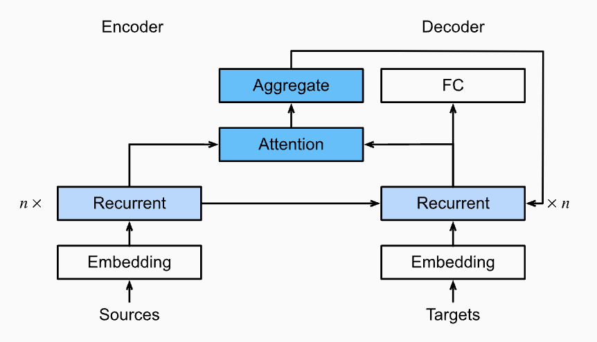
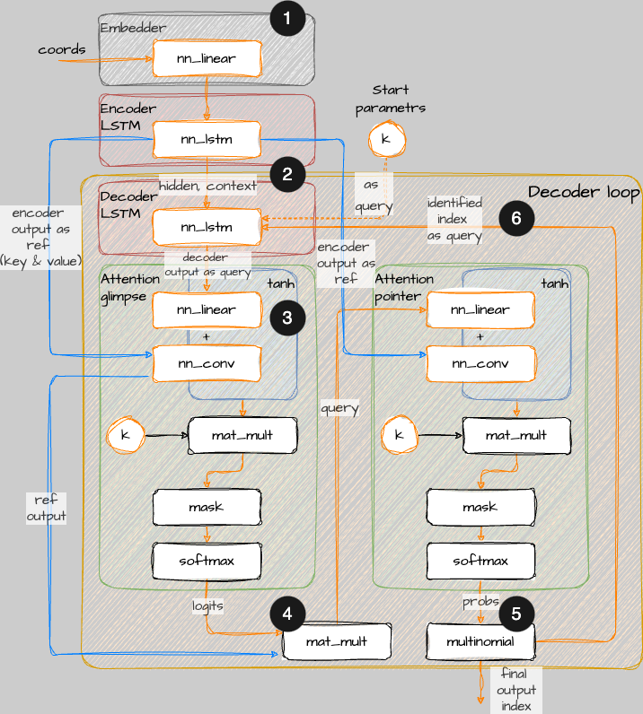

 
 
```{r setup, include=FALSE, echo=FALSE, warning=FALSE, message=FALSE}
knitr::opts_chunk$set(echo = FALSE, message = FALSE, warning = FALSE, error = FALSE, fig.width=7.5)

# Активируем тему для блога
thematic::thematic_rmd(bg = "#1D1E20", accent = "black", fg = "grey90", 
                      #font = thematic::font_spec("Roboto"), #sequential = firatheme::firaPalette(100), 
                      qualitative = palette.colors(palette = "Tableau")) 

# Сохраняем палитру в отдельную переменную
my_pal <- palette.colors(palette = "Tableau") |> unname() 

my_ggplot <- function(dt, ...){
 ggplot(dt, ...) +
   ggpp::annotate("text_npc", npcx = .5, npcy = .5, alpha = .9, size = 10, label = "InvestCookies.ru", color = "#1D1E20")
}
```

## Механизм внимания: где начинается ИИ в задаче коммивояжера?

Заголовок отсылает к знаменитой работе [Attention Is All You Need](https://arxiv.org/abs/1706.03762), которая фактически перевернула мир ИИ, сделав его другим, не таким как прежде. В этой научной публикации описаны принципы реализации архитектуры трансформеров, но в ее названии упоминается именно *механизм внимания*. Долгое время я пытался ответить себе на один простой вопрос: где все-таки заканчивается ML и начинается AI для задачи коммивояжера и вообще? Мне кажется, ответ пролегает где-то рядом с проростанием *механизма внимания*, который в 2014 году был [предложен](https://arxiv.org/abs/1409.0473) Dzmitry Bahdanau (извиняюсь, не знаю как правильно писать по-русски его фамилию). Безусловно, были работы Хопфилда, получившего в 2024 Нобелевскую премию по физике в том числе за свою архитектуру нейронной сети, которая способна решать задачу коммивояжера.  Были и другие работы, но, в случае разбора еще одного алгоритма из прошлого века, боюсь, нарваться на обратную связь в стиле: "дядь, не мороси, давай уже там про свой ИИ пиши, а не вот эти свои нафталиновые алгоритмы описывай", поэтому про нейронную сеть Хопфилда готов написать, но только если будет ощутимая обратная связь. 

*Механизм внимания* был предложен как способ улучшить *seq-to-seq* модели, применяемых для перевода текста с одного языка на другой. Кто бы мог подумать, но токены слов можно заменить координатами городов и попробовать решить задачу TSP той же моделью. В конце концов человек тоже использует одно и тоже серое вещество для решения разных задач. Первые попытки реализации этой идеи подразумевали наличие оптимального эталонного маршрута в виде, например, посчитанного решения [Concorde](/post/prostye_evristiki_dla_tsp/#concorde). Но позже появилась идея использования техники обучения с подкреплением или *Reinforce learning*. Таким образом, появилась нейронная сеть *Pointer Networks*, о которой собственно я и хотел сегодня поговорить. 

## ToRRRch 

Не так давно на R завезли [Torch](https://torch.mlverse.org/) -- это тот, что PyTorch, но только для R. Синтаксис R Torch не то чтобы отличается от PyTorch. В принципе, можно спокойно читать документацию PyTorch без особой потери смысла. К сожалению, R Torch по-прежнему находится в нулевой версии (0.13.0 на момент написания заметки), но пакет в целом работает стабильно и без нареканий. Почему же все-таки R? Потому что, даже если я пишу код на Python, то думаю все равно на R, а следовательно и понимаю тоже, а понимание внутренней сути происходящего -- есть мой первый приоритет в этой непростой области. 

Любопытно заметить, мой вариант алгоритма на R оказался существенно быстрее и менее требователен к ресурсам чем аналогичный на Python для вычислений на **CPU**. В тоже время версия R не смогла загрузить **GPU** более чем на **7%**, тогда как Python вариант смог на **22%** и в итоге выполнил работу в два раза быстрее. В общем, можно констатировать наличие специфики для R Torch, которую я пока не могу объяснить. Здесь нужно отметить, что я практикую тотальный отказ от циклов, или точнее заменой таковых тензорными операциями везде, где это возможна. Кроме того, я сторонник умеренного использования классов, функций и методов. Дело в том, что каждый кусок кода, обернутый в функцию стоит немного вычислительной мощности, а когда алгоритм много и много раз вызывает функцию то накладные расходы становятся ощутимыми. 

Несмотря на то, что мне удалось написать достаточно лаконичный и подробно документированный код, чисто из стилистических соображений я не имею намерений выкладывать сюда эту портянку. Все исходники доступны на github, проект [AI optimization](https://github.com/dkibalnikov/ai_optimization), альтернативно на Kaggle лежит тетрадка, которая умеет в GPU [Pointer Network in R](https://www.kaggle.com/code/dmitrykibalnikov/pointer-network-in-r?scriptVersionId=213658878). Приветствую всех и призываю всех к любому виду взаимодействия: ставьте звезды, форкайте, делайте пул реквесты, предлагайте свои идеи или контраргументы и прочее прочее.

## Механизм внимания

Вероятно, для того чтобы понять основную идею проще всего отталкиваться от исходной задачи перевода текста. Архитектура канонического решения, предложенная Bahdanau, выглядит следующим образом: 


Можно почитать подробное описание [тут](https://d2l.ai/chapter_attention-mechanisms-and-transformers/bahdanau-attention.html). Прообразом данной модели служила *seq-to-seq* модель, которая относительно эффективно справлялась с разным количеством слов в исходном тексте и переводе. Например, переводила такие штуки: *Attention Is All Salesman Needs* --> *Внимание -- это все, что нужно коммивояжеру*, где количество слов разное, а смысловая корреспонденция не прямолинейна. Кодировщик преобразует исходный текст в фиксированное скрытое представление, которое затем используется декодером для генерации целевого текста. Главное ограничение такой архитектуры заключалось в её неспособности эффективно удерживать контекст, особенно при работе с длинными и сложными предложениями. Решением этой проблемы и стал *механизм внимания*, предложенный Bahdanau.

Снизу диаграммы имеем `Sources`, то есть текст для перевода, который через эмбеддинг попадает в кодировщик (*Encoder*) на базе рекуррентной нейронной сети. Напомню, что такая нейронная сеть проходит по всем звеньям цепочки токенов исходного текста, определяя влияние предыдущих токенов на текущие. Исторически рекуррентные сети использовалась для прогнозирования временных рядов. Эталонный перевод (`Targets`) обрабатывается декодером (*Decoder*), который использует скрытые состояния кодировщика для генерации целевого текста. Кодировщик и декодер могут быть реализованы в несколько слоев `n x`, что является стандартным параметром LSTM или GRU реализации. 

Далее, поднимаясь вверх по диаграмме можно наблюдать модуль внимания, который встречает потоки информации из кодировщика и декодера одновременно, еще выше происходит агрегация и в рамках цикла результат возвращается в декодер для генерации нового состояния. Если немного подробнее, *механизм внимания* использует скрытые состояния рекуррентной сети кодировщика в качестве своеобразной базы знаний (ключей и значений), а в качестве запросов к такой базе знаний использует состояние предыдущего шага в цикле. Формально, это можно выразить следующим образом:

$$
c_{t'}=\sum_{t=1}^T \alpha (s_{t'-1}, h_t)h_t
$$

,  \[\alpha (s_{t'-1}, h_t)\] - скалярные веса механизма внимания, а контекст \[c_{t'}\] - есть результат его работы, который динамически обновляется в цикле и позволяет генерировать следующее состояние \[s_{t'}\]. 

Получается, что такая архитектура позволяет заменить статический контекст архитектуры *seq-to-seq* динамическим, который меняется в зависимости от предыдущего шага генерации текста. Что тут скажешь? Настоящая магия ИИ!

## Pointer Net

Хотелось бы напомнить, что никакого текста и токенов в задаче коммивояжера нет и поэтому выше описанная архитектура не может быть использована 1-к-1 и по этому поводу я нарисовал небольшую схемку для архитектуры *Pointer Net*:


Можно заметить, что некоторые блоки и связи перекочевали из предыдущей диаграммы, но в данном случае модуль внимания детализирован, а еще их на диаграмме две штуки. Кроме того, нет `Targets`, но есть `Sources` в виде координат, подаваемых на вход модели, поэтому лучше все подробнее расписать по шагам.

**Концептуальные шаги алгоритма**

1. Координаты городов поступают в модель сверху слева через модуль эмбединга. Эмбеддинг преобразует координаты городов в векторное представление фиксированной размерности, используя линейную модель без смещения (`bias=FALSE`).
2. Ниже идет блок кодировщика (*Encoder*) в виде LSTM модуля и сразу следом такой же LSTM блок декодера (*Decoder*): скрытое состояние кодировщика передается в скрытое состояния декодера. Тут интуитивно все логично. Также в декодер на вход поступает случайное состояние в пространстве эмбеддинга, необходимое для выбора первого города в маршруте. Действительно, не очень важно с какого города начинать, когда маршрут все равно замыкается в цикл
3. Выход из декодера попадает в первый модуль внимания (*glimpse*) в виде запроса, а в качестве базы знаний (ключей, значений) используется выход с кодировщика
4. Внутри модуля внимания происходит магия, которая порождает вероятности выбора (*logits*) городов с учетом исключения посещенных городов (*mask*)
5. Далее полученные вероятности выбора (*logits*) попадают еще в один аналогичный по структуре модуль внимания (*pointer*), который возвращает итоговые вероятности выбора города и соответственно индекс самого вероятного 
6. Индекс города с предыдущего этапа подается на вход декодера и цикл стартует вновь пока последовательность индексов не будет определена полностью

Как уже упоминалось, в данном случае отсутствует `Targets`, то есть нет эталонной правды с которой можно было бы сравнить инференсы модели чтобы минимизировать ошибку. С другой стороны, никто не мешает запустить много много раз модель и сравнивать решение модели с решением той же модели предыдущих итерации. Получится одна из разновидностей обучения с подкреплением, формула для оптимизации (**loss**) следующая:
$$
L=-R⋅\sum_{i=1}^nlog(\rho(a_i))
$$
, где \[R\] -- это награда агента, полученная из дистанции маршрута текущей и предыдущих итераций, а \[\rho\] -- это вероятность выбора городов, полученная на этапе #6 описания алгоритма выше. Это собственно все касаемо непосредственно алгоритма. 

## Некоторые мысли об архитектуре Pointer Net

Недостаток Pointer Net, который сразу бросается в глаза -- это рекуррентная природа основных блоков модели, построенных на LSTM или GRU, которые не могут быть вычислены независимо, то есть параллельно. В теории, этот недостаток решается архитектурой трансформеров, которая не использует рекуррентные блоки. Я очень надеюсь, что мне хватит терпения дойти до этой темы в будущем. 

Также возникает вопрос, а какой в принципе смысл подавать на вход модели последовательность посещений городов? Какая собственно разница коммивояжеру в какой последовательности были предыдущие города, если нужно выбрать просто город, который еще не посещен? Думаю, это ощущение недосказанности можно адресовать куда-нибудь в область GAT (Graph Attention Networks) и там поискать ответы. 

Наконец, самое интересное в ИИ -- это способность к обобщению, то есть интересно насколько пригодна обученная модель выдавать маршруты для набора городов с другими координатами те, которые модель еще не видела? Более того, возможно, имеет смысл сразу обучать модель на всем доступном пространстве координат, генерируя случайно задачи в рамках батч-обработки для параллельных вычислений? 

## Пример маршрута 

Вернемся к базовому примеру задачи, которую я использовал для иллюстрации в предыдущих заметках. Как я говорил, исходный код модели можно найти на github. Далее, я планирую работать уже с готовыми артефактами после этапа обучения:

```{r}
library(patchwork) # Пакет для построения композиции диаграмм
library(ggplot2)

# Загрузка рассчитанного базового примера  
res_tmp <- tempfile(pattern = "result", fileext = ".rds")
"https://github.com/dkibalnikov/ai_optimization/raw/refs/heads/main/test_samples/pointer_res.rds" |>
   download.file(destfile = res_tmp, quiet = TRUE) 

# Результат расчета Pointer Net
res <- readRDS(res_tmp)
```

Вот таким образом работает модель на задаче из 16 городов:

```{r, fig.height=8}
# Загрузка вспомогательных функций из проекта ai_optimization, расположенного на github
"https://raw.githubusercontent.com/dkibalnikov/ai_optimization/refs/heads/main/algorithms/functions.R"|>
  source(echo = FALSE)

# Базовый пример 
cities <- generate_task()

# Лучшее решение
p1 <- prep4plot(cities, res$best$idxs) |> 
  plot_tour() + 
  scale_color_viridis_c(begin = .3) +
  labs(title = paste0("Лучшее решение: ", res$best$reward |>round(2)), 
       col = "Маршрут", x = "x", y = "y")

# Итоговое решение 
p2 <- prep4plot(cities, res$last$idxs) |> 
  plot_tour() +
  scale_color_viridis_c(begin = .3) +
  labs(title = paste0("Итоговое решение: ", res$last$reward|>round(2)), 
       col = "Маршрут", x = "x", y = "y")

# Метрики производительности модели  
p3 <- tibble::tibble(n = seq_along(res$loss), loss = res$loss, reward = res$reward) |>
  tidyr::pivot_longer(-1, names_to = "variable") |>
  ggplot(aes(n, value, col = variable)) + 
  geom_line(alpha = .3) + 
  geom_smooth(formula = y ~ s(x, bs = "cs"), method = 'gam') +
  facet_wrap(~variable, nrow = 2, scales = "free") +
  geom_point(data = ~dplyr::filter(., n==which.min(res$reward)), col = "firebrick") + 
  labs(title = "Характеристики обучения нейронной сети", col = "", y = "Значение", x = "Итерация обучения") + 
  theme(legend.position = "bottom")

# Визуализация решений 
(p1+p2)/p3 + plot_annotation("Pointer Network")
```

На первый взгляд, модель справляется с задачей не лучшим образом, но предлагаю не спешить с выводами. На диаграмме представлено два результата: лучшее решение и финальное. Очевидно, что лучшее решение модели далеко не всегда совпадает с финальным. Другими словами, какая-то полурандомная вариация решения на промежуточных этапах обучения оказывается лучше чем итоговый вариант и это очевидный недостаток. Хотелось бы чтобы модель шла к оптимальному варианту решения: "твердо и четко", - как в свое время заявлял первый президент РФ.  

Далее предлагаю взглянуть на матрицу вероятностей лучшего решения, где каждый столбец представляет собой шаг модели. Первый столбец показывает вероятность для первого шага выбора: согласно такой матрице выбор должен быть сделан в пользу седьмого города, но по факту коммивояжер пошел во второй город. Будем считать, что некоторая случайность сбила с толку коммивояжера и он отправился в неверном направлении, которое по итогу оказалось более предпочтительным. 

```{r}
# Матрица вероятностей для каждого шага
apply(res$best$mem_probs, 2, \(x)round(x,2)) |> 
  as.data.frame() |> 
  emphatic::hl(scale_color_viridis_c()) |> 
  emphatic::as_html(font_size = "11px")
```

На завершающем этапе модель обретает большую уверенность и уже однозначно указывает на итоговую цепочку шагов: 7 -> 10 -> 11 -> 3 -> ... -> 1. Можно заметить, что вероятности в матрице по шагам равны единице или очень близки к этому значению, принимая внимание округление до двух знаков.

```{r}
# Матрица вероятностей для каждого шага
apply(res$last$mem_probs, 2, \(x)round(x,2)) |> 
  as.data.frame() |> 
  emphatic::hl(scale_color_viridis_c()) |> 
  emphatic::as_html(font_size = "11px")
```

Теперь можно попробовать посмотреть, как модель ведет себя на других примерах, то есть, на ее способность будучи единожды обученной на каком-то примере решать задачу для других. 

```{r}
# Новый пример
new_task <- generate_task(seed = 2023)  

# Визуализация решения для нового примера обученной моделью
prep4plot(new_task, res$new$idxs) |> 
  plot_tour() +
  scale_color_viridis_c(begin = .3) +
  labs(title = paste0("Решение для нового примера: ", -res$new$reward), 
       col = "Маршрут", x = "x", y = "y")
```

Трудно сказать, что *Pointer Network* справилась на отлично, но есть какие-то намеки на перенос опыта обучения с одного примера на другой. Это очень важное свойство такой архитектуры: фактически речь идет о генерации некоторого хорошего решения без необходимости переобучения модели.    

## Тестирование 

Очередной забег с визуализацией в виде горшков и тут становится очевидно, что новичок в мире TSP алгоритмов *Pointer Network* нещадно бит старичками. Впрочем, потенциал механизма внимания еще далеко не раскрыт полностью, но об этом в другой раз. Спасибо всем, кто смог дочитать до конца. 

```{r}
tsts <- list.files("test_results/", full.names = T) |> 
  lapply(readRDS) |> 
  purrr::list_rbind()

# Визуализация 
dplyr::mutate(tsts, task_size=lapply(route, \(x)ifelse(length(x)%%2==0, length(x), length(x)-1))|>unlist()) |> 
  ggplot(aes(stringr::str_wrap(model, 8), distance, fill = model, col= model)) + 
  geom_violin(alpha = .2) + 
  geom_jitter(alpha = .5) +
  facet_grid(~task_size, scales = "free") + 
  coord_flip() + 
  theme(legend.position = "none") + 
  labs(title = "Сравнение алгоритмов для задач TSP", subtitle = "Размерности: 16, 32, 64 города", 
       x = "Алгоритм", y="Дистанция итогового решения")
```

--- 

**Полезные ссылки** 

- [Attention Is All You Need](https://arxiv.org/abs/1706.03762)
- [Neural Machine Translation by Jointly Learning to Align and Translate](https://arxiv.org/abs/1409.0473)
- [R Torch](https://torch.mlverse.org/) 
- [Pointer Network in R](https://www.kaggle.com/code/dmitrykibalnikov/pointer-network-in-r?scriptVersionId=213658878)
- [The Bahdanau Attention Mechanism](https://d2l.ai/chapter_attention-mechanisms-and-transformers/bahdanau-attention.html)
- [AI optimization](https://github.com/dkibalnikov/ai_optimization)

---

Простой способ узнать о новых публикациях – подписаться на Telegram-канал:
<div class="telegram-icon" align="left">
<a href="https://t.me/investcookies" target="_blank" rel="noopener noreferrer me">
🍪🍪🪙 InvestCookies 
<svg xmlns="http://www.w3.org/2000/svg" viewBox="0 0 24 24" fill="none" stroke="currentColor" stroke-width="2"
    stroke-linecap="round" stroke-linejoin="round">
    <path
        d="M21.198 2.433a2.242 2.242 0 0 0-1.022.215l-8.609 3.33c-2.068.8-4.133 1.598-5.724 2.21a405.15 405.15 0 0 1-2.849 1.09c-.42.147-.99.332-1.473.901-.728.968.193 1.798.919 2.286 1.61.516 3.275 1.009 4.654 1.472.509 1.793.997 3.592 1.48 5.388.16.36.506.494.864.498l-.002.018s.281.028.555-.038a2.1 2.1 0 0 0 .933-.517c.345-.324 1.28-1.244 1.811-1.764l3.999 2.952.032.018s.442.311 1.09.355c.324.022.75-.04 1.116-.308.37-.27.613-.702.728-1.196.342-1.492 2.61-12.285 2.997-14.072l-.01.042c.27-1.006.17-1.928-.455-2.474a1.654 1.654 0 0 0-1.034-.407z" />
</svg>
</a>
</div>
